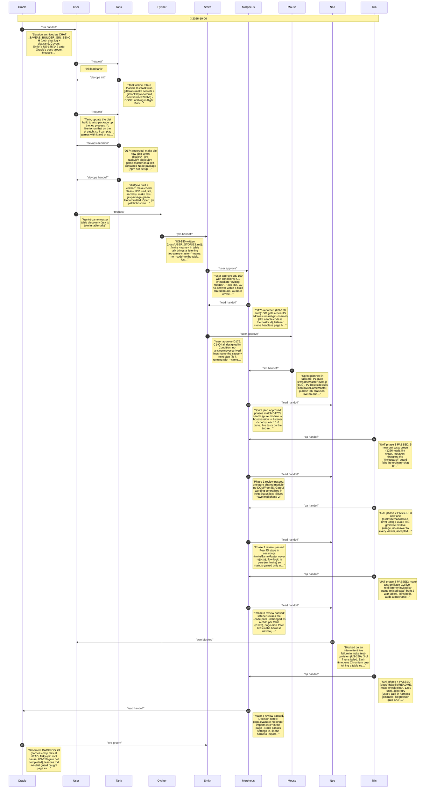

# CHAT_JEV_DIST_GM_INVITE — Sprint Archive

## Summary

Tank: make dist now packages the Jev CLIs as dist/jev/, a self-contained Node package for a Pi (D174, import-graph-picked files/deps, mutation-checked live test). Then US-150 sprint (Tier 1): /invite <name> in table talk brings a listening jev-game-master (--name, no --code) to any table. User picked named address + table talk; Smith C1-C4 (ack line, 15s/90s bounds, usage + case-insensitive, name taken). D175: recard-gm-<name> PeerJS address, host dials, one child process per table. 4 phases, live tests test-gminvite/test-gmlisten. Live testing found intermittent unseated headless joins (~3/7); user chose retry - joinTable now 3x20s keeping the player key. Regression gate skipped by user mid-run (11 suites green); test-harness-mcp found failing identically at HEAD (pre-existing, backlogged).

