# CHAT_SPRINT_HARNESS_MCP — Sprint Archive

## Summary

US-119 harness MCP server (Tier 2). Built on D135: tools/mcp/harnessServer.mjs (stdio, MCP SDK+zod devDeps) registered as recard-harness - game_start/status/stop, per named player act/view/wait/query/traffic, screenshot (inline + build/screenshots contact sheet). User gate cut raw WebRTC send (traffic log read-only) and headed mode; mid-sprint user reminders: DOM query stays, follow BOB protocol state saves (now done per persona). Session feeds a pure trafficLog.js. 7/7 over real stdio, mutation-proved; full regression green. D136.

```mermaid
%%{init: {"sequence": {"messageFontSize": 14, "noteFontSize": 18, "actorFontSize": 14}}}%%
sequenceDiagram
    autonumber
    participant Smith
    participant All
    participant Neo
    participant Cypher
    participant Trin
    participant Morpheus
    participant Oracle
    participant Mouse
    Note over Smith,Mouse: 📅 2026-09-18
    Smith->>All: "user approve"
    Note right of Smith: "*user test multiplayer-<br/>harness PASSED (user = a<br/>test author). Write-a-<br/>test loop is short:<br/>createTable -> act -><br/>waitForView -> assert,<br/>fail…"
    Neo->>Cypher: "retro"
    Note right of Neo: "Neo retro: submitAction<br/>extraction was<br/>mechanical but<br/>host/guest arg parity<br/>had to be machine-<br/>checked, not eyeballed.<br/>Friction: bobp make s…"
    Trin->>Cypher: "retro"
    Note right of Trin: "Trin retro: HEAD-<br/>worktree baseline was<br/>the right call, it<br/>proved rtg x4 / ui x1 /<br/>lint:design x2 were<br/>already there. focusZoom<br/>flake hit ag…"
    Morpheus->>Cypher: "retro"
    Note right of Morpheus: "Morpheus retro: the one-<br/>funnel refactor paid for<br/>itself because the<br/>harness now tests the<br/>real path. Revisit:<br/>extend the harness to<br/>motion…"
    Oracle->>Cypher: "retro"
    Note right of Oracle: "Oracle retro: story AC<br/>initially asserted view-<br/>level privacy, which D84<br/>retired, caught at impl,<br/>not planning. Lesson:<br/>check DECISIONS for…"
    Mouse->>Cypher: "retro"
    Note right of Mouse: "Mouse retro: 3 phases x<br/>1-3 tasks held, Tier 2<br/>fast-track fit. Scope<br/>grew once, at the user<br/>gate (migration),<br/>absorbed as its own<br/>phase."
    Cypher->>All: "retro"
    Note right of Cypher: "Cypher retro: AC mostly<br/>held, the privacy AC was<br/>wrong vs D84 and got<br/>corrected. Backlog<br/>added: waitForView<br/>closure trap,<br/>createTable fail-…"
    Cypher->>All: "pm launch"
    Note right of Cypher: "*pm launch multiplayer-<br/>harness. US-118 shipped:<br/>bobp make test-<br/>multiplayer runs a real<br/>host + 2 guests over the<br/>real protocol. D135.<br/>Retro…"
    Neo->>All: "swe fix"
    Note right of Neo: "*fix old failing tests,<br/>all green: make check<br/>(860 unit + lint incl.<br/>lint:design) + ui 20/20,<br/>rtg 16/16, hostsetup<br/>7/7, newgame 5/5,<br/>tablez…"
    Cypher->>Smith: "pm handoff"
    Note right of Cypher: "*pm plan sprint + *lead<br/>arch (Tier 2): US-119<br/>harness MCP server<br/>(docs/USER_STORIES.md),<br/>arch in morpheus.docs/ha<br/>rness_mcp_arch.md -<br/>stdio…"
    Smith->>Mouse: "user approve"
    Note right of Smith: "*user approve (user-<br/>confirmed gate): US-119<br/>approved + MCP SDK/zod<br/>devDeps. User narrowed<br/>scope: WebRTC exposure<br/>is a READ-ONLY traffic<br/>log…"
    Mouse->>Morpheus: "sm handoff"
    Note right of Mouse: "Sprint planned in<br/>task.md: P1 traffic log<br/>(pure ring buffer +<br/>Session tap), P2 MCP<br/>server + stdio test +<br/>make target, P3<br/>screenshots + cont…"
    Morpheus->>Neo: "lead handoff"
    Note right of Morpheus: "Sprint plan approved:<br/>ring buffer as a pure<br/>module keeps it unit-<br/>testable (session.js<br/>itself is not). @Neo<br/>*swe impl phase-1"
    Neo->>Trin: "swe handoff"
    Note right of Neo: "Phase 1 impl complete:<br/>src/trafficLog.js<br/>(bounded, unit-tested<br/>3/3) fed by every<br/>Session send/receive, __<br/>recardHarness.traffic({t<br/>ype,limit}…"
    Trin->>Morpheus: "qa handoff"
    Note right of Trin: "UAT phase 1 passed:<br/>trafficLog 3/3, capacity<br/>mutation caught. Session<br/>tap is live-only - Phase<br/>2's stdio test must<br/>assert real action-<br/>out/s…"
    Morpheus->>Neo: "lead handoff"
    Note right of Morpheus: "Phase 1 review passed:<br/>pure log + thin Session<br/>tap, per-Session<br/>lifetime correct. Phase<br/>2: server stays a thin<br/>layer over the harness,<br/>no s…"
    Neo->>Trin: "swe handoff"
    Note right of Neo: "Phase 2 impl complete: t<br/>ools/mcp/harnessServer.m<br/>js (8 tools, named<br/>players,<br/>errors->isError)<br/>registered as recard-<br/>harness in .mcp.json,<br/>dev…"
    Trin->>Morpheus: "qa handoff"
    Note right of Trin: "UAT phase 2 passed: 5/5,<br/>my Phase-1 condition met<br/>- dropping the guest-<br/>send record fails the<br/>traffic test. @Morpheus<br/>*lead review phase-2"
    Morpheus->>Neo: "lead handoff"
    Note right of Morpheus: "Phase 2 review passed:<br/>server is a thin layer,<br/>table setup still only<br/>in the harness, per-tool<br/>error wrapper keeps the<br/>table alive. @Neo *s…"
    Neo->>Trin: "swe handoff"
    Note right of Neo: "Phase 3 impl complete:<br/>screenshot tool (one<br/>player or all), inline<br/>PNGs + build/screenshots<br/>/<game>/NNN-player-<br/>label.png + regenerated<br/>index…"
    Trin->>Morpheus: "qa handoff"
    Note right of Trin: "UAT phase 3 passed: 7/7,<br/>PNG signature + on-disk<br/>file set + sheet<br/>contents asserted,<br/>viewed a real capture -<br/>correct per-player<br/>rendering (…"
    Morpheus->>Oracle: "lead handoff"
    Note right of Morpheus: "Phase 3 review passed:<br/>sheet rewritten per<br/>capture, one folder per<br/>game, names stable. All<br/>phases reviewed. @Oracle<br/>*ora groom"
    Oracle->>Smith: "ora handoff"
    Note right of Oracle: "Docs groomed: D136<br/>recorded,<br/>ARCHITECTURE/README<br/>point at recard-harness<br/>MCP, US-119 COMPLETE,<br/>backlog follow-ups<br/>filed. Archiving chat.<br/>@S…"
```

