# CHAT_TURN_RELAY — Sprint Archive

## Summary

US-151/152 sprint (Tier 2, D176): with CLOUDFLARE_TURN_KEY_ID/_API_TOKEN set, the Jev game master mints Cloudflare Realtime TURN credentials per process (children/bots mint their own), passes them to its headless pages as a peerConfig URL param (relay-only), and pushes refreshes into the long-lived listener via a JSHandle. Port-53 URLs filtered. Static server now refuses path traversal (404) and malformed % (400). Gates green: make check, test-gmlisten, test-jev-game-master; image exported as dist/recard-jev-36810d8-dirty.tar (same tag as before - rebuild after commit). Not live-tested against Cloudflare (no key). Uncommitted.

```mermaid
%%{init: {"sequence": {"messageFontSize": 14, "noteFontSize": 18, "actorFontSize": 14}}}%%
sequenceDiagram
    autonumber
    participant Smith
    participant All
    participant Neo
    participant Cypher
    participant Trin
    participant Morpheus
    participant Oracle
    participant Mouse
    participant Tank
    participant User
    Note over Smith,User: 📅 2026-10-06
    Smith->>All: "user approve"
    Note right of Smith: "*user approve US-150.<br/>Evidence: live suites<br/>driving the real app<br/>(test-gminvite 3/3:<br/>usage, inviting->no-<br/>answer seen by a 2nd<br/>viewer, accep…"
    Neo->>Cypher: "retro"
    Note right of Neo: "Neo retro: invite flow<br/>kept pure<br/>(runInvite/hasArrived)<br/>so main.js only gained<br/>wiring, reused --code<br/>mode as a child instead<br/>of a multi-tab…"
    Trin->>Cypher: "retro"
    Note right of Trin: "Trin retro: 2 new live<br/>suites + 8 unit tests, 3<br/>mutation checks<br/>(ordinary-chat guard,<br/>arrival watch, name-<br/>taken). Regression gate<br/>incomplet…"
    Morpheus->>Cypher: "retro"
    Note right of Morpheus: "Morpheus retro: D175<br/>held up unchanged<br/>through build - address-<br/>as-peer-id needed no new<br/>infra. Revisit:<br/>joinTable retry is a<br/>symptom fix, i…"
    Oracle->>Cypher: "retro"
    Note right of Oracle: "Oracle retro: decisions<br/>recorded in-turn (D174,<br/>D175 + 2 amendments).<br/>Gap: the harness-mcp<br/>failure went unnoticed<br/>since US-119 because no<br/>g…"
    Mouse->>Cypher: "retro"
    Note right of Mouse: "Mouse retro: 4 phases of<br/>1-3 tasks, no fix loops<br/>on the feature, one<br/>escalation (flaky join)<br/>resolved by user<br/>decision. Gate run cut<br/>short…"
    Cypher->>Cypher: "retro"
    Note right of Cypher: "Cypher retro: asking the<br/>2 real product questions<br/>up front (addressing,<br/>trigger) avoided rework,<br/>slash form /invite was<br/>right (no accidenta…"
    Smith->>Cypher: "retro"
    Note right of Smith: "Smith retro: C1 ack +<br/>Gate 2 recovery wording<br/>made failures self-<br/>explaining. UX theme:<br/>host-generated talk<br/>lines need their own<br/>voice."
    Tank->>Cypher: "retro"
    Note right of Tank: "Tank retro: dist/jev/<br/>now carries listening<br/>mode, README covers<br/>/invite and both bounds.<br/>Next infra: make deploy-<br/>jev HOST=... and a<br/>systemd…"
    Cypher->>All: "pm launch"
    Note right of Cypher: "*pm launch US-150:<br/>'/invite <name>' in<br/>table talk brings a<br/>listening Jev game<br/>master (jev-game-master<br/>--name <name>, shipped<br/>in dist/jev/)…"
    Note over Smith,User: 📅 2026-10-07
    User->>Tank: "report"
    Note right of User: "test-jev-image passed<br/>(user ran it)"
    Tank->>User: "devops handoff"
    Note right of Tank: "Image work done, state<br/>saved. Tar: dist/recard-<br/>jev-36810d8-dirty.tar<br/>(rebuild after commit<br/>for a clean tag).<br/>Handoff: user configures<br/>the p…"
    User->>Oracle: "request"
    Note right of User: "/oracle groom docs"
    Oracle->>User: "ora handoff"
    Note right of Oracle: "Groomed: README no<br/>longer claims make check<br/>skips lint (stale since<br/>dd67b83), added<br/>Deploying section<br/>(dist/, dist/jev/,<br/>export-jev-image,…"
    User->>All: "request"
    Note right of User: "/bob-protocol init"
    Mouse->>User: "sm init"
    Note right of Mouse: "Init: cold start<br/>reconciled. Last handoff<br/>Oracle->User (docs<br/>groomed, ready to exit).<br/>No persona has pending<br/>work, US-150 shipped,<br/>jev imag…"
    User->>All: "request"
    Note right of User: "/sprint Cloudflare<br/>Realtime TURN relay for<br/>the Jev game master<br/>(pod-side only, env-<br/>gated, refresh before<br/>TTL, children get fresh<br/>set) + fix…"
    Morpheus->>Smith: "lead decision"
    Note right of Morpheus: "US-151 (TURN relay, env-<br/>gated, refresh before<br/>TTL, listener updated in<br/>place) + US-152 (static<br/>server containment, 400<br/>on bad %) written: d…"
    Smith->>Mouse: "user approve"
    Note right of Smith: "*user approve US-151/152<br/>+ D176. Conditions: C1<br/>startup line names the<br/>relay and TTL but never<br/>echoes the token, C2<br/>half-set env error name…"
    Mouse->>Neo: "sm handoff"
    Note right of Mouse: "Planned 3 phases in<br/>task.md (relay core, wir<br/>ing+containment+README,<br/>gate). @Neo *swe impl<br/>phase-1"
    Neo->>Trin: "swe handoff"
    Note right of Neo: "Phase 1 done (TDD):<br/>tools/turnRelay.mjs + 11<br/>unit tests, peerOptions<br/>peerConfig +<br/>withPeerConfig, 3 round-<br/>trip tests. @Trin *qa<br/>uat phase-1"
    Trin->>Morpheus: "qa handoff"
    Note right of Trin: "UAT phase 1 PASS: make<br/>test green, mutation<br/>(drop refresh listener<br/>notify) caught by the<br/>refresh test. @Morpheus<br/>*lead review phase-1"
    Morpheus->>Neo: "lead handoff"
    Note right of Morpheus: "Phase 1 review PASS:<br/>matches D176 (env gate,<br/>:53 filter, 80% refresh,<br/>keep-on-fail).<br/>peerConfig overrides<br/>local empty ICE list<br/>uniformly -…"
    Neo->>Trin: "swe handoff"
    Note right of Neo: "Phase 2 done: openPeer<br/>adds peerConfig from<br/>sharedTurnRelay,<br/>listener page takes<br/>refreshes into<br/>peer.options.config (new<br/>gmlisten test), je…"
    Trin->>Morpheus: "qa handoff"
    Note right of Trin: "UAT phase 2 PASS: make<br/>check clean. Mutations:<br/>dropping the containment<br/>guard fails 4 traversal<br/>tests (first cut didn't<br/>climb to / - tighte…"
    Morpheus->>Trin: "lead decision"
    Note right of Morpheus: "Phase 2 review PASS.<br/>Lint pushed the listener<br/>off a page global onto a<br/>JSHandle {listening,<br/>ready} - better than<br/>D176 text (no hidden<br/>page…"
    Oracle->>All: "ora handoff"
    Note right of Oracle: "Groomed: lessons.md<br/>(traversal tests must<br/>reach a real file,<br/>JSHandle over page<br/>globals), D176 amended<br/>for the JSHandle.<br/>task.md closed. @S…"
    Smith->>All: "user approve"
    Note right of Smith: "C1-C3 met (startup line<br/>shows relay+TTL, no<br/>token, half-set names<br/>missing var, README<br/>egress). No hands-on:<br/>needs a real Cloudflare<br/>key in…"
    Neo->>All: "retro"
    Note right of Neo: "Neo retro: relay kept<br/>pure with injected<br/>fetch/timers, per-<br/>process minting removed<br/>all credential plumbing.<br/>Friction: lint rules<br/>forced the…"
    Trin->>All: "retro"
    Note right of Trin: "Trin retro: a mutation<br/>check caught a traversal<br/>test that could never<br/>fail. Backlog: no live<br/>TURN test (needs a key)."
    Morpheus->>All: "retro"
    Note right of Morpheus: "Morpheus retro: D176<br/>held. Revisit if tables<br/>outlive 24h: in-table<br/>pages keep their opening<br/>credentials."
    Cypher->>All: "pm launch"
    Note right of Cypher: "*pm launch US-151/152:<br/>with CLOUDFLARE_TURN_KEY<br/>_ID/_API_TOKEN set, the<br/>game master relays all<br/>WebRTC via Cloudflare<br/>TURN (refreshed), stati…"
    User->>All: "request"
    Note right of User: "prep for clear and groom<br/>docs"
```

