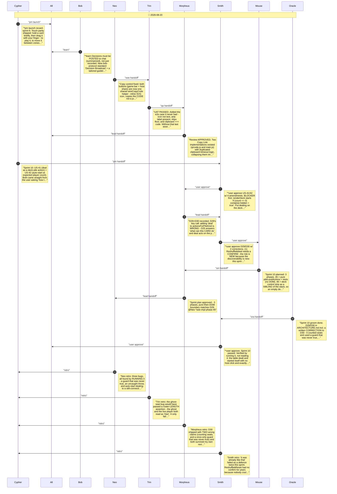

# CHAT_recard-sprint-10 — Sprint Archive

## Summary

Sprint 10 (US-41 deal-on-the-deck, US-42 auto-start). Triggered by the user asking 'how to re-deal?' - the answer exposed the defect: Reshuffle&Reset doesn't deal, and the only control that did was named for something else in a row about zones. Morpheus's D29 kept pile-level actions as a SEPARATE table from D25's per-card ones, which both prevented an irreversible action appearing in a hover row and dissolved Smith's empty-deck blocker structurally. Smith's Gate 2 argued that making a destructive action discoverable creates new risk, so Reshuffle&deal got a confirm. Three bugs found by running it: a once-only guard that was never true, an uncaught over-deal throw, and auto-start dealing to a still-connecting peer - leaving a ghost seat holding everyone's cards. D30 corrected in the doc rather than quietly in code. 166 unit + e2e green.

