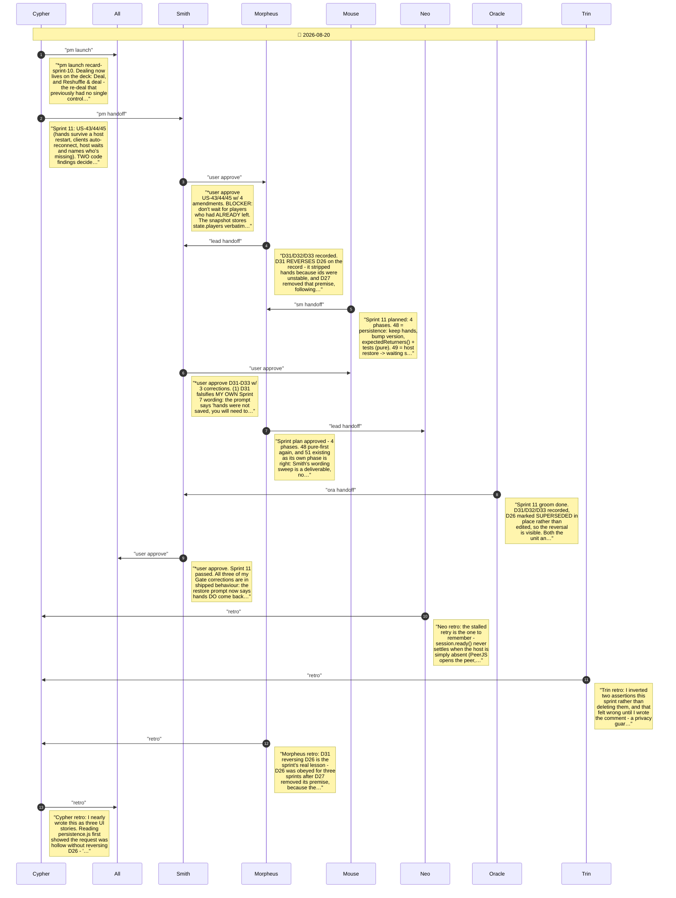

# CHAT_recard-sprint-11 — Sprint Archive

## Summary

Sprint 11 (US-43/44/45): restarting waits for the table. Cypher found the request was hollow as stated - persistence.js stripped hands, so 'restore the game' restored empty hands. D26 had stripped them because guest ids were unstable, a premise D27 removed three sprints earlier; D31 reverses it on the record and D26 is marked superseded in place. Smith's Gate 1 blocker: don't wait for players who had already left, since the snapshot stores everyone ever seated - that became the pure expectedReturners(). Gate 2 caught that D31 falsified Smith's own Sprint 7 prompt wording. Four bugs found by running it: session.ready() never settling so a bounded retry became infinite, an unregistered host-lost event, restore orphaning hands via a stale comment, and the manual Deal path seating unsettled peers - the same defect Sprint 10 fixed only in auto-start. 171 unit + e2e green.

