# CHAT_save-layout-remove-changetype — Sprint Archive

## Summary

Sprint: Save Layout/SaveAs, Remove Zone/Pile, changePileType (US-69..73, D61-D63). Full cycle Cypher->Smith Gate1->Morpheus arch->Smith Gate2->Mouse plan->6 phases (79-84) Neo/Trin/Morpheus Bloop->Oracle groom. Key finding: player-created zones/piles use crypto.randomUUID() ids, so saved layouts only cover stable-id built-in panels (D61). Two live UX bugs found+fixed (Table-pile always-fails Remove button; 1px scroll regression). 393/393 tests, lint baseline unchanged.

```mermaid
%%{init: {"sequence": {"messageFontSize": 14, "noteFontSize": 18, "actorFontSize": 14}}}%%
sequenceDiagram
    autonumber
    participant Oracle
    participant Smith
    participant All
    participant Neo
    participant Cypher
    participant Trin
    participant Morpheus
    participant Mouse
    participant User
    Note over Oracle,User: 📅 2026-08-27
    Oracle->>Smith: "ora handoff"
    Note right of Oracle: "*ora groom DONE: task.md<br/>phases 74-78 checked off<br/>w/ real summaries,<br/>USER_STORIES.md sprint-<br/>close + new E2E-rebuild<br/>backlog item, 2 new les…"
    Smith->>All: "user approve"
    Note right of Smith: "*user test techdebt-<br/>sprint PASSED. Tested<br/>the 3 things that<br/>actually changed<br/>behavior this sprint,<br/>not just re-checked<br/>Neo/Trin's own scena…"
    Neo->>Cypher: "retro"
    Note right of Neo: "Neo retro: tech-debt<br/>sprints pay for<br/>themselves via near-miss<br/>catches - twice a<br/>mechanical lint 'fix'<br/>would've been a silent<br/>regression (va…"
    Trin->>Cypher: "retro"
    Note right of Trin: "Trin retro: test<br/>coverage health check<br/>this sprint doubled as a<br/>real audit - discovered<br/>the unit suite (358<br/>tests) was the ONLY<br/>layer still…"
    Morpheus->>Cypher: "retro"
    Note right of Morpheus: "Morpheus retro:<br/>D58/D59's per-rule<br/>disable-with-<br/>justification pattern<br/>(never blanket suppress)<br/>worked well - each one<br/>documents WHY the lin…"
    Oracle->>Cypher: "retro"
    Note right of Oracle: "Oracle retro: 2 new<br/>lessons recorded (test-<br/>claim decay, verify-<br/>before-deleting-<br/>unexplained-files) -<br/>both are exactly the<br/>'worth remembering…"
    Mouse->>Cypher: "retro"
    Note right of Mouse: "Mouse retro: 5-phase<br/>plan (74-78) held up<br/>well even though the<br/>actual content diverged<br/>hugely from the pre-<br/>sprint guess (e2e<br/>removal wasn't…"
    Smith->>Cypher: "retro"
    Note right of Smith: "Cypher retro: US-64..68<br/>AC's 'flag genuine<br/>behavior-change findings<br/>rather than fix or<br/>suppress' clause proved<br/>itself twice (the 2<br/>near-mis…"
    Cypher->>All: "pm launch"
    Note right of Cypher: "*pm launch techdebt-<br/>sprint. US-64..68<br/>shipped: ESLint adopted,<br/>1021->7 lint findings,<br/>dead code+CSS cut, 2<br/>real bugs found+fixed,<br/>real dupl…"
    Neo->>All: "status"
    Note right of Neo: "Session close (prep for<br/>context clear): tech-<br/>debt sprint (US-64..68,<br/>D58-D60) fully shipped/r<br/>eviewed/tested/pushed-<br/>ready. Working tree<br/>clea…"
    User->>All: "request"
    Note right of User: "init *mouse status<br/>update"
    Mouse->>User: "status"
    Note right of Mouse: "Mouse resuming: tech-<br/>debt sprint (US-64..68,<br/>D58-D60) fully shipped &<br/>retro'd at 259c474, tree<br/>clean pre-this-session.<br/>No open sprint plan…"
    User->>All: "request"
    Note right of User: "Fix PlayerZone so that I<br/>can drop a card and<br/>initiate a new pile just<br/>like the table zone so I<br/>can lay down melds etc.<br/>Same with OpponentZo…"
    Neo->>All: "swe start"
    Note right of Neo: "Neo starting *swe fix:<br/>permissive drag/drop for<br/>PlayerZone/OpponentZone<br/>(drop card -> new pile,<br/>same as TableZone).<br/>Investigating dropTarge…"
    Neo->>Trin: "swe handoff"
    Note right of Neo: "Neo *swe fix done: seat-<br/>zone body shrink-wrapped<br/>exactly to its 1 pile,<br/>leaving 0 empty px for<br/>the existing card->new-<br/>pile drop handler (co…"
    Trin->>All: "qa start"
    Note right of Trin: "Trin starting *qa uat on<br/>Neo's zone-drop-gutter<br/>fix. Independently re-<br/>verifying the geometry<br/>claim + running full<br/>regression before<br/>signing…"
    Trin->>Morpheus: "qa handoff"
    Note right of Trin: "Trin UAT PASSED:<br/>reviewed diff - gutter<br/>is inert to every<br/>existing lookup (.pile-<br/>section/[data-card-id]<br/>selectors, not indexed<br/>children). o…"
    Morpheus->>All: "lead decision"
    Note right of Morpheus: "Morpheus reviewing:<br/>chose 'universal per-<br/>zone drop gutter' over<br/>alternatives (widening<br/>.seat-zone via flex-grow<br/>- rejected, contradicts<br/>the…"
    Morpheus->>All: "lead review"
    Note right of Morpheus: "Morpheus review<br/>APPROVED: root-cause<br/>diagnosis (CSS shrink-<br/>wrap geometry, not a<br/>reducer/dispatch<br/>restriction) is correct<br/>and non-obvious -…"
    User->>All: "request"
    Note right of User: "*nit why Score buttons<br/>different? Action<br/>buttons should be below<br/>the title bar"
    Neo->>All: "swe start"
    Note right of Neo: "Neo *swe fix nit:<br/>Score's -/+ buttons<br/>render inline with its<br/>title (not below) by<br/>deliberate 2026-08-25<br/>exception - forcing them<br/>below prev…"
    Neo->>User: "blocked"
    Note right of Neo: "Neo: regression<br/>reproduces on today's<br/>layout, worse than<br/>2026-08-25 (9 violations<br/>vs baseline 5 - 4 NEW:<br/>You/Score-+, Bob/Bob-<br/>Score-+ overl…"
    Neo->>User: "swe finding"
    Note right of Neo: "Neo finding: no zone<br/>anywhere has collision-<br/>aware positioning -<br/>every default position<br/>is a one-time static<br/>formula, never<br/>recomputed for r…"
    User->>All: "request"
    Note right of User: "let's save space by<br/>making ScoreZone show<br/>all players' scores with<br/>controls to update the<br/>score by typing it in or<br/>using +/-1 and +/-10<br/>for…"
    Neo->>Trin: "swe handoff"
    Note right of Neo: "Neo *swe impl done:<br/>ScoreZone consolidated -<br/>ONE panel lists every<br/>player (name, editable<br/>input, -10/-1/+1/+10).<br/>New: SET_SCORE reducer<br/>(ty…"
    Trin->>All: "qa start"
    Note right of Trin: "Trin starting *qa uat on<br/>consolidated ScoreZone.<br/>Independently re-<br/>verifying: reducer<br/>tests, diff review, live<br/>behavior (typed entry,<br/>+/-1/+…"
    Trin->>Morpheus: "qa handoff"
    Note right of Trin: "Trin UAT PASSED:<br/>independently re-ran<br/>362/362 tests + full<br/>lint (js/style/design) -<br/>baseline matches Neo's<br/>report exactly, 3 pre-<br/>existing u…"
    Morpheus->>All: "lead decision"
    Note right of Morpheus: "Morpheus decision:<br/>ScoreZone's attribute-<br/>per-scalar API<br/>(score/adjustable/label,<br/>one instance per player)<br/>fully replaced with<br/>.render(playe…"
    Morpheus->>Smith: "lead review"
    Note right of Morpheus: "Morpheus review<br/>APPROVED: consolidation<br/>is architecturally sound<br/>-<br/>.render(players,options)<br/>matches the existing<br/>ZonePanel pattern,<br/>SET_SCO…"
    Smith->>All: "user start"
    Note right of Smith: "Smith starting *user<br/>test on consolidated<br/>ScoreZone - HCI pass<br/>against the real running<br/>app (learnability, error<br/>prevention,<br/>consistency),…"
    Smith->>All: "user approve"
    Note right of Smith: "Smith UX test PASSED:<br/>live-tested row layout<br/>at 1440px (screenshot:<br/>clean, name<br/>left/controls right, no<br/>clipping), a large<br/>negative score (…"
    Mouse->>All: "sm status"
    Note right of Mouse: "Mouse: session close-out<br/>prep. This session<br/>shipped 2 items: *fix<br/>(permissive drop-to-<br/>create-pile for<br/>PlayerZone/OpponentZone<br/>- zone-drop-g…"
    Mouse->>User: "resume"
    Note right of Mouse: "Mouse resuming cold<br/>start: confirmed main<br/>already fast-forwarded<br/>to 6b7aeca and pushed<br/>(both this session's<br/>items - zone-drop-gutter<br/>fix +…"
    User->>Cypher: "request"
    Note right of User: "*plan sprint new<br/>feature: Save layout -<br/>create/save custom<br/>layout presets to<br/>localStorage as<br/>overrides of built-in<br/>defaults, SaveAs with<br/>cu…"
    Cypher->>Smith: "pm handoff"
    Note right of Cypher: "Drafted US-69..73 (Save<br/>Layout, SaveAs, Remove<br/>Zone, Remove Pile,<br/>changePileType).<br/>Researched first: no<br/>REMOVE_ZONE/PILE<br/>precedent exists,…"
    Smith->>Morpheus: "user approve"
    Note right of Smith: "*user approve. US-69..73<br/>approved with 2<br/>amendments: Save/SaveAs<br/>need visible success<br/>confirmation (Nielsen<br/>#1), empty-only<br/>remove/changePi…"
    Morpheus->>Smith: "lead handoff"
    Note right of Morpheus: "D61 recorded: saved<br/>layouts (US-69/70) cover<br/>only stable-id panels -<br/>discovered player-<br/>created zones/piles get<br/>crypto.randomUUID() ids,<br/>unu…"
    Smith->>Mouse: "user approve"
    Note right of Smith: "*user approve. D61-D63<br/>approved with 1<br/>condition: Save/Reset<br/>Layout controls need<br/>persistent disclosure<br/>captions (not per-click<br/>modals) - '…"
    Mouse->>Morpheus: "sm handoff"
    Note right of Mouse: "Sprint planned: 7 phases<br/>(task.md 79-85). Data-<br/>layer first: 79<br/>REMOVE_ZONE/PILE, 80<br/>CHANGE_PILE_TYPE, 81<br/>layoutOverrides.js<br/>module. Then UI…"
    Morpheus->>Neo: "lead handoff"
    Note right of Morpheus: "Sprint plan approved, no<br/>changes requested. Phase<br/>sizing and data-layer-<br/>before-UI sequencing<br/>correct, Phase 84<br/>correctly carries both<br/>Gate…"
    Neo->>Trin: "swe handoff"
    Note right of Neo: "Phase 79 impl complete:<br/>REMOVE_ZONE/REMOVE_PILE<br/>(state.js), TDD - 10 new<br/>tests written first, all<br/>pass. Empty-only guard,<br/>deck/hand/Table-Z…"
    Trin->>Morpheus: "qa handoff"
    Note right of Trin: "Trin UAT phase-79<br/>PASSED: independently<br/>re-ran full suite<br/>372/372, reviewed<br/>REMOVE_ZONE/PILE against<br/>D62 AC - empty-only,<br/>deck/hand/Table-Z…"
    Morpheus->>Neo: "lead handoff"
    Note right of Morpheus: "Phase 79 review PASSED:<br/>reducer actions match<br/>RENAME_ZONE/RENAME_PILE<br/>precedent exactly (find-<br/>or-throw, filter). No<br/>architecture concerns.…"
    Neo->>Trin: "swe handoff"
    Note right of Neo: "Phase 80 done:<br/>CHANGE_PILE_TYPE +<br/>ACTION_SPECS/pileActions<br/>wiring (D62/D63), TDD 7<br/>tests. Found+fixed live<br/>gap: default Table pile<br/>wasn't e…"
    Trin->>Morpheus: "qa handoff"
    Note right of Trin: "Trin UAT phase-80<br/>PASSED: re-ran suite<br/>379/379, lint:js<br/>confirmed clean (7<br/>baseline). Verified<br/>CHANGE_PILE_TYPE AC:<br/>zone<->discard both dir…"
    Morpheus->>Neo: "lead handoff"
    Note right of Morpheus: "Phase 80 review PASSED.<br/>ACTION_SPECS/pileActions<br/>wiring matches hide/show<br/>precedent exactly. No<br/>concerns. @Neo *swe impl<br/>phase-81"
    Neo->>Trin: "swe handoff"
    Note right of Neo: "Phase 81 done:<br/>src/layoutOverrides.js<br/>(D61) - saveLayoutOverri<br/>de/loadLayoutOverrides/d<br/>eleteLayoutOverride/over<br/>ridesForPreset/stableLay<br/>outSu…"
    Trin->>Morpheus: "qa handoff"
    Note right of Trin: "Trin UAT phase-81<br/>PASSED: 393/393, lint<br/>clean. Verified<br/>stableLayoutSubset<br/>against D61's exact<br/>rejected-alternative<br/>reasoning - random-UUID…"
    Morpheus->>Neo: "lead handoff"
    Note right of Morpheus: "Phase 81 review PASSED,<br/>data layer (79-81)<br/>complete and matches<br/>D61-D63. @Neo *swe impl<br/>phase-82"
    Neo->>Trin: "swe handoff"
    Note right of Neo: "Phase 82 done: Remove<br/>Pile (via pile<br/>ActionBar,<br/>remove/changePileType<br/>now offered by<br/>Pile.pileActions()) +<br/>Remove Zone (new heading<br/>action,…"
    Trin->>Morpheus: "qa handoff"
    Note right of Trin: "Trin UAT phase-82: code<br/>review passed - dispatch<br/>wiring matches<br/>split/take/hide/show<br/>precedent, relay-generic<br/>(no host special-casing<br/>neede…"
    Morpheus->>Neo: "lead handoff"
    Note right of Morpheus: "Phase 82 review PASSED,<br/>code-level. Table Zone<br/>exemption is the right<br/>minimal check (fixed<br/>known id, no new<br/>plumbing). @Neo *swe<br/>impl phase…"
    Neo->>Trin: "swe handoff"
    Note right of Neo: "Phase 83 done:<br/>changePileType already<br/>wired in Phase 82's edit<br/>(same onPileAction<br/>dispatch,<br/>performChangePileType<br/>toggles<br/>zone<->discard).…"
    Trin->>Morpheus: "qa handoff"
    Note right of Trin: "Trin UAT phase-83: code<br/>review passed - toggle<br/>logic (pile.kind==='disc<br/>ard'?'zone':'discard')<br/>correctly covers both<br/>directions of D63's onl…"
    Morpheus->>Neo: "lead handoff"
    Note right of Morpheus: "Phase 83 review PASSED.<br/>@Neo *swe impl phase-84"
    Neo->>Trin: "swe handoff"
    Note right of Neo: "Phase 84 done:<br/>Save/SaveAs/Reset UI +<br/>host-only visibility +<br/>Layout picker at table-<br/>create, all Gate1/Gate2<br/>conditions implemented.<br/>Live-ve…"
    Trin->>Morpheus: "qa handoff"
    Note right of Trin: "Trin UAT phase-84<br/>PASSED, combined with<br/>deferred 82/83 live<br/>pass: re-ran 393/393,<br/>re-confirmed lint<br/>baseline. Independently<br/>reviewed the li…"
    Morpheus->>Oracle: "lead handoff"
    Note right of Morpheus: "Phase 84 review PASSED.<br/>All phases (79-84)<br/>reviewed and complete.<br/>Phase 85 stays open per<br/>the reserved-bug-fix<br/>pattern - fills only if<br/>Smit…"
```

