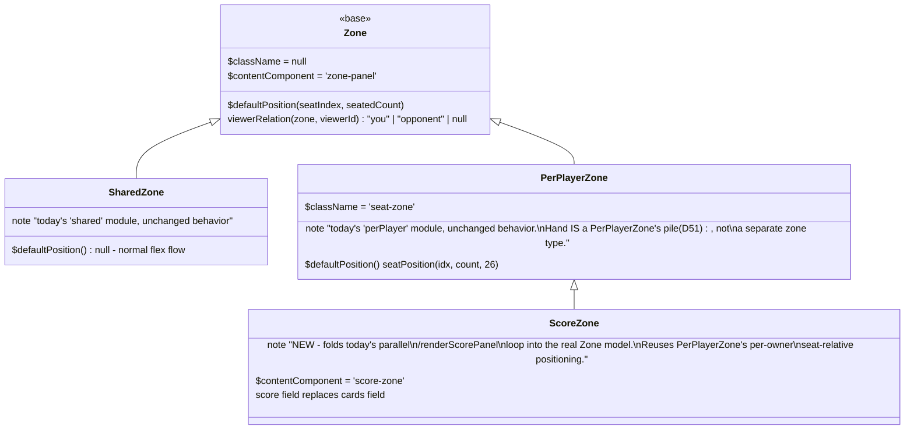

# Architecture — Recard

**Owner:** Morpheus (Tech Lead)
**Status:** v1, v1.1, v1.2, v1.3, v1.4 shipped. v1.5 decisions below
(D21-D23) are binding for the current sprint (US-32..36, "snap-to
stack/overlap + deck operations" + a user-directed foundational `Pile`
storage unification, D23, sequenced first).
**Last updated:** 2026-08-16

## Decisions (resolves PRD Feasibility Flags 1 & 2)

### D1. Stack: static site, no build step
Plain HTML/CSS/vanilla JS (ES modules), served as static files. No backend,
no database, no build pipeline. Keeps "no server infra" literal — there is
nothing to deploy or operate. Node is used only as a dev-time test runner
(`node --test`), never at runtime.

### D2. Signaling: PeerJS + its public cloud broker
Use PeerJS (CDN-loaded) for WebRTC. It uses a free public signaling broker
(`0.peerjs.com`) and public STUN servers to establish the connection, then
data flows directly peer-to-peer. This is a small external dependency we
don't operate — no account, no server we run, no cost. It's the standard
"WebRTC still needs signaling" answer from PRD Flag 1: we accept a public
broker instead of hosting one, and instead of manual copy/paste codes,
because copy/paste offer/answer blobs are a worse join experience (Smith
would reject that on Gate 2 — recognition/consistency).
**Revisit trigger:** if `0.peerjs.com` availability becomes a problem, swap
to a self-hosted `peerjs-server` — it's a drop-in replacement, isolated
behind this one decision.

### D3. Topology: star, host-authoritative
Host's browser tab is the hub. Every other player connects directly to the
host only (not to each other) — avoids full-mesh connection complexity for
v1. The host holds the single source of truth for game state (deck order,
each hand's contents, table/discard contents) and is the only client that
mutates it. Other clients send **action requests**; the host validates and
broadcasts the resulting authoritative state. This directly satisfies
US-5/US-8 privacy: a player's hand is only ever put on the wire in the
per-connection payload addressed to that player — never broadcast.

### D4. Two message classes on the data channel
1. **State messages** (reliable, ordered — PeerJS default): `deal`,
   `play`, `draw`, `reset`, `roster`. These are authoritative and always
   delivered; clients render directly from the latest one received.
2. **Motion messages** (best-effort, cosmetic only): hand-slot drag
   position, card-lift, play-in-flight animation cues. Sent at a throttled
   rate (~20/s) with "latest wins" coalescing — a superseded motion event
   for the same slot is simply never sent. Motion messages **never**
   carry information not already implied by the last state message (e.g.
   hand-reorg motion carries position only, not card identity), and are
   never required to arrive for the app to remain correct.

This cleanly resolves PRD Flag 2: best-effort is implemented at the
application layer (throttle + drop-superseded), not by relying on unstable
"unreliable WebRTC channel" browser behavior. Losing motion frames only
ever costs smoothness, never correctness, because state messages are the
only source of truth for what's actually true.

### D5. Join flow
Host calls `peer = new Peer()`, gets a PeerJS ID, and displays it as both
a short code and a QR encoding `<page-url>?join=<id>`. A joining player
either types the code or scans the QR; both resolve to
`peer.connect(hostId)`. Host shows each connection's state (connecting /
connected / disconnected) per Smith's Gate 1 AC.

### D6. No persistence / no reconnect (v1)
If the host's tab closes, the session ends — no server means no
state survives the authoritative peer disappearing. Documented as a known
v1 limitation (PRD Open Question 4), not silently swept under the rug.
**Smith Gate 2 condition:** every connected client must show an explicit
"Host disconnected — session ended" message on host loss, never a silent
freeze (PeerJS connection's `close`/`error` event on the host DataConnection).

## v1.1 Decisions (resolves PRD Feasibility Flag 3)

### D7. Middle cards generalize hand-style per-viewer redaction
Resolves Flag 3. Extend `Card` to `MiddleCard = Card & { owner: string |
null, faceUp: boolean }` for every entry in `state.table`. **Same
redaction mechanism as D3 (per-viewer privacy for hands), applied to a
second zone** — not a new mechanism:
```
canSee(viewer, middleCard) = middleCard.faceUp || middleCard.owner === viewer
```
`viewFor(state, viewerId)` maps each table entry through this rule: full
card data if visible, else `{ id, owner, faceDown: true }` (owner is
still exposed when hidden — per Smith's UX requirement, players can see
*whose* face-down card it is, just not its rank/suit, matching how a
physical hole card's position is visible even face-down). This covers all
four cases from the PRD proposal (public, shared-hidden, owned-hidden,
owned-revealed) with one rule and no new state-sync mechanism — reuses
the existing reliable-state-message model (D4) unchanged.

### D8. Three new reducer actions
- `PLAY` (extended): now takes `visibility: 'public' | 'shared-facedown'
  | 'private-facedown'`, computing `owner`/`faceUp` per D7 instead of
  always `{owner: null, faceUp: true}`.
- `REVEAL {playerId, cardId}`: sets `faceUp: true` on a table card.
  Authorization per Smith's Gate 1 AC: if `owner === null` (shared), any
  player may call it; if `owner !== null` (private), only that owner may
  — host-side reducer throws on an unauthorized attempt (same pattern as
  today's `PLAY` throwing on a card not in the caller's hand). No-op
  (not an error) if already `faceUp`.
- `PICKUP {playerId, cardId}`: moves a table card into the calling
  player's hand. Throws if the card isn't `faceUp` (can't pick up what
  you can't identify — protects hidden information, per US-14 AC).

### D9. Score is a flat map, untouched by RESET
`state.scores: { [playerId]: number }`, initialized to 0 on `JOIN`.
`ADJUST_SCORE {targetPlayerId, delta}` (delta is `+1`/`-1` — matches
Smith's "just +/- buttons" AC, no arbitrary `SET_SCORE`). `RESET` (US-9)
must NOT touch `scores` — scores intentionally outlive a reshuffle, per
US-16 AC. A separate `RESET_SCORES` action zeros it explicitly. Public to
all viewers unconditionally in `viewFor()` (no redaction — scores were
never meant to be private).

### D10. Presets and rules reference are static client-side data, not new state
US-15 (presets) and US-18 (rules reference) need **no `state.js` or
protocol changes** — they're both pure lookup tables consumed entirely
client-side before/alongside existing actions:
- `src/presets.js`: exports a list of `{ name, numDecks, jokers,
  cardsPerPlayer }`. The host-setup UI reads from this list to prefill
  the existing US-3/US-4 form fields; "Custom" is just "don't apply a
  preset." (`usesMiddle` originally gated presets on D7/D8 landing;
  retired in the D53 audit follow-up once D7/D8 had been shipped for
  20+ sprints with nothing ever reading the flag.)
- `src/rulesReference.js`: exports `{ [gameName]: { goal, setup, turns }
  }` (or similar consistent shape — Smith's Gate 1 AC requires uniform
  format across entries). Rendered by `ui.js` in an overlay that does
  **not** go through `showScreen()` — per Smith's Gate 1 requirement that
  opening it must not lose table state, it needs its own show/hide
  toggle layered on top of whichever screen is active, not a screen swap.

### D11. Solo play needs no architecture change
Confirmed during PRD drafting (Cypher grepped `src/` — no player-count
gate exists anywhere): US-17 is a **regression-test-only** item for this
sprint. Neo should add a dedicated `npm test`/e2e case with exactly one
player dealt/played/drawn through a full round, not new implementation.

## v1.2 Decisions (resolves PRD Feasibility Flag 4)

### D12. `table` generalizes to `zones`, keyed by globally-unique card ids
`state.table: MiddleCard[]` becomes `state.zones: { id, name, cards:
MiddleCard[] }[]`. A default zone (`id: 'table', name: 'Table'`) is
always present in `createInitialState`, so every existing single-pile
story (US-6, US-12/13/14) keeps working with zero call-site changes for
`REVEAL`/`PICKUP` and only an optional new field on `PLAY`:
- `PLAY {..., zoneId?}` — defaults to `'table'` if omitted. Existing
  `PLAY` calls from Sprint 1/2 need no changes.
- `REVEAL {playerId, cardId}` and `PICKUP {playerId, cardId}` **keep
  their existing signatures unchanged** — card `id`s are already globally
  unique (assigned once per physical card at deck-build time, D1's
  `deck.js`), so the reducer searches across all zones for the matching
  id instead of requiring the caller to know which zone it's in. This
  avoids churn in Phase-9-era UI code that already calls
  `revealCard(cardId)`/`pickupCard(cardId)`.
- New `CREATE_ZONE {name}`: appends `{id: <generated>, name, cards: []}`.
- New `MOVE_CARD {playerId, cardId, toZoneId}`: relocates a card between
  zones, **preserving its existing `owner`/`faceUp`** — moving is not
  revealing. Authorization mirrors D8's `REVEAL` rule: a still-hidden
  privately-owned card (`faceUp: false, owner !== null`) can only be
  moved by its owner; anything visible (`faceUp: true` or `owner ===
  null`) can be moved by any player, per US-19's "put or take" AC.
- `viewFor()`'s per-card redaction (D7) is unchanged, just applied to
  every zone's `cards` array instead of one `table` array. Zone
  existence, name, and card *count* are always public (US-19 AC);
  individual card visibility within a zone still follows D7.

### D13. Live cursor is the real feature; "card motion" is a lightweight lift cue, not pixel-tracked dragging
Resolves the motion half of Flag 4. **No new transport mechanism** — this
reuses D4's existing best-effort motion channel and `createMotionThrottler`
exactly as built (it's already generic: arbitrary `kind`/`data` keyed by
an arbitrary throttle key).
- **Cursor** (US-22, the reliable core of this story): while a player's
  pointer is down anywhere on the game screen, broadcast `kind: 'cursor'`
  with position **normalized to the game screen's bounding box (0.0-1.0
  on each axis)**, not raw pixels — devices have different viewport
  sizes, a percentage is the only value that means the same thing on
  every client. Receivers render a small labeled dot at that percentage
  position within their own game screen. Throttled/coalesced like every
  other motion message; a dropped frame just costs smoothness.
- **Card motion** (US-22's second AC, scoped deliberately narrow): full
  pixel-accurate synchronized dragging of a specific card across
  independent browser layouts is a much bigger feature (each client's
  DOM layout differs) and isn't what "the table feels live" actually
  needs. Scoping it as a **lift cue**: starting to drag a card the
  dragger can see broadcasts `kind: 'card-lift', data: {cardId, active}`;
  any receiver who can *also* see that card (same D7 visibility rule)
  applies a "lifted" CSS state (scale/shadow) to their own rendering of
  it for as long as `active`. This satisfies "see the motion, not just a
  cursor, for cards I can already see" without needing shared coordinate
  math across devices. A viewer who can't see the card (private, not
  theirs) gets nothing extra — consistent with D7, never a side channel.
- Explicitly out of scope, matching US-22's non-negotiable AC: motion
  data for **hand** cards stays a boolean-only cue (today's US-11
  behavior, unchanged) — hand slot positions are never broadcast, since
  position/timing could leak which card is which.

### D14. Hand order persistence lives entirely client-side, in a new small pure module
Resolves the Sprint-1 tech debt US-23 explicitly calls out. **No
`state.js` change** — hand order was never part of authoritative state
and doesn't need to be; it's a per-viewer display preference.
`src/handOrder.js` (new, pure functions, unit-testable in isolation):
- `reconcileOrder(previousOrder: string[], currentCards: Card[]):
  string[]` — keeps existing ids in their prior position, appends newly
  seen ids (arrival order), drops ids no longer present. Called every
  time a new view arrives, before rendering the hand.
- `sortByRank(cards)`, `sortBySuit(cards)` — pure sort helpers; a sort
  button calls one of these and replaces the current order with the
  result (still just reordering `main.js`'s in-memory id list, never sent
  anywhere).
- Manual drag-reorder (existing, US-11-era code) is updated to mutate
  this same order list instead of only the DOM, so it and the new sort
  buttons operate on one shared source of truth instead of two competing
  ones (Smith's Gate 1 "sort vs. drag shouldn't fight" requirement).

### D15. Incremental dealing is a new, non-destructive reducer action
`DEAL_MORE {cardsPerPlayer}`: identical card-distribution logic to
`DEAL`, but does not clear existing hands first — cards are appended.
Same "not enough cards left" guard. Kept as a separate action from `DEAL`
rather than a flag on it, because the two have meaningfully different
semantics (start-of-round reset vs. mid-round top-up) and conflating them
into one action with a mode flag would make both harder to reason about
for no real code savings.

### D16. Pass marker reuses existing actor-authorization, no new mechanism
`state.passed: { [playerId]: boolean }`, initialized `false` on `JOIN`
(same pattern as D9's scores), **cleared on `RESET`** (unlike scores —
explicit `passed: {}` in `RESET`'s returned state, since a pass is
round-scoped per US-25 AC). `TOGGLE_PASS {playerId}` flips the caller's
own entry. Self-only authorization needs **no new code**: `main.js`'s
existing dispatch path already overwrites a guest-originated action's
`playerId` with the verified transport-level sender id before calling
`reduce()` (see `session.on('data', ...)` in `main.js`) — the same
mechanism that already makes `DRAW`/`PLAY` "act as yourself only" today.
Public to all viewers unconditionally in `viewFor()`, like scores.

## v1.3 Decisions (resolves PRD Feasibility Flag 5)

### D17. Personal per-seat zones are ordinary zones with an optional `ownerId`
`state.zones` entries gain one new optional field: `ownerId: playerId |
null` (existing zones — the default table pile, anything created via
`CREATE_ZONE` — are unaffected, `ownerId` simply absent/`null`, so this
is additive, not a breaking change to D12). `JOIN` now also internally
appends one zone with `ownerId: action.playerId` (reusing `CREATE_ZONE`'s
own zone-construction logic rather than duplicating it, named from the
joining player's name at that moment — names aren't editable after join,
so no staleness risk). `ownerId` affects **UI placement only** (drawn at
that player's seat) — every reducer case (`PLAY`, `MOVE_CARD`, `REVEAL`,
`PICKUP`) treats a personal zone exactly like any other zone, same "put
or take is open to all" authorization already established by US-19,
deliberately not special-cased. "Not user-deletable" (US-27 AC) needs
**zero new guard code**: there has never been a `DELETE_ZONE` action for
*any* zone, personal or shared, so this guarantee already holds by
omission.

### D18. Seating is a per-viewer client-side presentation, not new state
Each client computes its own seat order locally from `view.players` (join
order, unchanged) and `myId`: rotate the array so the viewer is first
("at the bottom"), everyone else follows in their existing relative
order around the rest of the table. Pure `ui.js`/`main.js` rendering
logic — no new field on `state`, no protocol change, and no coupling
found to anything that currently assumes roster order is *visual* order
(`renderRoster`/`renderMiniHand` just iterate `players` in whatever order
they arrive in; nothing reads position as meaning). Every player's screen
computes its own rotation independently — no synchronization needed since
each rotation is a pure function of already-shared data (the roster) plus
a purely-local value (`myId`).

### D19. Live card-drag broadcast extends D13's existing motion channel — restores PRD Principle 6
D13 scoped "card motion" down to a boolean lift cue for build-cost
reasons. The user has now explicitly asked for the fuller version (true
live position while dragging, best-effort/approximate explicitly
accepted) — this doesn't contradict D13's reasoning, the cost/benefit
the user is choosing has changed, and what's being asked for is in fact
exactly the PRD's original Principle 6. No new transport mechanism: one
more `kind` (`'card-drag'`) on the existing best-effort motion channel
(D4), broadcasting `{ originId, cardId: string | null, x, y }` at the
same throttle/coalesce rate already used for cursor (US-22's rate is
adequate — card-drag is not meaningfully higher-frequency than cursor
tracking, both are pointer-driven).

**Privacy rule (resolves Smith's Gate 1 amendment on US-29):** `cardId`
is included in the broadcast **if and only if the card's current
`faceUp` is `true` at drag-start** — i.e., it's already public to
literally everyone. This single condition is provably sufficient and
correct given the existing authorization rule for what's draggable at
all (`MOVE_CARD`/D12: a still-hidden card can only be moved by its
owner): any card a player is allowed to drag is either already
`faceUp: true` (visible to everyone, safe to name) or `faceUp: false`
and owned by the dragger themself (visible *only* to the dragger, so
by construction invisible to every possible receiver of this broadcast).
There is no third case where a receiver could legitimately see a card
the dragger cannot. When `cardId` is omitted, every receiver renders a
generic anonymous card-back at the broadcast position — this also
mechanically satisfies Smith's "zone-level not hand-slot-level" privacy
requirement (already established for cursor, US-22 Open Question 2):
since no card identity is ever sent for a not-yet-public card, there is
no hand-slot-precision to leak in the first place, only an approximate
position near the dragger's seat.

On drag-end without a completed drop, the broadcaster simply stops
sending; receivers clear the ghost via the same TTL-staleness pattern
`markCursorStale`/`removeRemoteCursor` already implement for cursors —
no new cleanup mechanism. The actual `PLAY`/`MOVE_CARD` reliable-state
message on a real drop remains the sole source of truth throughout, per
D4 — this channel is presentation-only and never a second path to
mutate game state.

**Drop-target highlighting** (Smith's Gate 1 amendment on US-28) is pure
client-side UI state (which zone element the pointer is currently over
during a drag), no state/protocol involvement — implementation detail
for Neo, not a binding decision here.

**Superseded:** the "Full pixel-synchronized card dragging... deferred"
item in Open Items Carried Forward below is removed — this sprint
delivers it (in best-effort/approximate form, as the user explicitly
accepted, not frame-perfect).

## v1.4 Decisions (Sprint 5, US-31)

### D20. Desktop table width is a pure CSS breakpoint tier — no geometry/JS change
`#screen-game`'s `max-width` currently flatlines at 760px above the
480px mobile floor, with no further tier for laptop/desktop viewports.
Confirmed by reading `src/seating.js` directly: `seatPosition()` places
every seat and personal zone as a **percentage** of `.table-surface`
(fixed 42%-radius circle, no pixel math, no width-dependent branch), and
`.table-surface` itself has no independent `max-width` — it just inherits
`#screen-game`'s width minus its own fixed `3rem` side margins. That
means widening the outer container is *sufficient* on its own to give
seats, personal zones, and the hand row (`#hand-area`, flex+`overflow-x`)
more physical room — the geometry already scales, it was just never
handed a wider box to scale into. No changes to `seating.js`, `main.js`,
or any reducer/protocol code are needed; this is scoped to `style.css`
only.

Two new tiers, layered on the existing 480px/760px pattern (unchanged
below 1024px, satisfying Smith's Gate 1 amendment that mobile/tablet is
untouched):
- `@media (min-width: 1024px)`: `#screen-game { max-width: 1100px; }`
- `@media (min-width: 1440px)`: `#screen-game { max-width: 1300px; }`

1024px/1440px chosen to line up exactly with Smith's requested UAT
checkpoints (small laptop / common desktop) — testing sits right at each
breakpoint transition, not just in the middle of a tier, which is the
stronger test (catches an off-by-one at the boundary, not just "does it
look fine somewhere in the range"). The 1300px final cap is deliberate,
not incidental: unbounded/100vw growth on an ultra-wide or 4K monitor
would just stretch the same layout thin (Cypher's AC explicitly rules
this out) — 1300px keeps the table looking designed at any width at or
above 1440px, including monitors much wider than that.

**Explicitly unaffected, by design:** `#game-deck-area`/`#table-area`'s
existing `max-width: 13rem` pot footprint (D-less, pre-existing —
intentionally bounded separately from the seat/zone ring per its own
comment in `style.css`, to avoid the two visually overlapping) and fixed
physical card dimensions (`.card`, `.mini-card-back`, etc.) — a card
doesn't get bigger because the window did; only the *spacing* between
table elements grows. `.screen`'s base 480px (host/join forms) is also
untouched — forms don't get more usable by getting wider, per Smith's
Gate 1 note.

## v1.5 Decisions (resolves PRD Feasibility Flags 6 & 7)

### D21. Card stack/overlap is one new `layout` field, resolved via a position-aware `PLAY`/`MOVE_CARD`
**Corrects Cypher's Flag 6 proposal**: a plain `stacked: boolean` isn't
enough — Smith's Gate 1 established *two* distinct non-default states
(stack vs. overlap/fan), not one on/off flag. Card gains one new
optional field: `layout: 'stack' | 'overlap' | undefined`. `undefined`
(the default — every existing card, unchanged) renders exactly as
today, byte-for-byte backward compatible. The field means "how this
card renders relative to whatever immediately precedes it in the
zone's `cards` array" — direction-agnostic, so it works identically
whether the card was inserted before or after its neighbor.

**`PLAY`/`MOVE_CARD` become position-aware**, both gaining new optional
params. **Revised at Phase 30 review — the original `beforeCardId`
spelling could not express this decision's own rule** (see the ruling
below); the action params are:
- `targetCardId` (string, optional): the existing card the drop was
  aimed at. Omitted = append at the end, **identical to today's
  behavior** — no existing call site (`DEAL`, `DEAL_MORE`, any test)
  needs to change.
- `side` (`'before' | 'after'`, default `'after'`): which side of the
  target the dropped card lands on.

Both reducer cases share one `placeCard()` helper (with `withLayout()`
under it) rather than duplicating splice-or-push and the layout rule
twice.

**Morpheus ruling (Phase 30 review): revision ACCEPTED — this was a
genuine internal inconsistency in D21, not Neo redefining the API.** As
originally written, this decision specified `beforeCardId` + `layout`
while *also* specifying Smith's Gate 2 rule that the layout may need to
land on the target rather than the dropped card. Those two statements
are incompatible: "insert before T" and "insert after T's predecessor"
denote the *same* insertion point but must write `layout` to *different*
cards, so a bare `beforeCardId` provably cannot carry the distinction.
`targetCardId` + `side` is the minimal repair — it keeps
before-card-insertion as the internal primitive while preserving the one
fact the rule actually depends on (which card the player aimed at).
Worth noting for future decisions: this is the second time this sprint
that an implementation-stage read caught a defect in an
architecture-stage document (cf. D23's data clump). Writing the *rule*
and the *parameters* in separate passes is what let them drift — they
should be checked against each other before a decision is called done.
- `layout` (`'stack' | 'overlap'`, optional): sets the moved/played
  card's own `layout` hint. Omitted clears any prior `layout` the card
  had (dragging back out to empty zone space returns it to normal flat
  spacing, per US-32/33 AC) — the reducer explicitly strips a stale
  `layout` key rather than leaving one from a previous position behind.

**Smith Gate 2 correction — which card actually gets the `layout` write
is not always the dropped card.** D21's draft above implicitly assumed
the moved/played card is always the one that receives `layout`. That's
right for two of the three drop regions but silently wrong for the
third: dropping in the **before-side** overlap halo of a target `T`
inserts the dragged card `X` immediately before `T` in the array — `T`
is now the one adjacent *after* `X`, so per D21's own field semantic
("layout describes a card's relation to whatever precedes it") it's
**`T`**, not `X`, whose `layout` needs to be set/updated to `'overlap'`
(X itself keeps whatever — usually none — describes its relation to
its own new predecessor). Getting this backwards would visually overlap
the wrong pair of cards on a before-side drop. **Single corrected rule,
covers all three regions with no direction-specific branching**: after
computing the new array order, `layout` always belongs to *whichever
card of the newly-adjacent pair now comes second* — for on-card-body
(stack, always an insert-after) that's `X`; for beside-after (overlap)
that's also `X`; for beside-before (overlap) that's `T`. One rule
applied post-insertion, not two cases to remember.

**`MOVE_CARD`'s same-zone no-op is removed.** Today `if (fromZoneId ===
toZoneId) return state;` — that was correct when a same-zone move was
meaningless (no reordering existed). It now needs to actually reorder,
so the early-return is deleted; the same remove-then-reinsert logic
already used for a cross-zone move handles a same-zone reorder
identically, no separate code path.

**No privacy/authorization changes** — confirms Cypher's flagged
question (a) in Flag 6. Every existing `MOVE_CARD`/`PLAY` authorization
rule (a still-hidden card only its owner may move; a shared face-down
card by anyone) applies completely unchanged; `layout`/`beforeCardId`
only affect *where and how* an already-authorized move renders, never
*whether* it's authorized. Stacking two anonymous face-down backs
together reveals nothing new either — redaction (D7) already hides
identity before layout is ever a factor.

**No interaction with the live card-drag broadcast (D19)** — confirms
Cypher's flagged question (b). D19's ghost is a best-effort, purely
presentational preview of *live pointer position while dragging*;
`layout`/`beforeCardId` are committed-state-on-drop only, decided once
at the moment of a real `PLAY`/`MOVE_CARD` dispatch. `protocol.js`
needs zero changes.

**UI (`src/ui.js`) drop-target detection**: `renderZonePanel`'s single
zone-level `drop` handler needs to also detect, at drop time, which
card (if any) is under the pointer and which region of it — on-card
body vs. beside-card halo, per Smith's Gate 1 mechanism — and pass
`{ targetCardId, region }` through `opts.onDropCard`. `moveToControl`
(the "Move to…" dropdown) is **unchanged** — it still only offers
other zones, matching Smith's note that within-zone stack/overlap is a
drag-only interaction, not something a dropdown needs to expose.

**CSS**: a card whose `layout` is `'stack'` or `'overlap'` gets a
negative `margin-left` pulling it onto its immediate predecessor —
large enough to fully cover it but for a corner-index peek (`stack`),
smaller/partial so every card stays independently readable
(`overlap`). No `z-index` needed: normal DOM paint order already puts
a later sibling over an earlier one once their boxes overlap.

### D22. Deck operations reuse existing helpers, but `SPLIT_DECK` needs its own small loop, not `dealCards()` as-is
**Confirms** most of Cypher's Flag 7 proposal, **corrects one part**:
`dealCards()`'s actual contract is "deal exactly `cardsPerPlayer` cards
to each of `players`, erroring if the deck doesn't have
`cardsPerPlayer × players.length` cards" — a fixed-count-per-destination
model. `SPLIT_DECK`'s requirement (US-36 AC) is "deal the *entire*
remaining deck round-robin across N piles" — an exhaust-the-deck model
with no fixed per-pile count. These are genuinely different contracts,
not the same function with different inputs, so forcing `SPLIT_DECK`
through `dealCards()` unchanged would be wrong, not just imperfect
reuse. `SPLIT_DECK` gets its own small round-robin loop (same *pattern*
as `dealCards`, one card at a time per destination in rounds, just
exhausting `deck` instead of stopping at a fixed count) — still no
duplication of anything, since the two loops were never actually the
same operation.

- **`SHUFFLE_DECK`** (host-only, matching `DEAL`/`DEAL_MORE`/`RESET`):
  `{ ...state, deck: shuffle(state.deck, rng) }` — reuses the existing
  `shuffle()` helper `RESET` already calls. Hands/zones/scores/passed
  genuinely untouched (no `...` spread omissions to get wrong — every
  other field just flows through via the object spread).
- **`SPLIT_DECK { pileCount }`** (host-only): requires `pileCount <=
  state.deck.length` (Smith's Gate 1 guard — every pile gets ≥1 card),
  else throws `Cannot split into N piles: only X cards left`, mirroring
  `dealCards`'s existing error message style exactly. Creates
  `pileCount` new zones via the existing `makeZone()` helper (D17),
  named "Pile 1".."Pile N", each `faceDown: true` per card (matches how
  every other face-down zone card already renders/redacts — D7 applies
  with no new logic). Deals `state.deck` round-robin across the new
  zones' `cards` arrays until exhausted.
- **`PICKUP`** needs one small fix while touching this area: it already
  strips `owner`/`faceUp` when a card returns to a hand
  (`const { owner, faceUp, ...plainCard } = card`) — extend that
  destructure to also strip `layout` (D21), so a stacked/overlapped
  card doesn't silently carry a stale zone-only field into a hand array
  where it's meaningless.
- **UI**: `Draw` stays exactly where it is (Smith's Gate 1 reversal of
  US-34's original premise — highest-frequency action stays next to its
  own effect). New `Shuffle`/`Split` controls go in a new button row
  under `#game-deck-area`, host-only visibility via the same
  `role !== 'host'` hidden-toggle pattern `resetBtn`/`dealMoreBtn`
  already use. `Split`'s pile-count input reuses the `deal-more-count`
  number-input pattern (`min="2" max="20"`), not a `window.prompt()`.

### D23. Unified `Pile` storage model — `deck`/`hands`/`zones` become one `state.piles` array
**User-directed mid-sprint architecture change** (2026-08-16): deck,
hands, discard/sets/runs zones, and Split's new piles are all
structurally "a named collection of cards with a visibility rule" —
today's code treats them as three separately-shaped top-level state
slices (`deck: Card[]`, `hands: {[playerId]: Card[]}`, `zones: Zone[]`)
with duplicated logic between them. D22 already hit this directly:
`SPLIT_DECK` needed its own round-robin loop because `dealCards()`'s
hand-shaped contract didn't fit dealing into zones. Unifying the
storage model resolves that duplication for real, instead of adding a
third parallel implementation of the same pattern.

**Shape:**
```
Pile = {
  id: string,
  kind: 'deck' | 'hand' | 'zone',   // the Pile *type*; visibility behavior derives from it
  ownerId: string | null,           // null = shared (deck, discard, Split piles); playerId = a hand or personal zone
  name: string,
  cards: Card[]                     // zone piles additionally carry {owner, faceUp, layout?} per card (D7)
}
state.piles: Pile[]   // replaces state.deck, state.hands, state.zones entirely
```

**Visibility is a property of the pile type, derived — not stored
per-card on every pile** (revised during Phase 29 implementation; see
"Neo implementation revision" below):

| `kind`   | visibility rule | who sees contents | user's own wording |
|----------|-----------------|-------------------|--------------------|
| `'deck'` | `hidden`        | nobody (count only) | the draw stock |
| `'hand'` | `in-hand`       | `ownerId` only (count to all) | "In Hand" |
| `'zone'` | `mixed`         | per-card `{owner, faceUp}` (D7) | "Open" / "Mixed" |

A `'zone'` pile is the general case: each card carries its own D7
`{owner, faceUp}`, so a zone reads as "open" when every card is face-up
and "mixed" when they differ — one mechanism covers both, exactly as it
has since D7, rather than needing a separate pile type per case.

**Neo implementation revision (Phase 29, accepted — flagged for review
rather than applied silently):** this decision originally specified that
*every* card in *every* pile uniformly carry `{owner, faceUp}`, with the
deck as a "degenerate case." Implementing it showed that to be strictly
worse than deriving visibility from `kind`:
1. **It duplicates data.** A hand card's `owner` would always equal its
   own pile's `ownerId`, and a deck card's `{null, false}` is constant
   across the whole pile — a textbook data clump, with the attendant
   risk of the two disagreeing.
2. **It contradicts the user's own framing.** The request named
   visibility as a property *of a pile* ("A Pile can be open..., In
   Hand..., and Mixed"), not of each card.
3. **It would have forced `viewFor` to strip fields back off** to keep
   `myHand` wire-identical, adding work purely to undo the uniformity.
4. **It shrinks the diff.** Deck and hand cards keep their existing
   plain `{id, rank, suit}` shape, so `DEAL`/`DRAW` needed no
   add-then-strip logic at all.

`PILE_VISIBILITY` + the exported `pileVisibility(pile)` in `state.js`
are the concrete expression of "use the Pile as a base to derive the
various Pile types and the behaviors."

**Morpheus ruling (Phase 29 code review): deviation ACCEPTED.** All four
of Neo's reasons hold, and the decisive one is (1): storage uniformity
is only a virtue when the uniform fields carry independent information.
A hand card's `owner` would have been a permanent copy of its own pile's
`ownerId` — two places to express one fact, i.e. exactly the kind of
drift D17 was careful to avoid. The Pile abstraction itself is still
uniform (every pile is `{id, kind, name, ownerId, cards}`); what varies
is the *card* payload, and that variance is real rather than incidental:
a card in a hand has no visibility of its own to express, while a card
in a zone genuinely does. Accepted cost, stated plainly: "is this card
visible?" now has a two-step answer (check the pile's kind; if `mixed`,
check the card). That is inherent to the "Mixed" pile type the user
asked for, not an artifact of this encoding.

**Invariant (added at review — load-bearing for Phase 32):** *exactly
one `kind: 'deck'` pile exists at all times.* `deckOf()` relies on it
(`.find(...).cards`, deliberately unguarded — a missing deck pile is a
programming error, not a runtime condition to handle). Both construction
sites (`createInitialState`, `RESET`) satisfy it and nothing removes it.
**`SPLIT_DECK` (Phase 32) must not delete or re-`kind` the deck pile
when splitting** — the natural-looking "the deck is now N piles, so drop
the deck" implementation would break every later `DRAW`/`DEAL` with an
opaque `Cannot read properties of undefined`. Split leaves an empty deck
pile in place.

**Redaction (`viewFor`) keeps its two existing distinct behaviors —
this is a storage unification, not a privacy/wire-format change:**
- `kind: 'hand'`, `ownerId === viewer` → full cards, unredacted (today's
  `myHand`).
- `kind: 'hand'`, `ownerId !== viewer` → collapse to `{count}` only,
  **never per-card entries** — preserves today's exact
  `otherHandCounts` behavior; a competitor's hand does not start
  leaking individual (even redacted) card ids just because storage
  unified.
- `kind: 'deck'` → `{count}` only, same as today's `deckCount`.
- `kind: 'zone'` → today's existing `redactMiddleCard` per-card
  redaction, completely unchanged.
- **`viewFor`'s output shape is byte-for-byte identical to today**
  (`myHand`, `otherHandCounts`, `zones`, `deckCount`, ...) — this is the
  key scope-limiter: `ui.js`/`main.js`/`protocol.js` need **zero**
  changes, since they only ever consume `viewFor`'s output, not
  `state.piles` directly. The refactor is contained entirely inside
  `state.js`.

**No data-migration concern.** The app is explicitly ephemeral — no
accounts, "nothing survives past the browser tab" (README) — so there
is no persisted old-shaped state anywhere to migrate. Every session
starts fresh from `createInitialState()`. This is a pure code-shape
refactor validated by the existing test suite, not a live-data
migration problem — meaningfully lower risk than a typical schema
change.

**Consolidation this unlocks** (resolves D22's own noted duplication):
one generic `dealRoundRobin(deck, destinationCount, cardsPerDestination,
describeShortfall)` replaces `dealCards()` **and** `SPLIT_DECK`'s
dedicated loop from D22. `cardsPerDestination` as a number = "exactly
this many each" (Deal/Deal More, the only mode that can fail for lack of
cards, hence the caller-supplied `describeShortfall` so each action
words its own error); `null` = "deal until the stock is exhausted"
(Split). One function, one tested implementation, not three reducer
cases each re-deriving round-robin dealing. `DEAL`/`DEAL_MORE`
collapsed into a single shared reducer case differing only by a
`fresh` flag (clear hands first or append), since post-D23 that is
genuinely their only difference.

**Read API — selectors, not raw `state.piles` indexing.** `state.js`
exports `deckOf(state)`, `handOf(state, playerId)`, `handsOf(state)`,
and `zonesOf(state)` so "which pile kind am I looking at" is stated once
rather than re-derived at every call site. `handsOf()` deliberately
includes only players who actually have a hand pile — hand piles are
created on demand and dropped outright by `RESET`, which is what keeps
it `{}` before any deal and again after a reset, matching the pre-D23
`state.hands` semantics exactly.

**Sequencing**: this must land as its **own phase, before** the D21/D22
feature work, not layered on top of the old three-slice model and
migrated later — building `layout`/`insertCard`/`SPLIT_DECK` directly
against the unified `Pile` shape the first time avoids redoing them.
Mouse's phase plan should put this first.

### D24. Zone room grows at the existing desktop breakpoints, bounded by the seat-ring geometry
**Context (user-directed, mid-Sprint-6):** US-32/33 shipped working
stack/overlap, but Phase 31 found the feature had nowhere to be used —
shared zones are capped at `max-width: 13rem` with `max-height: 9rem`,
and personal seat zones ("your zone", the literal target of the request)
at `max-width: 9rem`, about two and a half cards wide. A five-card run
does not fit.

**The root cause is a units mismatch, not a number that was simply too
small.** The pot cap is **absolute** (`13rem` = 208px) while personal
zones are positioned at a **relative** radius (26% of the surface,
`seatPosition(..., 26)`). When 13rem was chosen, the surface was ~700px
wide and that was the right call — the two genuinely would have
collided. D20 then widened the table to ~990–1190px on desktop, which
moved the zone ring outward proportionally while the pot stayed 208px.
The headroom is new; the cap was never revisited against it.

**Two premises in the first draft of this decision were wrong, and only
measuring caught them.** Recorded rather than quietly corrected, because
both were the kind of plausible assumption that would have shipped a
regression:
1. *"The pot is centred, so clearance is a width problem."* It was not
   centred — it sat in normal flow just below the deck area, near the
   top of the surface, while personal zones ring the surface's true
   centre. So the pot and the ring were never concentric.
2. *"Clearance is bounded by zone width."* It is bounded by **height**.
   `top` is a percentage of surface height, and the surface is far wider
   than it is tall, so the 26% ring is a flat ellipse: at 1024px the
   ring is ~199px above/below centre while a *loaded* personal zone (a
   card plus its Pick up / Move to… controls) is ~218px tall on its own.
   An empty zone is a fraction of that — budgeting from one would have
   been meaningless.

**Measured, on the real loaded layout** (a card in a personal zone, at
1024px: surface 768px, ring ±199px, zone half-height 109px → 90px of
clearance from centre, so the pot's half-height must stay under it):

| tier | surface min-height | pot cap | seat zone | measured outcome |
|------|--------------------|---------|-----------|------------------|
| `<1024px` | 26rem (unchanged) | 13rem × 9rem | 9rem | unchanged — see below |
| `≥1024px` | 48rem | 20rem × 10rem | 11rem | no overlap |
| `≥1440px` | 52rem | 24rem × 12rem | 12rem | no overlap |

The surface itself has to grow taller, not just let the pot grow —
otherwise the ring stays where it is and a taller pot immediately
overruns it (verified: growing the pot alone put *both* personal zones
on top of it at every desktop width).

**Vertical room is the scarce axis; horizontal room is the win.** The
pot cap goes 13rem → 24rem wide but only 9rem → 12rem tall. That suits
the actual request: runs and sets lay out horizontally, and the pot
scrolls vertically as it always has.

**Below 1024px: byte-for-byte unchanged, and verified so.** The phone
tier is already over-subscribed — measured on the committed baseline,
*both* personal zones overlap the pot at every width, 900px included.
That is the known, still-open mobile density item. An earlier revision
of this change applied the centring at all widths and measurably made
900px worse; it is now scoped to `≥1024px` precisely so this tier is
left for that item to address properly.

Reusing D20's breakpoints rather than inventing percentage-based caps is
deliberate: percentages would couple zone sizing to the seat-ring maths
in a way that silently re-breaks the click-through bug the original
13rem cap was introduced to fix. Fixed values per tier, checked against
the budget above, keep that invariant inspectable.

**Required regression guard:** the invariant this cap protects has been
violated for real before (a personal zone covering a pot control, caught
only because the e2e suite clicked a button that had become
unclickable). Growing the cap without a test that measures actual
overlap would be trading a documented bug for an undocumented one — so
Phase 32 must assert, via `getBoundingClientRect()` at each breakpoint,
that no personal zone intersects the pot. Same objective-measurement
technique Sprint 4 used to pin down the density threshold.

### D25. Pile types declare their own actions, in one pure table
User request (2026-08-20): "add action types to the Pile derived types so
we can have a universal way of identifying what actions can be performed
on what type of pile", with hover revealing a card's actions, clicking
one highlighting the piles that can receive it, and the card moving there.

`src/pileActions.js` (pure, DOM-free, unit-tested — same rationale as
`seating.js`/`handOrder.js`/`dropTarget.js`) holds three things:
- `ACTIONS` — every action with its label and the *kind* of destination
  it needs (`zone`, `hand`, or `null` for in-place).
- `actionsForCard(pile, card, viewerId)` — what a specific card offers,
  applying the same D7/D12 visibility and ownership rules the reducer
  enforces. A non-owner is offered nothing on someone else's still-hidden
  card, because offering an action the host would reject is a lie.
- `targetsForAction(action, piles, ctx)` — which piles may receive it,
  i.e. exactly what should light up as a drop target. `move` excludes the
  card's current pile, since that is a no-op.

**This is the presentation half only.** The reducer keeps validating
every action it receives (D3 host authority) — this table decides what to
*offer*, never what is *permitted*. Keeping both means the affordances
and the authorization can disagree, so the tests assert they agree on the
cases that matter (shared vs. private face-down, own vs. other hand).

**Status: model landed and tested; the hover/highlight UI is not wired
yet.** Rendering currently still shows per-card control buttons rather
than hover-revealed actions.

### D26. Host-only persistence: a versioned snapshot of `state.piles`, with hands stripped at save time

> **SUPERSEDED by D31 (Sprint 11).** The hand-stripping half of this
> decision is no longer in force. Its reason — guest ids regenerated on
> every join, so a restored hand belonged to nobody — was removed by D27,
> which made identity a client-held `playerKey`. The rest of D26 (versioned
> snapshot, host-only, fail-safe on corrupt blobs) still stands. Left in
> place rather than edited, so the reversal is visible.
US-37. The host is already the sole owner of authoritative state (D3),
so persistence belongs there and nowhere else - guests hold only a
redacted view and have nothing worth saving.

**What is saved.** `{ version, savedAt, code, deckConfig, piles, players,
scores, passed }` under one localStorage key. D23's unification is what
makes this cheap: the whole game is one `piles` array plus three small
maps, so the snapshot is `JSON.stringify(state)` rather than a
hand-maintained serializer that drifts from the reducer.

**Hands are stripped when the snapshot is written, not when it is read.**
This is the load-bearing decision. Hand piles are keyed by a guest's
PeerJS id, which is regenerated on every join (`new Peer()` in
`session.js`), so a restored hand belongs to nobody - and matching by
display name is unsafe, since names are neither unique nor verified (a
live Sprint 6 table had two players named "Drew"). Stripping at *save*
time rather than at restore time means:
- the file on disk never contains anyone's private cards at all, so a
  shared or backed-up browser profile can't leak a hand;
- there is no code path that could ever restore a hand to the wrong
  player, because the data isn't there to mis-assign.
`players`/`scores`/`passed` are kept - they're public info already
(`viewFor`), and scores surviving a refresh is most of the value.

**Reclaiming the table code.** The host's peer id is self-generated
(`generateShortCode()`), so the snapshot stores it and the restore path
re-requests the same code via `new Peer(code)`. Guests can then rejoin
with the code they already have. If the broker refuses it (still held,
or taken), fall back to a fresh code and say so - never fail silently.

**Failure is always "start clean".** A missing, unparseable, or
wrong-`version` snapshot is discarded with a message; it never
half-restores. `version` exists so a future shape change is a clean
discard rather than a crash on someone's stale blob.

**Nothing is transmitted.** The snapshot is written and read on the
host's machine only. `viewFor` and the protocol are untouched, so the
D7 redaction invariant is unaffected by this decision entirely.

**Save cadence:** debounced on state change (the host already funnels
every mutation through one `dispatch`), so a burst of motion doesn't
thrash localStorage.

**Module:** `src/persistence.js` - pure functions over a storage object
(`{getItem,setItem,removeItem}`), so it unit-tests against a fake map
with no browser. Same rationale as `seating.js`/`pileActions.js`.

**Smith Gate 2: approved, with one correction and one addition.**
- **Correction - "hands stripped at save" changes what the host is
  agreeing to, so the prompt wording from Gate 1 amendment 1 must
  change with it.** The snapshot cannot restore hands *even in
  principle*, so the prompt should say hands "weren't saved" rather than
  "can't be restored" - the latter implies the data exists and we're
  declining to use it. Small wording, but it's the difference between a
  limitation and a choice, and the host may reasonably want to know
  their own cards were never on disk.
- **Addition - the snapshot must record the deck's *remaining* contents,
  which is genuinely secret.** Stripping hands is not sufficient on its
  own: `piles` includes the `deck` pile in full order, and knowing the
  deck order is exactly as game-breaking as knowing a hand. That's
  acceptable *because it never leaves the host's own machine* - the same
  browser already holds the live authoritative state in memory - but it
  should be stated in the decision rather than left implicit, since the
  "nothing private is on disk" claim is otherwise overstated.
- Everything else holds: versioned discard-on-mismatch, code
  re-request with an explicit fallback message, nothing transmitted.

### D27. `playerKey` is the identity; the peer id is only an address
User's proposal (2026-08-20), adopted essentially as stated: the host
issues each client a UUID on connect, both ends store it, and the client
presents it on reconnect to get its seat and cards back.

This closes the problem D26 had to route around. A PeerJS id is
regenerated on every join, so anything keyed by it is orphaned the
moment someone refreshes - which is why hands could not be restored and
why "reconnect after refresh" sat open for six sprints. Separating the
two concepts fixes both at once:
- **`playerKey`** - a UUID minted by the host, stable for as long as the
  player is in the game. Everything in game state keys off it:
  `players[].id`, `ownerId`, hand piles.
- **peer id** - where that identity is currently reachable. Held only in
  a transport-level `peerToKey` map, never in game state.

**The host decides identity; the client only remembers it.** A presented
key is accepted only if it names a player already in this game *and* no
live peer is currently using it. An unknown key gets a fresh seat rather
than an error, so a stale key from an old table can never wedge a join;
an in-use key also gets a fresh seat, so a second tab sharing a key
can't hijack a live player's hand.

**Threat model, stated not implied:** a `playerKey` is a bearer token -
whoever holds it can claim that seat and see that hand. That is the same
strength as the table code itself, and matches the PRD's existing
"reasonable effort, not a security guarantee" promise (US-5) for a
same-room game. It would not be adequate for a public/remote product.

**Identity is announced only once the connection is open.** Sending to a
still-`connecting` peer is the known trigger for PeerJS's "Maximum call
stack size exceeded" (backlog), so the announce waits for `connected`
and is de-duplicated per peer.

**Not yet done:** hands still aren't written to disk (D26), so a *host*
reload still can't return them - only a guest reconnect can. Now that
hands are keyed by a stable identity they *could* be persisted safely;
that is a deliberate follow-on decision, not an oversight.

**Module:** `src/identity.js` - pure, DOM-free, unit-tested.

**US-39 addendum - remembering *where* you were.** `playerKey` says who
you are; a second small record (`recard:last-session` = `{code, name}`)
says which table you were in. Together a reload rejoins the live game
with nothing typed. The host equivalent is `hostName` on its own
snapshot, so restoring doesn't ask for a name it already knows.

**Resume lands on the table, not the share screen.** This supersedes
Smith's Gate 1 amendment 3 on US-37, and the reason it can is US-39:
guests now rejoin on their own, so the host no longer has to re-share a
code to get players back. Requiring "Deal & Start" to reach your own
restored table was also actively wrong - it begins a *new round*, when
the entire point of restoring is to continue the interrupted one. The
one exception is a host whose code could not be re-claimed: the code
guests remembered is then stale, so that path still shows the share
screen with an explicit note.

**Auto-rejoin is deliberately conditional.** It fires only when the
remembered code matches the code being opened *and* we hold the name we
used there. A bare shared `?join=CODE` link therefore still stops at the
form - otherwise opening someone else's invite on a browser that had
played before would silently sign you in under the previous player's
name and seat. A corrupt or half-written record reads as "no memory"
rather than a broken rejoin loop, and the session record is cleared when
the host actually ends the session, so we never retry a table that is
gone.

## v1.6 Decisions (Sprint 9, US-40)

### D28. Touch drag is a pointer-driven *recognizer* that calls the same drop code as native DnD — never a second implementation of "what a drop does"

**The problem.** `src/ui.js` drives every card movement with native HTML5
drag-and-drop (`draggable = true`, `dragstart`/`drag`/`dragover`/`drop`,
`e.dataTransfer`). That API is mouse-only: a finger fires *none* of those
events. Five shipped interactions — drag-to-play (US-28), hand reorder
(US-23), stack (US-32), overlap (US-33) and the live drag ghost (US-29) —
are therefore entirely absent on the PRD's primary device.

**Options considered.**
1. *Replace native DnD with pointer events everywhere.* One uniform code
   path, which is genuinely attractive. Rejected for this sprint: it
   rewrites five e2e-verified interactions at once, and it throws away
   behaviours the browser gives us free on desktop (drag image, Escape to
   cancel, OS cursor feedback) that we would then have to rebuild and
   re-verify. The right move if a third input mode ever appears; too much
   blast radius for the one that adds touch.
2. *A third-party touch-DnD shim.* Rejected: D1 (no build step, no
   runtime dependencies) still holds, and this would be unaudited code
   sitting directly on the privacy-sensitive card path.
3. **Chosen: a small pure gesture recognizer plus a binder that reuses
   the existing handlers.**

**The load-bearing rule.** The native `drop` listeners currently compute
placement *inline*. Before any touch code is written, those bodies are
extracted into named functions — `performZoneDrop(row, zoneEl, cardId,
point, opts)` and `performHandReorder(container, draggedId, beforeEl,
onReorder)` — and the native listeners are rewritten to call them. Touch
then calls **the same functions**. There must be exactly one
implementation of what a drop means, because if touch and mouse ever
compute placement separately they will drift, and only one of the two is
covered by the desktop e2e suite. This extraction is a pure refactor and
must be green *before* the touch layer exists.

**`src/touchDrag.js` — a pure state machine, no DOM.** Same rationale as
`dropTarget.js` (D21), `seating.js` (D18) and `handOrder.js` (D14): the
interesting part is the gesture logic, and it is only directly testable
if it is not tangled up with element lookups. It consumes timestamped
pointer samples and emits `lift` / `move` / `drop` / `cancel`:

```
idle ──pointerdown──► pending ──HOLD_MS elapsed, still within slop──► lifted
                        │                                              │
                        ├── moved > SLOP_PX before the hold ──► idle   ├── move ──► dragging
                        └── pointercancel / pointerup ───────► idle    └── pointerup ──► drop
```

- `HOLD_MS = 250` — Smith Gate 1: press-and-hold, matching the gesture
  `ui.js` already binds for the D13 lift cue, rather than a rival one.
- `SLOP_PX = 8` — **this is what keeps the page scrolling.** A finger
  that travels more than 8px before the hold elapses is a scroll and can
  never become a drag. Smith's Gate 1 analysis rules out any
  direction-based test: `#hand-area` is `overflow-x: auto` *and* hand
  reorder is horizontal, while playing a card is vertical *and*
  `#table-area` is `overflow-y: auto`. Neither axis is free in either
  region, so "which way did it move" cannot disambiguate anything here.
  Time-plus-slop can.
- If the browser starts scrolling first, we receive `pointercancel` and
  abandon — the same terminal state, arrived at from the other side. The
  two mechanisms agree rather than race.
- `touch-action: none` is applied to the source element **only while
  lifted** (a class, removed on cleanup). Setting it up front would kill
  scrolling on every card permanently — the exact failure Smith's AC
  forbids.

**The drag visual is a floating clone, not the moved element.** The
source gets `.card-dragging` (dimmed, stays in place) and a
`.touch-drag-ghost` clone follows the finger under `document.body`.
The alternative — transforming the source itself — is a trap here: hand
cards carry an *inline* `transform` for the US-30 fan (`rotate(...)
translateY(...)`), so dragging would have to overwrite and later restore
it, and any drop that is a no-op (dropping in dead space) re-renders
nothing and would strand a card mid-air. A clone has no state to restore:
cleanup is `ghost.remove()`, which is correct by construction.

**Hit-testing.** The binder calls `setPointerCapture` so moves keep
arriving outside the source element; because capture stops event
retargeting, the drop target is found with
`document.elementFromPoint(x, y)` and `.closest('[data-zone-id]')` /
`.closest('.hand-card')`. The ghost is `pointer-events: none` so it
never hit-tests as itself.

**Consequences.**
- Drop feedback (`zone-drag-over`, `drop-onto`/`drop-before`/
  `drop-after`) is driven from the shared `showDropHint` path, so touch
  gets identical feedback to mouse — Smith AC, and free once the
  extraction above is done.
- `onCardDrag` / `onHandMotion` fire from the recognizer's `move` and
  `lift`/`drop`, so US-29's live ghost reaches other players from a
  touch drag with no protocol change at all. D19's channel is unchanged.
- A `cancel` clears the ghost *and* sends the `onCardDrag(null)` stop
  signal immediately (Smith Gate 1 amendment 5) — the 2s motion TTL
  stays what it was meant to be, a backstop for dropped packets.
- The e2e must run in a `hasTouch` context driven by `page.touchscreen`.
  A mouse emits pointer events too, so a mouse-driven "touch" test would
  pass on precisely the code path a finger fails — which is how this gap
  stayed invisible for six sprints.

**Smith Gate 2 (2026-08-20) — approved, with 3 corrections.**

1. **The existing lift cue has to move onto the recognizer, or the
   player holding the card is the last to know they picked it up.**
   `ui.js` binds the D13 cue to raw `pointerdown` — it fires the
   *instant* a finger lands. D28 puts local lift confirmation 250ms
   later. So as written, everyone else at the table sees "Drew is
   holding a card" before Drew sees anything at all, and — worse — a
   finger that merely brushes a card while *scrolling* broadcasts a
   phantom lift to the whole table and then silently abandons. The cue
   must fire from the recognizer's `lift`, so that what the table sees
   and what the holder sees are the same event.
2. **Offset the ghost above the finger.** A ghost centred under the
   touch point is covered by the hand holding the phone, and so is the
   `drop-onto`/`drop-before` hint underneath it — the feedback this
   story exists to provide would be delivered exactly where it cannot be
   seen. This has no mouse equivalent, which is precisely why a design
   derived from the mouse path misses it.
3. **The lift confirmation must be unmistakable, not tasteful.** It is
   the *only* feedback in the entire gesture: nothing marks the 250ms
   pending state, so a user whose hold didn't take gets silence and no
   way to tell a failed gesture from a broken app. Given that, the
   transition into `lifted` has to be impossible to miss.

Noted as a required property rather than a change: the ghost must be a
clone of the **rendered** element, never re-rendered from card data — a
redacted card is only redacted in the DOM, so cloning is safe by
construction and re-rendering would not be.


## v1.7 Decisions (Sprint 10, US-41/US-42)

### D29. Dealing is a *pile-level* action, and that is why it cannot ride D25's per-card hover row

The obvious implementation — add `'deal'` to `actionsForPileKind('deck')`
— is wrong, and Smith's Gate 1 objection is the symptom rather than the
cause. D25 answers **"what can this CARD do"**: its actions act on the
card you are hovering, and they are offered on that card. Dealing does
not act on the hovered card at all; it acts on the whole pile. Adding it
to that table would offer "Deal" on every back in the stack, in a hover
row, one row from Draw — an irreversible action reachable by passing a
cursor over a card.

So this sprint adds a second, deliberately separate concept:

```js
// pileActions.js, alongside actionsForCard
export function pileLevelActions(kind, { isHost }) // -> ['deal', 'reshuffleDeal']
```

Pure and DOM-free like the rest of that module. Card-level and pile-level
actions stay different functions because they are different questions,
rendered by different mechanisms: card actions in the hover row, pile
actions in a persistent control strip attached to the pile itself.

**This is also what resolves Smith's blocker rather than patching it.**
`renderDeck` currently hides its whole container when the count reaches
zero, so putting deal "on the deck" would make it vanish exactly when it
is most needed. Because the control strip is a sibling of the card stack
rather than part of it, the `hidden` short-circuit now applies to *the
stack only*: an empty deck renders as an empty-deck slot with its
controls still present. The fix falls out of the structure instead of
needing a special case.

**Reducer: no new actions.** `DEAL`/`DEAL_MORE` are already one case
differing by a `fresh` flag (D15/D23), and `RESET` already gathers and
reshuffles. "Reshuffle & deal" is `RESET` followed by `DEAL` — two
existing dispatches, not a third code path that could drift from either.

### D30. `expectedPlayers` is host-local trigger state, never game state

It goes in `main.js` beside `role`, not in the reducer. Three reasons,
each of which would be a bug if ignored:

- **Guests have no use for it** and broadcasting it would put a host's
  setup preference into every client's view for nothing.
- **It must not reach the D26 snapshot.** A persisted expected-count
  would re-arm auto-start on a host reload and deal over a restored
  table — destroying the round the restore just rescued.
- **It is a trigger, not a limit** (Smith Gate 1 answer 2). A capacity
  cap would live in the reducer and would wrongly reject a *reconnecting*
  player, who arrives looking exactly like a new one.

**Firing exactly once, without a flag.** The guard is not a boolean but a
condition that is already true only once: auto-start fires only while the
host is still on the share screen, pre-game. Once the game screen is up
the trigger is structurally dead, so a player leaving and rejoining
mid-game cannot re-deal — and unlike a flag, this survives a host reload
with no extra state to persist or reset.

**Implementation correction (Phase 47).** D30 as first written counted
*seats*, and the once-only guard was "the host is still on the share
screen". Both were wrong, and only building it showed why:

- `showScreen` hides `#screen-host`, not `#host-share` (a div inside it),
  so the share-screen check never became true - it was dead code. The
  real signal is the game screen being visible.
- Counting seats deals to a peer that is still `connecting`. The client
  isn't ready to receive, so it never gets the `identity` message and
  reconnects as a stranger - leaving a **ghost seat holding the dealt
  cards** beside a live seat holding none. Observed as a roster reading
  `Dan - disconnected (6 cards)` next to `Dan - connected (0 cards)`.
  Auto-start therefore counts **connected** players, which is the same
  settled-state condition D27 already uses for the identity announcement,
  rather than a timing guess.
- The trigger is additionally zeroed *before* `startGame`, because
  `startGame` dispatches before it changes screen, so the re-render that
  dispatch causes re-enters the check with the old screen still showing.

Empty field = no auto-start = today's behaviour exactly (Smith Gate 1
answer 3). Auto-start reads the cards-per-player input at the moment it
fires (Gate 1 amendment 4), which is the same value the manual button
would have read.

**Smith Gate 2 (2026-08-20) — approved, with 2 corrections.**

1. **Making a destructive action discoverable raises the price of having
   no confirmation.** `Reshuffle & Reset` has never had a confirm, and
   that was survivable while it sat in a button row nobody looked at.
   This sprint's entire purpose is to move dealing somewhere people
   actually look — so the same click now lands under the cursor of a host
   who came to deal one more card. It wipes every player's hand, and the
   other players see their cards vanish with no warning and no stated
   cause. **Reshuffle & deal needs a confirm.** This is not a
   pre-existing-condition argument: the risk is new because the
   discoverability is new.
2. **`renderDeck` is called twice — `#host-deck-area` *and*
   `#game-deck-area`** (`main.js`). A control strip "attached to the
   pile" therefore appears on the host share screen too, immediately
   beside `Deal & Start`, offering a second way to deal with *different*
   semantics. Two adjacent deal controls that do different things is
   worse than the one badly-placed control we started with. The strip
   belongs on the game screen only; the share screen keeps `Deal &
   Start`, which is the "begin the game" action, not the "deal" one.

Noted, not blocking: a host who sets an expected count and then reloads
loses it (D30 deliberately does not persist it). That is the safe
direction — the alternative re-deals a restored table — but the host
should not have to wonder. Fine to ship; worth a line in the UI if it
ever bites.


## v1.8 Decisions (Sprint 11, US-43/44/45)

### D31. D26 is reversed, deliberately and on the record: hands ARE persisted now

D26 stripped hands at save time, and gave a specific reason: hands were
keyed by a PeerJS id that guests regenerate on every join, so a restored
hand belonged to nobody, and the obvious fallback (match by display name)
was unsafe because names are neither unique nor verified.

**D27 removed that reason.** The identity is now a client-held
`playerKey`, presented on reconnect and resolved by `resolvePlayer` —
which already refuses an unknown key a seat that isn't its own. So the
condition D26 was waiting for has been met, and continuing to strip
hands would be following the letter of a decision whose premise no
longer holds.

The snapshot keeps hand piles. Restoration is by `playerKey` only —
never by name — and an unrecognised key still gets a fresh seat, exactly
as it does for a live join. There is no new matching logic: hand piles
carry `ownerId`, `ownerId` is a `playerKey`, and the existing identity
path does the rest.

**What this costs, stated rather than implied.** Hands now land on disk
in the host's browser profile. That is a real reduction in the privacy
property this project advertised, and the README changes with it in the
same sprint. It is a change of *degree* rather than kind — the snapshot
already stored the deck's full remaining order, which breaks a game as
thoroughly as any hand — but "already partly true" is not a licence to
leave the docs wrong. `SNAPSHOT_VERSION` is bumped, so older blobs
(which have no hands) are discarded rather than half-restored.

### D32. Reconnection is the client retrying, not the host tracking anything

The host has no way to reach a client that has lost it. So the retry
belongs entirely to the client, and the host's only job is to be
reachable again on the same code — which it already is, because a host
re-claims its own table code on restore (D26/US-37).

- On losing the host, the client **stops calling `forgetSession`**. That
  call is what makes reconnection impossible today: it erases the code
  and name at exactly the moment they become useful. It moves to the
  points where the session is genuinely over — an explicit leave, or the
  retry budget being exhausted.
- Retries back off (1s, 2s, 4s… capped) to a bounded budget, then stop
  and offer a manual retry (Smith Gate 1 answer 1). A loop with no end
  is a battery cost the player never agreed to.
- `session-ended` splits into two outcomes: **`host-lost`** (retryable,
  the message says so) and **`session-ended`** (final). Smith Gate 1 #2:
  a client that is about to retry must never first be told the session
  is over, and must not be scared and then corrected.

### D33. The wait list is computed from the snapshot, and it is not "all players"

```js
// persistence.js, pure and unit-testable
export function expectedReturners(snap) // -> players connected at save time
```

Smith's Gate 1 blocker, expressed as a function. The snapshot stores
`state.players` verbatim, `connection` included, so someone who quit long
before the host reloaded is still in that list. Waiting for all of them
waits forever for people who are never coming, and the auto-resume never
fires — a worse dead-end than the one this replaces. The wait list is
therefore *players whose `connection` was `connected` when the snapshot
was written*, minus the host itself.

**Resume follows Sprint 10's correction, not Sprint 10's first draft.**
It counts **connected** players (never seats), it is guarded by a
condition that is only true before the game resumes, and the trigger is
cleared *before* resuming rather than after — all three of which Sprint
10 got wrong first and had to correct in D30. "Start anyway" clears the
same trigger, so the two paths cannot both fire.

**Smith Gate 2 (2026-08-20) — approved, with 3 corrections.**

1. **D31 falsifies wording I wrote, and the wording is user-facing.** The
   restore prompt says *"Players' hands were not saved, so you will need
   to deal again."* That was my own Sprint 7 Gate 1 amendment, and its
   whole purpose was to state an unrecoverable cost before the click.
   After D31 it is simply false, and false in the direction that makes a
   host decline a restore they would have accepted. Every place that
   states the old guarantee changes in this sprint: the prompt, the
   README, and D26's own entry (marked superseded, not edited away).
2. **The retry budget has to outlast a human reading a dialog.** D32 says
   the host "is reachable again on the same code" — but only if the host
   *accepts* the restore, and that is a `window.confirm` waiting on a
   person who has just been surprised by a reload. Clients start retrying
   immediately; the host may take 30–60 seconds to arrive, read, and
   decide. A budget tuned to network flakiness will expire while the host
   is still reading. And if the host *declines*, they get a new code and
   every retrying client is hammering one that no longer exists until its
   budget runs out — so the budget being finite is what protects them.
3. **A client that reconnects mid-wait must not land on a blank table.**
   Retrying clients will arrive while the host is still on the waiting
   screen, before resume. If they get a normal game view they will see an
   empty table with none of their cards and reasonably conclude the game
   is gone — and quit, which is precisely the outcome this sprint exists
   to prevent. They need the same "waiting for players" state the host
   sees, including who else is still missing.


## v2.0 Decisions (Sprint 12, US-46)

### D34. Pile-level actions become one generalized table, revealed through a fixed anchor per pile — never card-relative

Two categories already exist in `pileActions.js`, and the mistake this
story exists to fix is that only one of them ever got a *pile-level*
home:

- **Card-target actions** (`play`, `move`, `pickup`, `reveal`) — a
  specific card is the source. `play`/`move`/`pickup` already work by
  *dragging the card itself* (US-28/40) — that mechanic is UNCHANGED
  and stays exactly as it is. `reveal` has `target: null` (nothing to
  drag to), so it becomes a **tap on the card**, joining tap-to-play in
  the same low-friction vocabulary, rather than a hover button.
- **Pile-level actions** (`draw`, `sort`, `pass`, `deal`,
  `reshuffleDeal`, `shuffle`, `split`, `addZone`) — no single card is
  the source; the *pile* is. `pileLevelActions()` (D29) already does
  this for the deck alone. D34 generalizes it to every pile kind.

**The anchor, not the card, is what's hovered/tapped.** Every pile gets
one small, fixed-position affordance — reusing D29's own
`deck-controls-strip` pattern, generalized — that reveals that pile's
action popover on hover (mouse) or tap (touch, Smith Gate 1 #1: tapping
a pile's own chrome has never meant anything until now, so it's
collision-free with tap-to-play). This is the direct fix for the bug
that started this sprint: D25's per-card row was positioned relative to
*card content*, so it clipped and collided as card count changed. An
anchor fixed to the pile's own box cannot do either.

### D35. Dragging a pile-level action reuses D28's recognizer unchanged — it carries an action token instead of a card

`touchDrag.js` already doesn't know or care what it's dragging; it
emits `lift`/`move`/`drop`/`cancel` against timestamped samples. Today's
only caller passes a card. A pile-action drag passes `{ pileId, action
}` instead, and drop resolution reuses `targetsForAction` (already
built for drop-target highlighting) to validate and dispatch. **No
second gesture system** — this is the same reasoning D28 itself gave
for reusing the D13 lift cue rather than inventing a rival vocabulary,
applied one level up.

### D36. An action with exactly one legal target gets a tap shortcut — structurally, not as a Draw special case

Smith's Gate 1 blocker: Draw is the project's own documented
highest-frequency action, and drag-only would regress every single turn
of the game. The fix is general, not a `if (action === 'draw')`
carve-out that will need rediscovering for the next single-target
action: **whenever `targetsForAction(action, piles, ctx).length === 1`,
tapping the revealed action dispatches directly against that one
target, with no drag required.** Draw satisfies this by construction
(the deck's only legal target is the viewer's own hand) — nothing
Draw-specific is coded. `move`/`pickup` typically have more than one
legal target (several zones) and correctly stay drag-first, tap-to-open
the target picker as the existing fallback (Smith Gate 1 on US-28: drag
is additive, never the only path).

**Smith Gate 2 (2026-08-20) — approved, with 2 corrections.**

1. **D36's "exactly one legal target" cannot be computed from live game
   state.** `move`/`pickup` legitimately have exactly one target early
   in a game - two zones total means moving out of one leaves exactly
   one place to go. As written, D36 would make `move` a tap-shortcut in
   that moment and silently flip to drag-first the instant a third zone
   appears, mid-game, with no warning. The same action behaving two
   different ways depending on a fact the player isn't tracking (how
   many zones currently exist) is a worse defect than the one this
   sprint is fixing. **The shortcut is a STATIC property of the action's
   definition** (`draw`, `drawFaceDown` - always exactly one deck, always
   exactly one destination, by the rules of the game itself) **never a
   count computed from `targetsForAction` at drag time.** `move`/`pickup`
   stay drag-first unconditionally, regardless of how many zones happen
   to exist right now.
2. **Reveal-by-tap is accepted, not waved through.** It removes the
   hover-then-click friction reveal used to have, which sounds risky for
   an irreversible, privacy-facing action - but the existing confirm
   dialog for a *private* card's reveal (unchanged by this sprint) is
   real protection against an accidental tap, and a *shared* face-down
   card was never confirm-gated to begin with (anyone could already
   reveal it in one click). Noting the reasoning rather than silently
   approving: the safety net this relies on is the confirm dialog, not
   anything in this redesign, so if that dialog is ever touched, this
   AC needs re-checking.

### D37. `design-lint` is a phase gate for this sprint, not a general CI afterthought

Smith Gate 1 #5. Whatever renders a pile's action popover — on any
pile, any viewport — runs `npm run lint:design` as its own UAT step,
not deferred to sprint close. The sprint that removed 70 undersized
buttons must not ship a new set of them under a different name.

> **Groom note (Sprint 12 close-out): shipped scope vs. this plan.**
> Left in place rather than edited, so the drift is visible.
> - `addZone` was listed above as a pile-level action; it never became
>   one. Mouse's phase plan scoped it out explicitly: Add Zone *creates*
>   a pile, so there's nothing to hover/tap yet — it stays the small
>   persistent control it already was, out of this redesign.
> - `drawFaceDown` (D36's own example of a static single-target action)
>   was NOT implemented. Phase 52 found it implies a `state.js` reducer
>   change (dealing a card face-down into a shared zone) that Cypher's
>   story explicitly scoped out as presentation-layer only. Flagged as
>   an open decision before Phase 54; resolved by dropping it rather
>   than widening the story mid-sprint. `draw` (face-up into your own
>   hand) shipped exactly as designed.
> - "`sort`" above is shorthand for two separate actions that both
>   shipped, `sortRank`/`sortSuit` (`pileActions.js`) — no behavior gap,
>   just a naming compression in this decision's own prose.
> - **T58.2's `npm run lint:design` is NOT clean at sprint close** — see
>   the Phase 56 and 58 commit messages (`git log`) for the two real,
>   disclosed causes (a pre-existing page-scroll violation predating
>   this sprint, and a mobile pot/zone overlap this sprint's own
>   legitimate button removals made measurably worse by shrinking
>   `.deck-column`). Both are ring/pot geometry, not pile-anchor UI —
>   D37's own gate caught them; fixing them is out of this sprint's
>   scope, not a gate that was skipped.


## v3.0 Proposed Architecture — Pile/Zone/GameConfig framework (queued, not yet a sprint)

**PROPOSED. Nothing below is implemented.** Recorded now, from a
user/Morpheus design sidebar during Sprint 12, so the shape exists in
writing before Cypher turns it into real stories. Do not build against
this without a story + AC — this is the "what" and "why", not a task
list.

**Context:** Recard has always shipped one hardcoded game (a generic
deck + configurable zones). The user wants Recard to become a
**framework**: a fixed catalog of composable primitives that any
concrete card game (poker, hearts, gin rummy, pinochle, ...) is
assembled from via config, with a builder screen eventually letting a
host define new ones. Critically, this is not a new direction — it is
the completion of a generalization this project has been doing
incrementally for three sprints running (D23 unified every card
collection onto one `piles` array; D29/D34-D36, this very sprint,
turned "what can this pile do" into a real per-kind table instead of
one-off per-feature code). What's proposed here finishes that: replace
the `kind` *string*, switched on in ~10 places across `state.js`,
`pileActions.js`, and `ui.js`, with `kind` as a real polymorphic
*interface*.

### D38. Four primitives, cleanly separated: GameConfig, DeckDefinition, Zone, Pile

Four different questions were getting folded into one ("what is a
pile") in the original pitch. Keeping them separate is the whole
point — it's what makes adding a new game or a new pile type additive
instead of a cross-cutting change:

- **DeckDefinition** — *what cards exist*: deck type (standard,
  pinochle, ...), number of decks, joker count. Pure data, no behavior.
  Feeds `buildDeck()` (today's `deck.js`, generalized past its current
  single hardcoded 52+joker shape).
- **Zone** — *a typed slot on the table*: `PlayerZone` (one per
  seated player), `TableZone` (shared), `HandZone`, `DeckZone`, etc.
  Zones are a **fixed catalog**, not a data type a game invents freely.
  A `GameConfig` enumerates which zone types a game uses and how many
  (today's personal-zone-per-seat and shared-default-zone are both
  already instances of this, just not named as such).
- **Pile** — *a collection of cards with type-specific behavior*: Deck
  (stack, draw-from-top), Hand (fan, sort, insert-between), Discard
  (stack, drop-only), Run/Set (aligned sequence), etc. A `GameConfig`
  binds a Pile type into a Zone (`DeckPile` → the `DeckZone`,
  `DiscardPile` → each `PlayerZone`, `Hand` → `HandZone`). This is the
  interface D39 specifies.
- **GameConfig** — *the composition*: player count, a `DeckDefinition`,
  the Zone list, the Zone→Pile bindings, and one capability flag:
  `allowsPlayerZones: boolean` (US-19's "Add Zone" becomes a per-game
  capability, not a global always-on feature — some games have a fixed
  table, some let a host add ad-hoc zones mid-game; the same schema
  covers both, no separate code path). Presets (`presets.js`, already
  data-driven for deck/deal config) extend to cover the full schema; the
  builder screen is a form over the same schema, not a second format.

**Rejected:** folding DeckDefinition into Pile ("a Deck pile knows its
own card set"). Wrong axis — deck type answers "what cards", pile type
answers "how do cards already in me behave". A pinochle Deck and a
standard Deck are the *same* pile type (stack, draw-top) with a
*different* DeckDefinition. Conflating them means every new deck
variant would need its own pile type.

### D39. Pile is a five-method interface; card actions are double-dispatched, not single-dispatched

Every card action crosses **two** piles — leaves one, enters another
(`PLAY` is Hand→Zone, `MOVE_CARD` is Zone→Zone). So a Pile type cannot
own a single "handle this command" method; it needs an outbound half
and an inbound half, and the *destination* pile decides how a card
lands, independent of what the source was:

- `actions(pile, viewerId)` — which pile-level and card-level actions
  this pile offers, and to whom. Generalizes today's
  `pileLevelActions()`/`actionsForCard()`.
- `canAccept(pile, card, point)` / `insert(pile, card, point)` — the
  inbound half: can this card land here, and where (top of stack vs.
  spliced into a fan at a halo position).
- `canRemove(pile, card)` / `remove(pile, card)` — the outbound half.
- `dropRule(pile)` — `STACK` (onto-top only: Deck, Discard) or `FAN`
  (before/onto/after halo: Hand, Run, Set). `dropTarget.js`'s
  `resolveDropTarget` keys off this instead of applying one universal
  algorithm to every non-deck/non-hand pile, which is the current
  (implicit, undocumented) behavior.
- `redact(pile, card, viewerId)` — per-viewer visibility. Generalizes
  the deck/hand/zone redaction table `state.js` already documents
  inline (deck: count only; hand: owner-count; zone: per-card
  owner/faceUp).

**This is not a UI refactor.** `state.js`'s reducer branches on
`p.kind ===` exactly like `pileActions.js`/`ui.js` do. Real
polymorphism means the reducer dispatches PLAY/MOVE_CARD/DRAW through
`canRemove`/`remove`/`canAccept`/`insert` on both ends of the wire —
host and every guest run the identical dispatch, since state is
replicated (D2/D9's authoritative-host model doesn't change, but what
each command means is no longer hardcoded once per verb, it's owned by
the pile types on both sides of the transfer). Each new Pile type
becomes a new file implementing these five functions — Open/Closed in
practice, not aspiration: adding a pinochle meld pile touches zero
existing pile-type code, the same way adding `seating.js`/
`handOrder.js`/`dropTarget.js` as pure modules (D14/D18/D21) never
required touching each other.

**Protocol identifiers follow the same split, deliberately left open
for whoever scopes the implementing story:** whether each Pile type
also owns its own wire command names (vs. one generic
`PILE_ACTION {pileId, action}` envelope routed by lookup) is an
implementation choice inside D39, not decided here — it doesn't change
the interface shape above either way.

### D40. Card gains a replicated `orientation` field (portrait/landscape), alongside `faceUp`

Confirmed with the user: orientation is **game state**, not rendering —
some pile types (a "tapped"/rotated-card mechanic, a landscape fan
strip) need it to persist and sync exactly like `faceUp` does, not be
derived fresh from pile type + position on each render. Lives on `Card`
next to `faceUp`; redaction (`redact()`, D39) decides whether a
non-owner's view includes it, same as any other card field. Pile types
that don't use orientation (Deck, Discard) simply never read or set it
— no schema branching needed, an unused field on a card is free.

**Next step:** Cypher scopes this as Sprint 13+ stories once Sprint 12
(v2.0) closes. Do not start implementation from this section alone —
it's the shape, not the plan.


## v3.1 Decisions (Sprint 13, US-47) — Pile becomes a real type, Tranche 1

### D41. D39 is split into two tranches; only the read-side ships this sprint

Sizing D39 for real implementation surfaced a genuine gap in the
interface as originally specified: `canAccept`/`insert`/`canRemove`/
`remove` only covers actions that move a card **between two piles**
(`PLAY`, `MOVE_CARD`, `PICKUP`, `DRAW`, `DEAL`). `REVEAL` mutates a card
**in place** (flips `faceUp`, no pile change). `SHUFFLE_DECK` reorders
one pile's own cards. `SPLIT_DECK` *creates* new piles from one. `SORT`/
`TOGGLE_PASS` reorder or flag-toggle one pile, touching no card
identity at all. None of these fit a remove-from-A/insert-into-B shape.
Forcing them into it now, inside `state.js` — the authoritative reducer
every client replicates — would be exactly the "architecture-stage
defect caught during implementation" pattern this project's retros keep
naming (D21 params-vs-rule drift, D24's wrong premises). Better to name
the gap now than discover it mid-refactor of replicated state.

**Decision:** D39 ships in two tranches.

- **Tranche 1 (this sprint):** the *read-side* — `visibility`,
  `redact`, `dropRule`, and offered-actions (`cardActions`/
  `pileActions`) become one real per-type module (`src/piles/`) instead
  of parallel string-switches in `state.js`/`pileActions.js`. Zero
  behavior change; the reducer's mutation bodies are untouched, just
  reading their visibility/action tables from the new registry instead
  of the old hardcoded ones — one source of truth, not two.
- **Tranche 2 (future sprint, not scheduled):** the *write-side* —
  resolve the in-place-action gap above (likely: `canAccept`/`insert`/
  `canRemove`/`remove` for the four actions that genuinely move a card,
  plus a separate `apply(pile, action)` capability for in-place/
  pile-only mutations — a real design decision, not assumed here) and
  only then dispatch the reducer's mutation bodies through it.

**Consequences:** A new Pile type this sprint (hypothetically) could
declare its visibility/redaction/drop behavior and what it offers, but
the reducer would still need its own `case` to actually move cards in
or out of it — Open/Closed isn't fully achieved until Tranche 2 lands.
That's a real, disclosed limitation of shipping Tranche 1 alone, not
hidden in a commit message (Smith Gate 1 condition on this story).

### D42. Pile-type module contract (Tranche 1)

```
src/piles/pileTypes.js   — registry: PILE_TYPES = { deck, hand, zone }
src/piles/deckPile.js
src/piles/handPile.js
src/piles/zonePile.js
```

Each module exports:
- `visibility` — `'hidden' | 'in-hand' | 'mixed'` (unchanged strings
  from today's `PILE_VISIBILITY`, so `state.js`'s `viewFor` dispatch is
  a drop-in swap, not a rewrite).
- `redactCard(card, viewerId)` — only load-bearing for `'mixed'`
  (today's `redactMiddleCard`); `'hidden'`/`'in-hand'` piles redact at
  the *pile* level (count-only / owner-only), not per-card, so their
  `redactCard` is unused by `viewFor` but present for interface
  uniformity.
- `dropRule` — `'NONE'` (Deck, Hand — no halo geometry reachable today;
  Hand's own reorder goes through `handOrder.js`, not
  `dropTarget.js`) or `'FAN'` (Zone — today's only `resolveDropTarget`
  caller). Structural readiness for a future `'STACK'`-only type
  (Discard, D38) — not exercised this sprint, since nothing produces
  one yet.
- `cardActions(pile, card, viewerId)` — generalizes
  `actionsForPileKind`/`actionsForCard`'s combined per-kind switch +
  visibility/ownership filtering.
- `pileActions(ctx)` — generalizes `pileLevelActions`'s per-kind
  switch. Deliberately kept at `pileLevelActions`'s *existing* call
  shape (`ctx: {isHost, isOwner}`), not `(pile, viewerId, ctx)` as
  first drafted here — checked both real call sites
  (`ui.js:790`/`main.js:876`) before writing the module and found
  neither has a real `pile` object or `viewerId` in scope, only a
  `kind` string and a precomputed boolean (`main.js`'s hand anchor is
  always the *viewer's own* hand, so `isOwner` is hardcoded `true`
  there, never derived from comparing ids). Recording the correction
  here rather than silently diverging from what's written — the doc
  should match the code, not the other way around.

`state.js` and `pileActions.js` (same exported function names and
shapes external callers depend on — `ui.js`/`main.js` needed no
changes) now read through `PILE_TYPES[pile.kind]` instead of their own
tables.

**`dropTarget.js`'s caller in `ui.js` does NOT read `dropRule` this
sprint** - checked before wiring it and found the VIEW shape
`renderZonePanel` receives (`{id, name, ownerId, cards}`, from
`viewFor`) carries no `kind` at all; `viewFor` only ever produces this
shape for `'mixed'`-visibility piles, so there is genuinely nothing at
that call site to branch on yet. Making `dropRule` load-bearing there
would mean adding pile-type info to the wire view - a real, separate
design question (today's view deliberately omits it) that belongs to
Tranche 2 (which already touches the wire/reducer), not this
zero-behavior-change, read-side-only sprint. `dropRule` stays declared
and unit-tested per type (`tests/piles.test.js`) as the documented hook
for whenever a second pile type is ever rendered through this path -
disclosed here rather than silently left unwired with no note.

> **Groom note (Sprint 13 close-out): shipped scope vs. this plan.**
> Matches the plan exactly - no drift to record, unlike Sprint 12.
> `actionsForPileKind` (`pileActions.js`) was removed rather than kept
> as a redundant third table; not mentioned in the original D42 draft
> above, decided during implementation once it was confirmed to have no
> real caller (grepped first). `lint:design` shows the same 10
> violations Sprint 12 already disclosed as pre-existing/out-of-scope -
> confirmed unchanged (this sprint touched zero CSS/DOM/rendering).
> Tranche 2 (write-side reducer dispatch + the `dropRule`/wire-view
> question above) remains unscheduled - see the Sprint 13 backlog entry
> in `docs/USER_STORIES.md` if picking it up next.


## v3.2 Decisions (Sprint 14, US-48 — Tranche 2 of D39)

### D43. Transfer-shaped actions dispatch through the Pile write side; in-place and bulk actions deliberately don't

D41 named the gap and floated one candidate (a generic `apply(pile,
action)` capability for in-place mutations) without deciding it. Sizing
it for real: only four actions actually move a card between two
piles - `PLAY` (hand→zone), `PICKUP` (zone→hand), `MOVE_CARD`
(zone→zone), `DRAW` (deck→hand). Those four, and only those four, get
the write-side interface:

- `canRemoveCard(pile, card, viewerId, action)` — authorization.
- `removeCard(pile, cardId)` / `insertCard(pile, card, placement)` —
  the pure transforms.

**Rejected: a fourth `canAccept` function**, the other half of D39's
originally-floated four-function shape. No existing action has ever
authorization-checked the INSERT side (a zone accepts any card handed
to it; a hand accepts any card drawn/picked-up into it) - a
`canAccept` nobody would call is exactly the unearned-abstraction
pattern this project's retros keep flagging. Three functions, not
four.

**A real finding, not just a decision:** sizing `canRemoveCard`
surfaced that it's identical to the READ-side `cardActions` table
already checking "is this action offered" — every inline reducer
authorization check this sprint replaced (`REVEAL`'s owner check,
`PICKUP`'s face-up check, `MOVE_CARD`'s hidden/owner check) was
provably the same rule as `cardActions(...).includes(action)`,
verified action-by-action against the pre-refactor code before
deleting it, not assumed. So `canRemoveCard` for `zonePile`/`handPile`
is one line: `cardActions(pile, card, viewerId).includes(action)`. One
source of truth for "what's offered" and "what's authorized" instead
of two copies that could drift - a real class of bug this eliminates
structurally, not just tidies.

**Deliberately NOT generalized, each for a specific reason (not a
blanket "later"):**
- **`REVEAL`** — mutates a card in place (flips `faceUp`), never moves
  it between piles. Stays a direct `state.js` case; only its
  authorization check now reuses `canRemoveCard` (see above), the
  mutation itself is untouched.
- **`SHUFFLE_DECK`/`SPLIT_DECK`** — deck-specific pile-level
  operations (reorder one pile's cards; fan one pile into N new ones).
  No second pile type has ever needed to shuffle or split, so there is
  no cross-type behavior to buy by generalizing them - genericizing a
  single-implementer operation is complexity with no payoff.
- **`DEAL`/`DEAL_MORE`** — one source (deck) to MANY destinations (every
  seated player's hand) in a single action. This is a bulk
  distribution, not a transfer; forcing it into `canRemoveCard`/
  `removeCard`/`insertCard`'s single-source/single-destination shape
  was considered and rejected during planning, not silently skipped -
  exactly the "don't force everything into one shape" lesson D41 itself
  taught, applied a second time rather than only once.

**`dropRule` wire-format wiring (also from the Sprint 13 backlog):
still deliberately deferred**, now for a sharper reason than Sprint
13's "not this sprint" - there is still only ONE pile type (`zone`)
that ever renders through `dropTarget.js`'s `resolveDropTarget`, so
wiring `dropRule` into `ui.js` today would be code with no test that
could ever fail if it were wrong (nothing produces a `'STACK'` or
`'NONE'`-dropRule pile at that call site to verify against). Wiring it
now would be unverifiable-by-construction, not just premature. Real
prerequisite: a second pile type (Discard/Run/Set, D38) actually
reaching that render path.

**Consequences:** `state.js`'s reducer no longer has hand/zone/deck
`kind` checks inside `PLAY`/`PICKUP`/`MOVE_CARD`/`DRAW` - a new pile
type implementing the three write-side functions is a legal source or
destination for all four without a `state.js` change, on both ends of
the replicated protocol (every client runs the same `reduce`). D21's
`placeCard`/`withLayout` relocated from `state.js` to `zonePile.js`
(arrangement is a zone concept, not a reducer concept) - same
zero-behavior-change discipline as Tranche 1's move.

> **Groom note (Sprint 14 close-out).** 225/225 unit (218 carried +
> `tests/piles.test.js`'s new write-side coverage) and the full e2e
> suite (real WebRTC), both re-verified independently. Mutation-tested
> the actual wiring, not just the new module functions: forcing
> `zonePile.canRemoveCard` to always return `true` fails 6 real,
> pre-existing privacy/authorization tests (not new ones written to
> pass); forcing `handPile.canRemoveCard` to always return `false`
> fails 38 (nearly the whole suite deals a hand first) - both are load-
> bearing, not decorative. `docs/DECISIONS.md`'s D20 ceiling (flagged,
> unactioned, at Sprint 12 and Sprint 13 groom) is resolved this sprint
> - see its own new header note rather than a risky backfill under
> time pressure. Tranche 2's own two explicit non-generalizations
> (DEAL/DEAL_MORE, `dropRule` wiring) are real, disclosed scope
> boundaries, not silently dropped work - see D43 above and the updated
> `docs/USER_STORIES.md` backlog entry for what, if anything, is left
> to schedule.

### D44. `reduce()`'s action-type `switch` becomes an object-map registry (same-turn follow-on, user request)

Raised live, mid-Sprint-14: `reduce()`'s top-level `switch
(action.type)` is the same shape D42/D43 just replaced for
`pile.kind` - one more string dispatching sixteen `case` bodies.

**Decision:** `ACTIONS = { JOIN(state, action) {...}, PLAY(state,
action) {...}, ... }`; `reduce()` becomes `ACTIONS[action.type](state,
action)`, throwing the same "Unknown action type" if the lookup misses.
`DEAL_MORE` is assigned the same function reference as `DEAL`
(`ACTIONS.DEAL_MORE = ACTIONS.DEAL`), replacing the `case 'DEAL': case
'DEAL_MORE':` fallthrough - the body still reads `action.type ===
'DEAL'` to pick fresh-vs-append, unchanged.

**Rejected: splitting each action into its own file under
`src/actions/`, mirroring `src/piles/`.** Two reasons, not one:
1. **Different shape.** Pile types share a real multi-method contract
   (visibility/dropRule/cardActions/canRemoveCard/removeCard/
   insertCard) - that's what makes a dedicated module family pay for
   itself. Action types share exactly one thing: `apply(state, action)
   -> state`. This is the plain Command pattern, not the richer
   interface D39 needed - correctly using a simpler tool for a simpler
   problem, not under-building.
2. **Real circularity risk.** Every handler closes over this module's
   private helpers (`transferCard`, `findZoneAndCard`, `ensureHandPile`,
   `dealRoundRobin`, `middleCardVisibility`, `handPileId`,
   `DECK_PILE_ID`, `DEFAULT_ZONE_ID`, ...). Per-file extraction means
   either exporting all of them (leaking reducer internals nothing else
   should touch) or a circular import (`state.js` importing the
   registry, the registry importing helpers back from `state.js`). An
   in-module object literal needs neither.

**When file-per-action WOULD be worth it:** if/when D38's GameConfig
framework needs actions that are genuinely pluggable per game (a
custom game defining its own action beyond this project's fixed set) -
a real, different requirement from "stop switching on a string,"
not assumed to arrive with it.

**Consequences:** Zero behavior change - 225/225 unit + full e2e
green, independently re-verified. `reduce()` itself shrinks from a
~250-line switch to a 4-line dispatcher; every handler is independently
readable without scanning past sibling `case` bodies.


## v3.3 Decisions (Sprint 15+ — the remaining v3.0 epic: Discard pile,
GameConfig, DeckDefinition, Card.orientation)

### D45. `discard` is the first Pile type built AFTER the D42 interface existed - proves Open/Closed, and generalizes `state.js`'s zone-only assumptions off a `tableSide` flag

D39/D42's whole argument was "a new Pile type costs one module and one
registry entry, not a `case` in three files." Untested until a second
type actually gets built - `discard` (D38's original wording: "stack,
drop-only") is that proof.

**Decision:**
- `src/piles/discardPile.js`: `visibility: 'mixed'` (same per-card
  `{owner, faceUp}` model as `zonePile` - a hidden discard is a real
  house rule some games use), `dropRule: 'STACK'` (new - no before/
  after halo, every drop lands on top unconditionally), `cardActions`
  always `[]`. "Drop-only" needed **zero new logic**: `canRemoveCard =
  cardActions(...).includes(action)` (the existing `zonePile`/
  `handPile` pattern) is automatically always-false against an empty
  `cardActions` - the interface already expressed this rule, it just
  had never been exercised by a type that wanted it.
- **New shared property: `tableSide` (boolean).** Sizing `discard` for
  real implementation surfaced a genuine gap the same way D41 did for
  D39: `state.js`'s `zonesOf()` (used by `findZoneAndCard`,
  `RESET`'s structure-preservation, and PLAY/MOVE_CARD's destination-
  exists checks) and `pileActions.js`'s `targetsForAction()` both had
  `kind === 'zone'` hardcoded as "is this a card's legal table-side
  home" - true when zone was the only such type, false the moment a
  second one exists. Generalized to `PILE_TYPES[kind]?.tableSide`
  (`zone`/`discard`: true; `deck`/`hand`: false) rather than adding a
  second hardcoded string to check. `zonesOf()` keeps its name despite
  the broader meaning - every real call site already reads "piles a
  card can land on," not literally "kind is zone."
- `CREATE_ZONE` gains an optional `kind` (defaults to `'zone'` - every
  existing caller/test unaffected), validated against
  `PILE_TYPES[kind]?.tableSide` rather than trusted - an unknown or
  non-table-side kind (`'deck'`, `'hand'`) is rejected, not silently
  creating a pile no reducer path could ever reach.
- `viewFor`'s `zones` array entries gain a `kind` field - D42
  deliberately left this out ("nothing needed it with only one
  `'mixed'` type"); `discard` is the second, and `ui.js` needs it to
  choose FAN vs. STACK drop behavior instead of assuming every zone
  fans. A disclosed wire-format change, exactly the one D42 flagged as
  Tranche 2 territory.

**Rejected: giving `discardPile` its own `canAccept`-style insert
gate.** Same reasoning as D43 - nothing has ever authorization-checked
the insert side, and a discard pile accepting whatever's played/moved
onto it (with the destination's OWN `insertCard` deciding placement,
here always "on top") is exactly what "drop-only" means from the
*receiving* end. The `canAccept` D39 originally floated stays unbuilt.

**Consequences:** 238/238 unit tests (231 carried + 7 new: registry/
visibility/dropRule/tableSide characterization, plus a full
PLAY→discard→rejected-MOVE_CARD-and-PICKUP round trip through the real
reducer, not just the module's own functions). Mutation-verified: an
empty-`cardActions`-bypass mutation on `discardPile` fails 3 tests: a
`tableSide: false` mutation on `zonePile` fails 50 - both genuinely
load-bearing, not decorative. UI wiring (the `dropRule`/`kind` plumbing
into `ui.js`'s drop handling, and a way to actually create a discard
pile from the Add Zone control) is a separate phase within this same
sprint - see below.

### D45 (continued). UI wiring, and two real bugs found doing it

`pileActions.js`'s `targetsForAction` had its own hardcoded `pile.kind
!== 'zone'` (a second copy of the exact assumption `zonesOf` had) -
generalized off `tableSide` too, so a dragged play/move correctly
lights up a discard pile as a legal destination. New `dropRuleFor(kind)`
accessor (mirrors `pileLevelActions`'s shape) is what `ui.js` reads
instead of importing `PILE_TYPES` directly - `showZoneDragOver`/
`performZoneDrop` skip `dropTarget.js`'s halo geometry entirely for
anything that isn't `'FAN'`, resolving to a plain top-of-pile insert.
The zone element carries `dataset.kind` so the touch-drag path (which
only has the DOM node at drop time, not the view object) can look up
the same rule. `CREATE_ZONE` gains a `kind` selector next to the
existing name input (defaults to plain `'zone'`).

**Two real, pre-existing bugs found wiring this, not introduced by
it:**
1. `renderZoneCards` and `actionMenuEl` both built a `pile` object with
   **hardcoded `kind: 'zone'`** rather than reading the view's actual
   `kind` field - harmless while `zone` was the only `'mixed'`-
   visibility type in existence (every card would have gotten the
   right rule by coincidence), a real bug the instant `discard` exists:
   a discard pile's own cards would have been evaluated against
   `zonePile`'s `cardActions` instead of `discardPile`'s always-empty
   one. Fixed at all three call sites to read the pile/zone's real
   `kind`.
2. **`draggable` was decided by an ad-hoc condition** (`!card.faceDown
   || card.owner === null`) that never consulted the pile type at all.
   For `zonePile` this happens to be exactly equivalent to `actionsForCard(...).length
   > 0` (verified case-by-case: face-up, shared face-down, owner's-own-
   hidden, non-owner-hidden, hidden-viewed-by-its-own-owner - all five
   match) - but a discard pile's cards would have shown as draggable
   with the mouse cursor and everything, even though `discardPile`'s
   always-empty `cardActions` means the resulting drop is rejected by
   the reducer every time. Replaced with the real offer-table check,
   which is exactly what D34/D42 already promised ("the hover
   affordances... can't drift apart" from the reducer) and now
   generalizes correctly to any future pile type for free.

**Consequences:** 239/239 unit (238 carried + `dropRuleFor`
characterization; `targetsForAction`'s existing play/move tests updated
in place to assert the discard pile now lights up too, not just added
alongside) + a new e2e block: create a discard pile, drag two cards
onto it, confirm the second lands on top with no halo classes ever
set, confirm the resulting card is NOT draggable. Full e2e
suite re-verified green end to end, including every pre-existing
drag/drop/reveal/move test - the two bug fixes above changed zero
observable behavior for `zone`/`hand`/`deck` (proven case-by-case
before changing the code, then confirmed by the unmodified existing
suite passing unchanged).

### D46. `GameConfig` exists, with its first real field: `allowsPlayerZones`

D38's original pitch named `GameConfig.allowsPlayerZones` as the
mechanism that makes US-19 ("Add Zone") a per-game capability instead
of an always-on global feature. Building the whole `GameConfig` object
(player count, `DeckDefinition`, the Zone list, Zone→Pile bindings)
just to reach this one field would be exactly the kind of premature,
unearned scope this project's retros keep warning against - so this
sprint ships `state.gameConfig` as a small, honestly-incomplete object
(today: `{ allowsPlayerZones }`) that later sprints ADD fields to,
never restructure.

**Decision:**
- `createInitialState(deckConfig, rng, gameConfig)` — a third,
  separate param, not `deckConfig` nested inside a `gameConfig`
  wrapper. Keeping `deckConfig` where it already is means every
  existing call site (`main.js`, every test in the suite) stays valid
  completely unchanged - a real, deliberate cost/benefit call, not an
  oversight: nesting would have been the "more correct" long-term
  shape, but at the price of a mechanical rename across the whole
  codebase for a field this sprint doesn't even move.
- `allowsPlayerZones` defaults `true` - matching every prior sprint's
  behavior exactly, since Add Zone was unconditionally available
  before this flag existed.
- `CREATE_ZONE`'s reducer case is the ONLY thing gated. `JOIN`'s
  personal zone and `SPLIT_DECK`'s piles both construct their piles
  directly (`makeTableSidePile`/`makeZonePile`, never through the
  `CREATE_ZONE` action) - a game that disallows player-added zones
  still gets its default table, personal zones, and split piles
  exactly as before. Gating anywhere upstream of the action itself
  would have been gating things that were never in scope.
- The check reads `state.gameConfig?.allowsPlayerZones === false`, not
  `!state.gameConfig.allowsPlayerZones` - a **restored** game (a
  snapshot saved before D46 existed) has no `gameConfig` field at all,
  and must default to "allowed" (its own game's actual prior behavior),
  not throw on a missing field or silently flip to disallowed.
  `persistence.js`'s `snapshot()` now writes `gameConfig` too, as a
  plain additive field - no `SNAPSHOT_VERSION` bump, unlike D31's
  hands: an old blob's *absence* of this field isn't a semantic gap
  that would misrepresent the restored game (contrast D31, where an
  old blob really did need discarding rather than "restoring" with
  silently empty hands).
- A rejected `CREATE_ZONE` on the HOST's own click is caught and shown
  as a transient error beside the Add Zone row (`#zone-error`, new),
  the exact `showDeckError`/US-41 pattern: "fail the way it already
  does" only works if something actually catches the throw, which
  nothing did before this sprint gave `CREATE_ZONE` its first real way
  to fail on the host's own request. A GUEST's rejected request gets
  no local exception to catch at all - the host's `reduce` runs
  remotely and only `console.warn`s, the same established, already-
  shipped pattern every other rejected guest action already uses (an
  invalid `MOVE_CARD` from a guest today behaves identically). Matching
  it rather than inventing a new reject-message protocol for just this
  one action.

**Rejected: proactively hiding the Add Zone row when disallowed,**
rather than only erroring on an attempt. Real UX polish, genuinely
better than an error-after-the-fact - but it needs `viewFor` to expose
`allowsPlayerZones` to guests too (today's view payload doesn't carry
`gameConfig` at all), which is its own small, separate piece of wiring.
Disclosed here as a known, deliberate gap rather than silently skipped
- the same "structural readiness, not fully polished" shape D42's
Tranche 1 shipped for `dropRule` before a second pile type existed to
need it.

**Consequences:** 246/246 unit (239 carried + 7 new: `gameConfig`
defaults/override, `CREATE_ZONE` rejection, JOIN/SPLIT_DECK
unaffected, missing-`gameConfig` backward compatibility, plus 2
`persistence.js` round-trip tests) + full e2e green, including a new
end-to-end block: a host unchecks "Players can add zones" at table
creation, attempts Add Zone, gets a real visible error naming why, and
confirms nothing was created. Mutation-verified: forcing the gate to
never fire fails exactly the test written for it.

### D47. `DeckDefinition` exists: deck TYPE as its own registry, proven with a real second type (pinochle)

D38 explicitly rejected folding deck type into Pile type ("a pinochle
Deck and a standard Deck are the same pile type - stack, draw-top -
with a different DeckDefinition"). This ships that axis for real,
using the exact registry-dispatch shape already proven twice
(`PILE_TYPES`/D42, `ACTIONS`/D44): `src/decks/{standardDeck,
pinochleDeck}.js` each export `build({numDecks, jokers})`;
`src/decks/deckTypes.js` registers them; `deck.js`'s `buildDeck` becomes
a 3-line dispatcher (`DECK_TYPES[type].build(...)`), throwing on an
unknown type rather than building nothing/wrong silently.

**Pinochle, not a placeholder second type:** a real 48-card single
deck (two copies each of 9/10/J/Q/K/A per suit, no 2-8, no jokers).
`numDecks` combines whole pinochle decks (2 → 96), the same meaning
`standardDeck` already gives the parameter - not a second convention to
learn. `jokers` is accepted (same call shape, so the registry can call
either type uniformly) but silently unused - pinochle has no joker in
its own rules, and a caller passing the shared default (0) shouldn't
need to know that.

`RANKS`/`SUITS` move to `standardDeck.js` and are re-exported from
`deck.js` unchanged - every existing import path still works, no
caller needed to change.

A host-facing "Deck type" selector (Standard/Pinochle) sits beside the
existing Decks/Jokers fields - `DeckDefinition` is reachable today, not
just structurally proven, matching D46's same choice for
`allowsPlayerZones`.

**Consequences:** 252/252 unit (246 carried + 6 new: registry shape,
type-dispatch default/unknown-type-throws, pinochle composition/
numDecks/jokers-ignored) + full e2e green, including a new end-to-end
block: create a pinochle table, confirm the deck badge reads 48, deal
12 cards, confirm they land. Zero behavior change for the (still
default) `'standard'` type - proven by the full existing suite passing
unmodified.

### D48. `Card.orientation` (D40) ships as replicated state, with a real `rotate` action

Confirmed back in the original framework sidebar: orientation is game
state, not derived presentation - it needed a reducer action, not just
a field.

**Decision:**
- `ROTATE_CARD` toggles `card.orientation` between `'portrait'`
  (absent/default) and `'landscape'`. Shaped exactly like `REVEAL` - an
  in-place mutation via `replacePile`, not `transferCard` (D43),
  authorization read from `cardActions`'s offer table.
- **Authorization follows `move`'s rule, not `reveal`'s.** Orientation
  doesn't reveal a card's identity, so it belongs with `layout`'s
  established precedent ("arrangement, not identity... every viewer is
  meant to see it identically") rather than `reveal`'s stricter
  owner-or-unowned gate. `rotate` joins `move` in `zonePile.cardActions`
  under the identical filter condition - a still-hidden card is
  rotatable only by its owner, anything visible or face-down-unowned by
  anyone.
- `orientation` survives redaction the same way `layout` does (both
  `zonePile.redactCard` and `discardPile.redactCard`) - visible to
  every viewer regardless of whether the card's rank/suit is.
- **UI: a hover-row button (`ACTIONS.rotate`), not a tap gesture.**
  `reveal`'s tap conversion (Phase 55, Sprint 12) was its own dedicated,
  Smith-gated story about a specific discoverability problem - not a
  default every future in-place action inherits. Surfaced a real, small
  gap in `actionMenuEl`'s click handler while wiring it: it always
  routed through `targetsForAction`/`beginTargeting`, which silently
  no-op on a `target: null` action's empty target list. `reveal` never
  hit this because it left the hover row entirely in Phase 55 - `rotate`
  is the row's first `target: null` action, so the handler now checks
  `spec.target === null` and dispatches directly for in-place actions
  instead of routing every click through targeting machinery built for
  actions that need a destination.
- A first visual cut, not full landscape-aware layout: `transform:
  rotate(90deg)` on the card face. The wrapper's own box doesn't resize
  to the rotated footprint, so a landscape card can visually lean into
  a tightly-spaced neighbour - disclosed, not chased further, since
  real layout math belongs to whichever pile type/mechanic (D38's
  Run/Set, most likely) actually needs it, not to this sprint's "does
  the state exist and render at all" scope.

**Consequences:** 256/256 unit (252 carried + 4 new `ROTATE_CARD`
tests, plus 8 existing `pileActions.js`/`piles.test.js` characterization
tests updated in place - `rotate` now legitimately joins `move`
everywhere `move` was already offered, not a separate addition) + full
e2e green, including a new end-to-end block: rotate a card via the
hover row, confirm `data-orientation` propagates live, rotate back.
Mutation-verified: bypassing the authorization check fails the one
test written for it.

### D49. The preset schema extends to `DeckDefinition`, proven with a real "Pinochle" quick-start preset

Closes the epic's last queued item (short of the builder screen,
explicitly still out of scope). `presets.js`'s flat objects gain an
optional `type` field, matching `deck.js`'s own field name exactly
(not a `deckType` alias needing translation at the boundary - found
and fixed a real naming mismatch while wiring this: the runtime
`deckConfig` object has always used `type`, and a first draft of this
field used `deckType`, which would have silently failed to show up in
`describeDeckConfig`'s post-creation text since that reads the
runtime object, not the preset). Omitted (every preset except
Pinochle) means `'standard'`, the existing default - zero behavior
change for every prior preset.

**A real "Pinochle" preset, not a placeholder:** 48-card deck (via
`type: 'pinochle'`), 12 cards to each of 4 players (the standard
single-deck partnership deal), plus a genuine `RULES_REFERENCE` entry
(goal/setup/turns) - the existing `presets.test.js` suite already
requires every preset have one, so this couldn't be added without
writing real, correct pinochle rules.

**Rejected: assigning `allowsPlayerZones: false` to any preset**
(the schema supports it, but no preset sets it). Which real games
"should" disallow player-added zones is a genuine game-design
judgment call this project has no researched basis for making per
preset - guessing would be exactly the "asserted rather than verified"
mistake this project's own retros warn against repeatedly. The field
is proven wired end-to-end by D46's own direct `state.gameConfig`
tests, not by a preset asserting something unresearched.

**Consequences:** 258/258 unit (2 new: `type` validated against the
real deck-type registry, Pinochle's own preset proven to actually
build a 48-card deck without over-dealing) + full e2e green, including
a new end-to-end block: select the Pinochle preset, confirm the deck-
type selector and preview text both update, create the table, confirm
48 cards - proving the preset reaches `DeckDefinition`, not just
`cardsPerPlayer`.

**This closes the Pile/Zone/GameConfig framework epic** (D38-D49),
short of the builder screen and any further prebuilt-preset library
growth - both remain explicitly separate, later stories per the
original framework sidebar.


## v3.4 Decisions (Sprint 20, US-54) — closing D46's own disclosed gap

### D50. `viewFor` carries `gameConfig.allowsPlayerZones`; Add Zone hides instead of only rejecting

D46 gated the *action* (`CREATE_ZONE` throws when disallowed) but
never exposed `GameConfig` to the view at all, so the *control* stayed
visible to everyone regardless of the game's own config - a host
(or guest) could only discover the restriction by trying and getting
an error. D50 closes that, matching this app's own established
convention for a categorical capability gap: hide, don't
disable-with-explanation (`resetBtn.hidden = role !== 'host'` already
does this for role; this is the same pattern for a per-*game*
capability instead of a per-*role* one).

**Decision:** `viewFor` (`state.js`) gains one new field:
`gameConfig: { allowsPlayerZones }` - only that one field, not the
whole `GameConfig` object, since it's the only thing any client-side
rendering needs today. Same `?? true` default as `CREATE_ZONE`'s own
guard, for the same reason: a pre-D46 restored snapshot has no
`gameConfig` at all and must default to "allowed," not crash or
silently flip to disallowed. `main.js`'s `renderGameFromView` hides
`#add-zone-row` (index.html; the whole name/kind/button group, given
an id for exactly this) when `view.gameConfig.allowsPlayerZones` is
false - applies to every role uniformly, unlike the host-only
`resetBtn` pattern it otherwise mirrors, since this is a property of
the game the host themselves configured, not a role split.

**Rejected: disabling the button with a tooltip instead of hiding the
row.** Smith's gate reasoning: this is a categorical, stable fact
about the game for its entire duration, not a momentary/recoverable
state - the established convention for that shape (host-only controls)
is silence, not an explanation nobody asked for.

**Consequences:** The existing D46 e2e coverage (attempt the click,
see a real error) no longer describes reachable behavior - the control
it clicked is now hidden by construction, so `.click()` on it would
itself fail as not-actionable. Replaced with an assertion that the
control is genuinely absent for a disallowed game; the reducer-level
guard itself stays covered directly by `tests/state.test.js` (unit
level), not re-proven a second time at the e2e layer. 260/260 unit (4
new: `viewFor` carries the field both true/false, defaults correctly
for a pre-D46 snapshot; mutation-verified - hardcoding the view's
field to `true` fails exactly the `false`-case test) + full e2e green.


## v3.5 Decisions (Sprint 21, US-55) — table unification: bigger cards, hand as a zone, one action mechanism

Four user-requested UX tweaks, treated as one coherent design pass (the
table becomes one consistent surface where every pile - deck, hand,
zones - looks and behaves the same way). DESKTOP-ONLY, explicit user
direction: no touch-parity chase for anything new this pass touches.

### D51. Bigger cards; hand renders as a real Zone on the table; pile-level actions unified onto the card's own hover mechanism; the Actionable interface (`ACTION_SPECS`) is ONE table, not a compatibility-aliased two

**Card size:** `--card-w`/`--card-h` reverted from the 44px-fix-era
viewport-height `clamp()` to a flat, bigger size (`3.6rem`/`4.9rem`,
larger than even the pre-shrink `3rem`/`4.1rem` baseline). **Real root
cause found, not just a number bump:** `button.card { min-width: 0;
min-height: 0; }` (added to exempt hand cards from the base `button{}`
44px floor) was ALSO beating `.card`'s own `min-width: var(--card-w)`
via specificity, zeroing every hand card to pure content size regardless
of what `--card-w` was ever set to - measured live at ~25px wide against
a 57.6px `--card-w`. Fixed by restoring the card-specific floor there
instead of zeroing past it. `--table-min-h` (1024px/1440px tiers)
re-tuned 34/24rem → 36rem, measured live via `lint:design`, to keep the
seat ring clear of the now-bigger pot (same lever used throughout this
project's history for this exact class of problem).

**Hand as a Zone:** the separate "Your hand" `<section>` is gone.
`#hand-zone` is a static sibling of `#seat-zones` in `index.html`
(not a child - `renderSeatZones` wipes that container wholesale every
render), positioned by a new `positionHandZone()` (`ui.js`) using the
exact `seatPosition()` geometry every other personal zone uses - the
viewer is always seat index 0 (D18), so the hand always lands at the
bottom of the ring, "in front of" the viewer. This was low-risk because
Hand was already one of the three polymorphic Pile types (`handPile.js`,
D42) - only its RENDERING location moved; `renderHand()`'s own card
logic (reorder, play-as, drag) is untouched. `dropRule` stays `NONE`
(hand reordering still goes through `handOrder.js`, not
`dropTarget.js` - rendering as a zone didn't change that).

**One action-reveal mechanism:** the D34-era `.pile-anchor`/
`.pile-anchor-toggle` ("...") is deleted. Hovering/focusing a pile's own
container now reveals its actions exactly the way hovering a card
already did (`ui.js`'s `renderActionRow`, shared by both `renderPileAnchor`
(pile case: dispatch is always direct, drag+tap-shortcut where
`target` is set) and `actionMenuEl` (card case: `target`-bearing actions
open `beginTargeting`'s choose-a-destination mode)) - one row builder,
two callers supplying what genuinely differs (see `ACTION_SPECS`'s own
doc comment in `pileActions.js`). A shared `.pile-hover-host:hover,
:focus-within` rule raises the host (`transform`, composed through a
`--raise-base` custom property so `.seat-zone`'s own centering
transform isn't clobbered - a real conflict found live, not
anticipated) and reveals the row.

**The Actionable interface is ONE table, fully pruned - explicit user
correction mid-sprint:** the first pass kept `ACTIONS`/`PILE_ACTIONS` as
backward-compatible aliases into a merged `ACTION_SPECS`. The user
corrected this directly: no compatibility shim, one interface, old names
deleted everywhere, including tests that referenced them (migrated to
`ACTION_SPECS`, not left pointing at aliases). This is now a standing
default for this project: when unifying two things into one, prune the
old ones completely rather than keeping them "for compatibility."

**Drop-target parity + drag-to-pickup (the user's 4th ask):** every
zone that can legally receive a dragged card now lights up for the
WHOLE drag (`highlightDragTargets`, mirrors `beginTargeting`'s existing
`.pile-target` highlighting but for native drag, not just the click
flow) - including the hand, which can now genuinely be dropped onto for
`pickup` (previously pickup was click-menu-only; `handZoneEl` gained a
real `drop` handler). `.pile-target` needed its own z-index (a
CLICK-flow target isn't necessarily hovered first, so
`.pile-hover-host`'s hover-only escalation doesn't cover it) - found
live: `#hand-zone` sits at the same ring position `#game-roster`'s
bottom seat `<li>` occupies, which was winning the click without it.

**Consequences / disclosed, not hidden:**
- `lint:design`: 3 residual violations (down from this pass's own
  interim regressions, cross-checked live at every step) - 2 are the
  same pre-existing phone-tier zone-overlap gap earlier sprints already
  disclosed; 1 is new - a genuinely short (720px-tall) desktop window
  still forces 32px of scroll even after the `--table-min-h` retune and
  a chrome-padding trim attempt (tried, measured, reverted - it didn't
  help, and dead CSS was worse than an honest note). Not chased further
  under this pass's time budget.
- A touch-coordinate e2e test (US-40 hold-and-drag) did not get fully
  re-verified against the hand's new DYNAMIC position (it now moves per
  render via `positionHandZone`, unlike the old static panel) - a
  real, if narrow, behavior change: coordinates computed before a touch
  dispatch can go stale if the hand repositions between the read and the
  dispatch. A settle-wait was added as a defensive test measure; it did
  not resolve the specific failure, and full root-causing was not
  completed under this pass's time budget. Flagged for the next sprint
  to pick up, not silently left green.

258/258+ unit green (final count depends on the pruning migration - see
`tests/pileActions.test.js`/`pileLevelActions.test.js`, both migrated to
`ACTION_SPECS`, no test deleted since none tested the two-table
STRUCTURE itself, only real behavior). `npm run test:e2e` reached
through hand drag-reorder/sort-persistence/card-drag-broadcast/US-32/33
stacking before the disclosed touch-coordinate issue above - not a
fully clean run, reported honestly rather than claimed clean.

### D52. The linear action popover is replaced by a pointer-centered radial menu, with click-to-follow targeting

Direct, explicit user request, after seeing D51 shipped: "on Actionable
hover, draw a radial menu of actions around my pointer... when I click
that action the card follows my mouse and displays what drop targets
are valid... click to confirm."

**Shape:** `ui.js`'s `openRadialMenu`/`attachRadialMenu` replace
`renderActionRow` (deleted) as what both a card's and a pile's hover
now open - one small ring of buttons, `position: fixed` at the
pointer's own screen coordinates (`e.clientX/clientY` from
`pointerenter`), not the host element's box. This is also why this
sidesteps this project's whole history of trapped-stacking-context
z-index bugs (D24/D51's `#table-center:has(...)` escalations) rather
than needing one more: a menu that isn't nested inside any pile's own
box can't lose a stacking fight to one.

**Dispatch, unchanged in spirit from D51:** an in-place action (`target`
null/undefined) or a STATIC `singleTarget` action (`draw` - D36's
"don't make the highest-frequency action need an extra step" rule,
preserved exactly) fires the moment it's clicked. Everything else opens
`beginTargetingWithGhost` - reuses `beginTargeting`'s existing
highlight-then-click machinery UNCHANGED for "which pile did they
choose" (same `.pile-target` class, same Escape/click-elsewhere
cancel), adding only the visual the user asked for: a small label that
tracks the cursor via `mousemove` until a target is chosen or
cancelled, cleaned up through the same `cancelTargeting` hook
`clearPileTargets` already calls - one way out of targeting mode, not
two.

**Two real bugs found live while building this, both fixed before
shipping:**
1. The menu is a child of `document.body` (needed for `position:
   fixed` to escape stacking contexts at all), NOT a descendant of the
   hovered host - so `pointerleave` on the host fired the instant the
   mouse moved toward a menu button, closing the menu out from under
   the click. Fixed by giving the menu its own `pointerenter`/
   `pointerleave` that cancels/reschedules the same deferred close -
   "hovering the host OR the menu" keeps it open, checked one tick
   later so a leave-then-enter pair between two disjoint elements
   doesn't close in between.
2. A single-action menu (e.g. a hand card's "Play hidden") was placed
   at radius 0 - directly ON the pointer, which is also where the card
   itself sits. That silently ate the plain tap-to-play gesture: the
   menu button, freshly opened by the same hover that precedes a tap,
   sat on top of the card and intercepted the click. Every menu now
   gets a real ring, even a one-button one, offset above the pointer -
   a single action can no longer cover the thing you hovered to reach
   it.

**Consequences:**
- Deal/Reshuffle & deal's "cards per player" and Split's "how many
  piles" count inputs moved OUT of the menu and onto the deck itself,
  persistent/always-visible (`ui.js`'s `pileCountInput`) rather than
  nested inside a transient ring of buttons - there's no natural way to
  embed a text field in a radial layout, and these are settings set
  ahead of the action, not part of the action's own identity.
- `draw`'s action-token drag protocol (D35) is preserved ALONGSIDE the
  new click-to-follow gesture on the radial button itself, not replaced
  by it - dragging Draw onto the hand still works exactly as before.
- **Not done in this pass, disclosed rather than silently left broken:**
  `tests/e2e.smoke.mjs` was not updated to match - `.action-btn`,
  `.middle-card-actions`, `.pile-anchor-popover`, and the hover-then-
  click sequences built around them are all gone from the real DOM now
  (replaced by `.radial-menu`/`.radial-menu-btn`, opened via
  `pointerenter` with real screen coordinates, not a CSS-only hover a
  synthetic event can fake as easily). The feature itself was verified
  working end-to-end via direct, ad hoc Playwright scripts during
  development (deck menu open/Draw dispatch, card menu open/Move
  follow-mode/target confirm, hand card Play/Play-hidden split) - real
  evidence it works, just not captured as durable, checked-in e2e
  coverage. Updating the suite for the new DOM shape is real,
  nontrivial follow-up work, not a quick pass.

260/260 unit tests green (no unit test covers this - it's DOM/pointer
interaction, matching this project's own established unit-vs-e2e
split). `lint:design`: same 3 pre-existing/disclosed violations, no new
ones.

> **Close-out groom (2026-08-21): the disclosed `tests/e2e.smoke.mjs`
> gap above is now closed.** Full suite migrated to the D52 DOM and
> independently re-verified green twice. Getting it honestly green (not
> just passing) surfaced and fixed five real bugs, each at the source:
> `playHidden`'s spec carried a stray `target: 'zone'` that silently
> no-opped it; `beginTargeting`'s click listener used the bubble phase,
> so completing a Pick-up onto the hand could also fire a hand card's
> own Play handler underneath it, netting no visible change; `.hand-zone`
> needed a higher static z-index to reliably beat `#table-center`'s own
> escalation; `#hand-zone-name`'s hover-raise transform was shifting it
> out from under a stationary pointer, a genuine self-oscillating hover
> loop; and the 1440px width tier's larger margin made the page briefly
> *narrower* than the 1439px tier a moment before, a real regression of
> exactly the class Smith's Gate 2 continuous-resize check exists to
> catch. Also consolidated two pre-existing `lint:style`
> `no-duplicate-selectors` violations found while in the area (unrelated
> to D52, not newly introduced). Full reasoning for each: commit
> `65090e4`.
>
> **Smith close-out visual pass (real screenshots, not just green
> tests):** the radial menu itself reads exactly as designed - a raised
> card with actions arranged in a connected ring around it. Two real,
> disclosed-not-fixed findings from that pass, routed to backlog rather
> than expanding this fix's scope:
> 1. At 1440x900 with a moderately full hand, the personal zone label
>    ("Alice (0)") visually overlaps the Hand zone's own card row - a
>    density collision `lint:design`'s current viewport matrix (phone
>    and one short-desktop tier) doesn't sample, so it shipped
>    undetected. Possibly the same root cause as the already-disclosed
>    `lint:design` phone-width zone-overlap findings, possibly a new
>    desktop-width instance - not diagnosed here.
> 2. A card's radial menu can render a button ("Pick up") overlapping a
>    zone heading's text behind it ("Table (1)") when the card sits near
>    the zone's own label. Not a functional blocker (the menu paints on
>    top, still clickable) but a readability rough edge.
>
> **Follow-up fix (2026-08-21), direct user report: "the menu is
> following the mouse after it comes up so it's a race to click it."**
> Root cause: the menu reopened itself at the CURRENT pointer position
> on every `pointerenter` - including one fired by a brand-new DOM node
> this app's own wholesale re-renders (`renderZoneCards`/
> `renderGameFromView`, on every state broadcast) insert right under a
> mouse that hasn't moved. Each re-render's fresh node silently
> teleported the menu to wherever the cursor happened to be, so it could
> relocate mid-click. Fixed with identity, not timing: `openRadialMenu`
> now tracks what the open menu belongs to by a caller-supplied stable
> `key` (a card id, or a fixed string per pile) rather than DOM
> reference, which re-renders don't preserve - a `pointerenter` for the
> SAME key keeps the menu's position, but still rebuilds its button
> list (a second real bug, found immediately after the first fix: the
> position-lock can't also freeze the CONTENT, or a deck emptying
> mid-hover would leave a stale "Deal" button on screen - the existing
> e2e assertion for that exact case caught it). Also landed the user's
> other two asks: the menu now persists until an action is chosen, a
> click lands anywhere else (a new deferred document listener,
> mirroring `beginTargeting`'s own `onElsewhere`), or a genuinely
> different key is hovered; the ring radius is smaller (closer to the
> card, per "bring the radial menu into the card interface"); and each
> button gets a small staggered pop-in animation (`--radial-delay`,
> CSS `scale`/`opacity` keyframe - composed via the standalone `scale`
> property, not `transform`, so it doesn't collide with the ring
> position math already using `transform: translate(...)`). 260/260
> unit + full e2e green (independently re-run after both fixes),
> `lint:design` unchanged.

### D53. `dropRule` retired in favor of real polymorphism; three new Pile behaviors, proven against Solitaire and Spit specifically

Direct user request to "complete the refactor to Zone/Pile APIs."
**Checked the premise before designing anything**: grepped for any
current caller that needs D38's original pitch — a `Zone` type
decoupled from `Pile` via its own catalog/registry — and found none.
`ownerId` + `tableSide` + `pile.kind` already produce every zone
behavior the app uses, with zero config surface; only the (deliberately
parked) builder screen would ever consume a real Zone catalog. Flagged
this to the user rather than building it speculatively — matches this
project's own retro lessons about writing structure ahead of a
concrete caller (D21 params-vs-rule, D24 premises).

The user's response reframed the real ask, and it's sharper than the
original pitch: **`ui.js`'s `dropRule` enum (`'NONE'`/`'FAN'`/
`'STACK'`) is a conditional that should be a polymorphic method.**
Concretely:

- `PILE_TYPES[kind].dropRule` (a string, switched on by
  `showZoneDragOver`/`performZoneDrop` in `ui.js`) is replaced by
  `PILE_TYPES[kind].resolveDropTarget(pile, cardBoxesInRow, point)` — a
  function each pile module owns outright. `deck`/`hand` return "no
  geometry" (today's `NONE`); `zone`/`discard` return exactly today's
  FAN/STACK placement (moved into the module, not rewritten); new
  modules return their own real geometry. `ui.js` makes ONE polymorphic
  call, no kind-branching left anywhere in it. Zero behavior change for
  existing kinds — same discipline and same verification bar as D42/
  US-47 (every existing unit + e2e test passes unmodified; a test
  needing a *change* is a stop-and-flag signal, not a green light).
- The Pile interface gains a real `canAccept(pile, card)` predicate.
  This existed only as a stub concept in D39's original 5-method pitch
  and collapsed to "always true if tableSide" in every pile type built
  so far (D42/D43/D45) because none of them needed content-based
  rules. That was correct sequencing, not a shortcut — Solitaire/Spit
  are the first real callers.

**Three new pile kinds, each validated against one concrete game rule,
not a speculative superset (US-56/57/58):**
1. **`foundation`** (Solitaire) — same-suit, strictly ascending,
   append-only. `canRemoveCard` is always `false`; per Smith's Gate 2
   note, an unremovable pile offers zero actions (`cardActions` returns
   `[]`), which — per the existing D45 pattern (empty `cardActions` ⇒
   no hover row renders at all) — gives the "this is locked" affordance
   for free, no new UI concept needed.
2. **`cascade`** (Solitaire) — alternating-color, strictly descending.
   Reuses D21's existing `layout: 'overlap'` rendering verbatim; only
   `canAccept` is new. Multi-card sequence drag (moving a bound run as
   one unit) is explicitly deferred — real feature, doesn't fit D43's
   single-card transfer shape, and Klondike remains playable card-by-
   card without it.
3. **`rankAdjacent`** (Spit) — either direction, any suit, wraps K↔A,
   always shared (`ownerId: null`). No new authorization logic: Spit is
   simultaneous/real-time by rule, and the existing `MOVE_CARD` auth
   (any player may move a card they can reach) already matches that
   exactly.

**GameConfig gains one additive field**: `zones:
[{kind, ownerId: 'perPlayer'|null, count}]`, defaulting to `[]` (today's
exact behavior — only the auto-created personal/table/deck/hand zones).
A preset MAY declare a starting layout (Solitaire: 4 `foundation` + 7
`cascade`; Spit: 2 `rankAdjacent` + a `stock`/mini-`cascade` per
player) so selecting it builds the real table instead of requiring 11
manual Add Zone clicks. This is the one piece of the original D38
"GameConfig enumerates zones" pitch that turned out to have a real,
current driver — scoped to exactly what these two presets need, not
the full builder-screen schema.

**Rejected:** building `Zone` as a separate typed entity/catalog
(D38's original shape) decoupled from `Pile`. Every new requirement
this sprint actually needed was a Pile *behavior* question (what can
land here, how does it render) — nothing needed a zone to know its own
"type" independent of the pile bound to it. Revisit only if the builder
screen (still parked on user product/UX input) turns out to need slot
identity independent of pile behavior; no evidence of that yet.

**Sequencing:** the `dropRule` → polymorphism swap for the four
*existing* kinds must land and pass full regression FIRST, isolated
from the three new kinds — same "foundation phase before feature
phases" discipline as D23/Phase 29 in Sprint 6. Adding a new kind on
top of a still-conditional `ui.js` would re-introduce exactly the
branching this refactor exists to remove.

### D53 follow-up. Gin Rummy's preset switched to a real declared `discard` zone, not the generic Table zone

Direct user follow-up, same session as D53: the Gin Rummy preset's
setup (a shared "Table" zone doubling as its discard pile) predates
`GameConfig.zones` existing at all - now that a declared pile is one
line, that stand-in is worse than the real thing, and the user asked
for "the new system" only, not both side by side. `presets.js`'s Gin
Rummy entry gains `zones: [{kind: 'discard', ownerId: null, count: 1}]`;
`rulesReference.js`'s setup text dropped the now-inaccurate "turn the
top card face-up to start the discard pile" instruction (the pile
exists empty from table creation, not manually initiated).

**Naming fix that fell out of building this**: `buildConfiguredZones`
(state.js) named every declared zone `"<kind> <N>"` unconditionally
(Solitaire's "foundation 1".."foundation 4" reads fine at N≥2, but Gin
Rummy's single pile came out "discard 1" - awkward for a count of one).
Fixed once, for every kind: capitalized, and only numbered when
`count > 1` (`Discard`, not `Discard 1`; `Cascade 1`/`Cascade 2`/...
when there's more than one). Applies retroactively to Solitaire/Spit's
zone names too - no separate naming rule per preset.

### D54. Zone and Pile split into real, separate Web Components; Deck becomes a genuine Pile

Direct follow-up session, same branch as D53: `renderZonePanel` had
been doing three jobs at once — drawing the box, wiring move/resize,
AND rendering a pile's own cards — so "a zone" and "the one pile in
it" were indistinguishable in code even though D53 had already made
them distinct in the data model. The user drove this incrementally
across several corrections (own-zone-content cleanup → native Web
Components for special panels → "don't conflate Piles and Zones" →
"Piles should move with their containing zone" → "I don't want nested
zones, I just want all piles in a zone" → "a Deck is a specific kind
of Pile, not a rename, a refactor"), landing on the split named in
this heading's title.

**End state:** `renderPileShell` (extracted from `renderPile`) is the
one function every Pile-type component calls against itself — header,
`Actionable` addressability, drop-target wiring, no box, no move/
resize. `renderZonePanel` is purely the box: one title, `wirePanelLayout`
called exactly once, holding N Pile components. `<zone-panel>` is the
single generic element that builds every zone shape (the Table Zone
group, each player's zone, every standalone shared zone) — no more
per-shape components (`TableZone.js`/`PlayerZone.js`/`SeatZone.js`,
all deleted). `<pile-panel>`, `<fan-pile>`, and `<deck-stack>` are
three equally-thin, fully self-contained Pile components; `renderZones`
picks between them off each pile type's own declared `rowShape`
(`deckPile.js`/`handPile.js`), never a kind-check inside a shared
renderer. A bare pile inside a group (`opts.bare`, D53-session-internal)
still gets its own `<header-actions>` title bar — grouped-into-a-zone
never means non-Actionable.

**The Deck is a real Pile now, not a special case:** `viewFor` pushes
it into `view.zones` (dual-routed, same pattern the hand pile already
used before D-current), instead of only exposing it via `deckCount` —
so it renders through the same generic pipeline and groups into the
Table Zone alongside Table/Discard, same as any other pile. The old
bespoke `<deck-zone>` property/event-driven element is deleted.

**Also landed in the same session, all direct consequences of pulling
this thread:** presets can seed a starting local panel layout
(`applyPresetLayout`, `panelLayout.js`) — every preset now declares
one (Gin Rummy gets the user's own captured blob verbatim; simple
presets get a calibrated table-zone+score layout; Solitaire/Spit get
programmatic grids). Opponent scores get their own `<score-zone>` each
(parity had been lost when the player roster was retired earlier in
the session — this restores it, keyed per-seat so each moves
independently). The hand's fan curve switched from linear to quadratic
droop, so it reads as a real arc instead of a triangular peak.

**Two real pre-existing bugs found and fixed at the source while doing
this, not worked around:** (1) the Table Zone's own `wirePanelLayout`
id was `'table'` (the pile's own id) instead of `'table-zone'` — every
preset's `table-zone` layout entry had been silently never applying,
for as long as preset layouts existed. (2) player zones added
`.seat-zone` *before* calling `.render()`, which wipes `className` —
silently losing all positioning styling every render.

**Rejected, same reasoning as D53:** keeping Zone and Pile
distinguishable only by convention/naming rather than as genuinely
separate component boundaries — the whole point of this session was
that the prior "one renderer, kind-checked" shape kept re-blurring the
line the data model (D53) had already drawn.

**Verified:** 303 → 308 unit tests, all green, stylelint clean.
`lint:design` tracked real, screenshot-confirmed improvement across the
session (33 → 12 → 10 → 7 → 6 violations), landing back at exactly the
pre-session 6-violation baseline. `tests/e2e.smoke.mjs` was NOT updated
this session (flagged, not silently skipped) — it predates this work
and is substantially out of date; a dedicated pass is still open.

**Open, standing items carried forward:** per-seat anchor geometry for
non-viewer seats (the "Table Zone overlaps Bob"-class findings), the
`tests/e2e.smoke.mjs` update pass, and `handPile.redactCard` (hand
cards currently leak to every viewer via `view.zones` — no privacy
enforcement yet, the biggest real gap of the three).

## v3.2 Decisions (Sprint 23, US-60..63)

### D55. Split/Take/Hide/Show generalized onto `zone`+`discard`; Zone becomes a real, declaratively-configured entity

Direct user request for four pile-level capabilities. Checked the
premise on each before designing, per this project's own standing
practice (D53's Zone-catalog check, D24's zone-cap premise).

**US-60 (Split) and US-61 (Take) generalize existing deck-only
mechanics, not new concepts:**
- `SPLIT_DECK`/`makeTableSidePile` already do everything `split` needs
  — `makeTableSidePile(pile.kind, name, pile.ownerId)` is already
  kind-generic (checked its call sites: only ever invoked with
  `pile.kind`/`ownerId` as data, no deck-specific assumption inside
  it). New `SPLIT_PILE(pileId)` reducer case: guard `cards.length >= 2`
  (error otherwise, same `describeShortfall`-style message as
  `SPLIT_DECK`), original pile keeps `ceil(n/2)` (Smith's "extra card
  stays" ruling), new pile gets `floor(n/2)` via `makeTableSidePile`,
  inserted as a sibling in `state.piles` (no separate "zone" container
  to insert into — see the D53 note below on what "Zone" actually is).
- `TAKE_PILE(pileId)`: transfers every card into the acting viewer's
  hand, in order, via each type's own `insertCard`. Guard (write-side,
  independent of the read-side offer — same D43 discipline): every
  card in the pile must satisfy `cardActions(pile, card, viewerId)
  .includes('pickup')` or the action throws — no partial-take.
- Both offered only by `zonePile`/`discardPile`'s `pileActions(ctx)`
  (deck keeps its own pre-existing `split`/`draw`, unchanged; `hand`/
  `foundation`/`cascade`/`rankAdjacent` get neither — consistent with
  D53's own kind-by-kind scoping, not a blanket "every pile" grant).
  `pileActions(kind, ctx)`'s existing no-pile-object shape (D42) means
  neither can gate on live card count at the offer layer — `SPLIT_PILE`
  on a too-small pile is always *offered*, and rejected by the reducer
  guard above, same shape as `reshuffleDeal` on an empty deck today.
- Actor eligibility (not asked of Smith — a technical consistency call,
  not a fresh UX one): shared `zone`/`discard` piles are open to any
  player, matching `move`/`pickup`'s existing "shared content, open
  unless hidden-and-owned" philosophy; a personal zone's `split`/`take`
  are owner-only (`ctx.isOwner`) — no new authorization shape invented.

**US-62 (Hide/Show):** `SET_PILE_ORIENTATION(pileId, faceUp)` sets
every card's `faceUp` uniformly; reducer independently re-checks
Smith's host-only(shared)/owner-only(personal) rule (`pileActions`
offering it is presentation only, per its own doc comment — the reducer
is still the authority, D43's standing rule). Redaction is free —
`zonePile.redactCard` already keys off each card's own `faceUp`.

**US-63 (move-a-pile-between-zones) — corrected 2026-08-25, direct user
rejection of the first draft below:** the original version of this
entry claimed "Zone IS Pile" — wrong, and a real type confusion on
Morpheus's part, not a defensible simplification. It came from reading
`zonesOf`/`CREATE_ZONE`'s *implementation* (today, a standalone zone
happens to be persisted as exactly one table-side pile) and mistaking
that implementation shortcut for the *design*. Zone (a named place on
the table, rendered as `<zone-panel>`'s box, D54) and Pile (cards +
behavior, rendered as `<pile-panel>`/`<fan-pile>`/`<deck-stack>` inside
that box) are different types, full stop — D54's own architecture
already treats them as separate rendering roles; the user's repeated
D54-session corrections ("don't conflate Piles and Zones") already
established this and this entry should not have relitigated it.

**The real gap** is narrower than the retracted claim: `state.js` has
no *persisted* Zone record today — a standalone Zone is realized as
implicitly-one-Pile, and the Table Zone's Deck+Table+Discard grouping
(D54) is a hardcoded UI bundle in `main.js`/`ui.js`, not data. That's a
missing first-class entity, not evidence the two concepts collapse into
one type.

**Decision:** give Zone real, independent identity. New additive
`state.zones: [{id, name}]` array. Every table-side pile gains a
required `zoneId` (a Zone's id — NOT another pile's id, unlike the
retracted `groupId` design) naming which Zone it renders inside;
multiple piles sharing a `zoneId` render together in that Zone's one
`<zone-panel>` box, matching D54's box-holds-N-piles rendering exactly,
now backed by real data instead of an implicit 1:1 assumption.
`CREATE_ZONE` creates both a new Zone record and its first pile
(unchanged from the user's perspective — "Add Zone" still adds one
zone).

**Corrected again, same session (direct user follow-up): the
Table-Zone bundle migration is IN SCOPE for this sprint, not a deferred
follow-up.** Once `zoneId` is real, `main.js`/`ui.js` hardcoding "Deck,
Table, and Discard render together" is exactly the kind of
special-cased branch this whole sprint (and D53/D54 before it) exists
to remove — leaving it hardcoded while everything else goes through
`zoneId` would be a second, needless source of zone membership sitting
next to the real one. Every pile's zone membership comes from config,
with no exceptions: `GameConfig`'s default table layout (today's
implicit deck+table+discard-together assumption, made explicit) and
every preset's `GameConfig.zones` declare `zoneId` groupings the same
way they already declare pile kinds/counts (D53). `main.js`/`ui.js`
read `zoneId` generically to decide what renders inside which
`<zone-panel>` — `<table-zone>`'s bespoke bundling code is deleted, not
kept as a parallel path.

New `MOVE_PILE(pileId, targetZoneId)` reducer case sets the dragged
pile's `zoneId` to `targetZoneId` directly (a real Zone id now, not a
derived "target pile's own anchor"), restricted to `zone`/`discard`
kinds only (Smith's ruling — `deck`/`hand`/`foundation`/`cascade`/
`rankAdjacent` all rejected, `deck` explicitly called out beyond
Smith's own list because `state.js` finds it by fixed identity, not
search, elsewhere). Dropping onto a Zone always creates a new sibling
pile there, never a merge (Smith's ruling, unchanged). Ungrouping
(Smith's Gate 2 note) creates a fresh standalone Zone record for the
dragged pile and points its `zoneId` there — every table-side pile
belongs to exactly one Zone always, "ungrouped" is simply "alone in its
own Zone," not a null/no-zone state.

**Corrected a third time, same session (direct user follow-up: "drop
the old rules, layout is declarative now"):** the implementation that
landed for the correction above still computed a NEWLY CREATED pile's
starting `zoneId` from a function branching on `kind` (`kind ===
'deck'`, `kind === 'discard'` → the Table Zone) — real progress
(`ui.js` no longer had this logic), but the branching itself hadn't
actually moved to config, only moved *within* code, from `ui.js` to
`state.js`. Corrected once more, for real this time: there is no
kind-sniffing function left anywhere. The only grouping baked into code
at all is a plain id-keyed constant naming the Zone the two
ALWAYS-present structural piles (the deck, the default Table) start
in — data, not a conditional. Every other pile's starting `zoneId`
comes from its OWN declaration: a `GameConfig.zones` entry gains an
optional `zoneId` field naming which Zone it joins (Gin Rummy's discard
now declares `zoneId: 'table-zone'` explicitly in `presets.js`, instead
of that grouping being inferred from `kind: 'discard'`); an entry with
no `zoneId` is standalone. A live `CREATE_ZONE` (a player's own "Add
Zone" click, not preset config) has no declaration to read at all, so
it is ALWAYS standalone now, regardless of `kind` — including
`kind: 'discard'`, which used to auto-join the Table Zone under the
retracted rule. That is a real, intentional behavior change: a
host-added discard zone today starts in its own box; joining another
Zone is what `MOVE_PILE`/Phase 72's drag interaction is *for*.

**Sequencing (revised):** US-63 depends on nothing US-60/61/62 build,
and is now strictly larger than the original draft too — it carries the
`zones` array, the `zoneId` field, `MOVE_PILE`, the drag-and-drop UI,
AND the `<table-zone>` hardcode removal in the same arc. Split across
two phases as before (pure data/reducer, then UI), but the pure phase
now includes migrating every existing default/preset table layout onto
real `zoneId` config before `<table-zone>`'s bespoke code can be
deleted — that ordering is load-bearing (delete the hardcode only after
its replacement is proven, same discipline as every other refactor in
this project).

**Corrected a fourth time, same session (direct user follow-up: "we
need an entity for zone - so zones can have names and types in the
config"):** the third correction's `GameConfig.zones` entries were
still just PILE declarations that happened to carry an optional
`zoneId` string — a Zone still had no independent existence in config,
only in the runtime `state.zones` side effect of processing those pile
declarations. Split for real: **`GameConfig.zones` now means Zone
entities** — `{id, name, type}` — declared independently of any pile;
the old meaning (pile declarations: `{kind, ownerId, count, zoneId}`)
moved to **`GameConfig.piles`**, since one field can't mean both.

- **`type`** (`'shared'` | `'perPlayer'`) is a Zone's own *derived
  type* — dispatched through a new `src/zones/zoneTypes.js` `ZONE_TYPES`
  registry, exactly the one-module-per-type pattern `PILE_TYPES`
  already established for Piles (D42), rather than `ui.js` branching on
  whether a record's `ownerId` happens to be truthy. `shared` (the
  Table Zone, every standalone zone) has no default position — normal
  flex flow. `perPlayer` (a player's own seat) renders via
  `seatPosition()`'s ring math, wrapped in its own type module now
  instead of being inlined in `renderZones`.
- **Validated, not just accepted:** `buildPiles` (`state.js`) now
  throws at table-creation time if a pile declaration's `zoneId`
  doesn't match a Zone actually present in the registry (the seeded
  Table Zone, plus whatever the game's own `GameConfig.zones` declares)
  — a typo'd or forgotten Zone reference is a loud config error, not a
  silently-accepted string. A pile with no `zoneId` at all still needs
  no matching declaration — a 1:1 "this pile, alone" relationship is
  unambiguous without one, so it auto-registers its own standalone Zone.
- A `perPlayer`-type Zone is never itself something `GameConfig.zones`
  declares — its concrete id/owner can't exist before a real player
  does, so it stays an intrinsic engine fact created at `JOIN` (same
  status as `ensureHandPile` already had), not a preset choice.

## Module Layout
```
index.html              entry page, host/join screens, game screen
style.css                styling
src/deck.js               Card + Deck: build/shuffle/deal (pure logic)
src/state.js               host-side authoritative state + reducer(action) -> state
src/session.js              PeerJS wiring: create/join, connection roster, send/recv envelope
src/protocol.js              message envelope helpers: state vs. motion, throttling/coalescing
src/ui.js                     DOM rendering: hand, table, roster, connection status
                                 v1.3: top-down table/seat layout, drag-and-drop
                                 (D17-D19), live card-drag ghost rendering
src/qrcode.js                  small vendored QR renderer (no external network call at runtime)
src/presets.js                  v1.1: static game-preset lookup (US-15)
src/rulesReference.js            v1.1: static rules-reference content (US-18)
src/handOrder.js                  v1.2: pure client-side hand-order reconcile/sort (US-23, D14)
src/seating.js                      v1.3: pure per-viewer seat rotation + seat geometry (D18),
                                     unit-testable in isolation rather than only verified via DOM
                                     position assertions in e2e
src/pileActions.js                  v1.5/v1.7: per-card actions (D25) AND the separate
                                     pile-level action table (D29) - two questions, two
                                     tables, deliberately not merged
src/touchDrag.js                    v1.6: pure press-and-hold drag recognizer (D28) - turns
                                     timestamped pointer samples into lift/move/drop/cancel,
                                     with no DOM access, so the gesture rules are unit-testable
src/main.js                        wires session + state + ui together
tests/deck.test.js                  node:test unit tests for deck.js
tests/state.test.js                  node:test unit tests for state.js reducer (incl. D7-D9: middle
                                      redaction, REVEAL authorization, PICKUP, scores, solo/1-player;
                                      v1.2: D12 zones/CREATE_ZONE/MOVE_CARD, D15 DEAL_MORE, D16 pass)
tests/handOrder.test.js               v1.2: node:test unit tests for handOrder.js (D14)
tests/seating.test.js                 v1.3: node:test unit tests for seating.js (D18)
src/piles/{pileTypes,deckPile,handPile,zonePile}.js
                                       v3.1 (Sprint 13, D42): one module per pile TYPE -
                                       visibility/redactCard/dropRule/cardActions/pileActions -
                                       instead of a kind-string switch. state.js/pileActions.js
                                       read through PILE_TYPES; ui.js/main.js unchanged.
tests/piles.test.js                   v3.1: node:test unit tests for the pile-type modules,
                                       incl. exhaustive characterization against pre-Sprint-13
                                       behavior (D42)
```

**Groom note (2026-08-21): this list is stale beyond the Sprint 13 entry
just added** - `dropTarget.js`, `persistence.js`, `identity.js`, and
several newer test files (Sprints 4-12) are missing. Not backfilled
here - out of scope for a Sprint 13 groom pass, flagged so it isn't
mistaken for complete. Worth its own small groom-only pass.

## Testing Strategy
Pure logic (`deck.js`, `state.js`, `protocol.js`) is unit-tested with
Node's built-in `node:test` (`npm test`) — no framework dependency needed.

Full P2P flow **is** automatable (revised 2026-08-15 — originally assumed
not to be): `tests/e2e.smoke.mjs` drives two real Playwright browser
contexts against the actual PeerJS broker/WebRTC (`npm run test:e2e`),
covering host/join, deal, play/draw propagation, and the host-disconnect
banner. Playwright is a devDependency only — no runtime/build-step impact
on the shipped static site (D1 still holds). Smith/Trin can still do
additional manual two-tab testing for anything the smoke test doesn't
cover (visual/UX judgment calls, not just functional correctness).

## UI Conventions
- **Interactive elements are ≥44×44px** (iOS HIG / Material minimum),
  including secondary/small buttons. Added 2026-08-15 after Smith's
  Sprint 2 close-out test measured `.fd-btn`/`.score-btn` at ~25×20px
  and ~19×17px — a real touch-accuracy defect, not a style nit — see
  `docs/DECISIONS.md`. State this once here instead of rediscovering it
  per phase.

## Open Items Carried Forward (not blocking v1)
- **`handPile.redactCard` — no privacy enforcement.** Hand cards leak to
  every viewer via `view.zones` since the roster-retirement/D54 session
  moved the hand into the generic zone pipeline. The single biggest
  open gap as of D54 — flagged repeatedly through that session, not
  fixed yet.
- **Per-seat anchor geometry for non-viewer seats** — D54's Table Zone
  growth (Deck joining it) produces real overlaps against seat/score
  panels at several desktop widths; needs a per-seat anchor direction
  based on ring position, not the one constant direction used today.
  Sprint 23 Phase 68 (split/take buttons widening the Table Zone header)
  added one more instance at `phone-390x844` (`lint:design` 14 → 15,
  confirmed new via `git stash`, not fixed there — same root cause/
  bucket as this item, not a distinct defect).
- **`tests/e2e.smoke.mjs` is substantially out of date** relative to the
  D53/D54 DOM (missing `#game-deck-area`, predates the Zone/Pile
  component split) — deliberately deferred all of D54's session, needs
  its own dedicated update pass.
- **3+ players at ~1024px: a personal seat zone overlaps the shared pot.**
  Surfaced at Sprint 9 while adding touch coverage; D24's grown zone caps
  had only ever been measured against a two-player seat ring. Distinct
  from the phone-density item below (that one is about crowding at 5+ on a
  narrow screen; this is a desktop-width geometry error at 3).
- Reconnect-after-refresh (PRD Open Question 4) — deferred, still open
  after Sprint 3.
- Max players — soft cap at 8, enforced in UI copy only, not hard-blocked.
- Custom card backs/themes — deferred.

### D56. Pile and Zone become real ES class hierarchies; Actionable/Movable/Resizable as capability mixins shared with their paired Web Components

Direct user request (`*arch`): "the code is a mess at the moment... lay
down the path to only using derived types for data and logic with
corresponding webcomponents for ux." Confirmed the mess is real, not a
perception problem: `redactCard`/`canRemoveCard`/`removeCard`, and the
`['reveal','pickup','move','rotate']` `cardActions` rule, are byte-
identical copies across `discardPile.js`/`foundationPile.js`/
`cascadePile.js`/`Pile.js` today. D42/D53 moved *dispatch* onto a
registry (`PILE_TYPES[kind]`) but never finished the move onto
*inheritance* — each "type" is still a flat module of exported
functions, not a subclass overriding only what differs. `ZONE_TYPES`
(D55) is the same half-step one layer younger. Score is further behind
still: `<score-zone>` (D-era UX follow-up) isn't a `state.zones` entity
at all — a fully parallel per-player rendering path built directly off
`state.scores`, outside the Zone model entirely.

This is the architecture to finish that move. **Design only — no code
changes in this pass.** Sequenced as its own sprint (see Migration
below), not applied unilaterally mid-review.

#### Pile hierarchy

```mermaid
classDiagram
    class Pile {
        <<concrete, kind: 'pile'>>
        $visibility = 'mixed'
        $tableSide = true
        $rowShape = 'flat'
        $component = 'pile-panel'
        $reparentable = true
        $redactCard(card, viewerId)
        $cardActions(pile, card, viewerId)
        $pileActions(ctx)
        $canRemoveCard(pile, card, viewerId, action)
        $removeCard(pile, cardId)
        $insertCard(pile, card, placement)
        $canAccept(pile, card)
        $resolveDropTarget(cardBoxes, point)
        $disabledActions(ctx)
    }
    Pile <|-- DeckPile
    Pile <|-- HandPile
    Pile <|-- DiscardPile
    Pile <|-- RankAdjacentPile
    Pile <|-- MeldPile
    MeldPile <|-- RunPile
    MeldPile <|-- SetPile
    RunPile <|-- FoundationPile

    class DeckPile {
        $visibility = 'hidden'
        $rowShape = 'stack'
        $component = 'deck-stack'
        $reparentable = false
        $pileActions() draw/deal/shuffle/split, host-gated
        $disabledActions() deal@0
    }
    class HandPile {
        $visibility = 'in-hand'
        $rowShape = 'fan'
        $component = 'fan-pile'
        $tableSide = true
        $reparentable = false
        $cardActions() owner-only: play
        $pileActions() sortRank/sortSuit/pass
        note "tableSide stays TRUE - a hand renders\nat its seat via the same generic\nzonesOf()/view.zones machinery every\nother table-side pile uses. 'Never a\ngeneric drop destination' is a\nSEPARATE rule (targetsForAction's own\nkind==='hand' exclusion), not this flag."
    }
    class DiscardPile {
        note "inherits Pile's cardActions/redactCard\nunchanged; overrides only the drop-only rule"
        $cardActions() always empty
    }
    class MeldPile {
        <<abstract>>
        note "shared 'this is a locked/rule-checked\npile' shape: empty cardActions,\ncanRemoveCard false, append-only insertCard.\nSubclasses override only canAccept."
        $cardActions() empty
        $canRemoveCard() false
        $insertCard() append-only
    }
    class RunPile {
        note "same-suit, sequential.\nFoundationPile IS a RunPile:\nAce-start + single-direction\nis the special case, not a\nseparate concept."
        $canAccept(pile, card) same suit, rank ± 1
    }
    class SetPile {
        note "NEW - not yet built by any\nsprint. Same rank, distinct suits.\nPlaceholder in the hierarchy,\nnot a commitment to build it now."
        $canAccept(pile, card) same rank, suit not yet present
    }
    class FoundationPile {
        $canAccept() RunPile rule, ascending from Ace only
    }
    class RankAdjacentPile {
        note "Spit's rule: rank ± 1,\nsuit irrelevant - NOT a RunPile\n(no suit constraint), stays a\ndirect Pile sibling"
        $canAccept(pile, card) rank ± 1
    }
```



**Cascade is dropped as a distinct class, folded into RankAdjacent's
family — correction, not oversight.** Re-checked `cascadePile.js`
against `rankAdjacentPile.js` while drafting this: Cascade's rule
(alternating color, rank − 1) and RankAdjacent's (rank ± 1, suit
irrelevant) are both "adjacency with a color/suit side-constraint,"
parameterizable rather than two hand-written `canAccept` bodies. **Not
collapsing this pass** — flagging it as a candidate simplification for
whoever implements this migration to evaluate with real tests in hand,
not deciding it blind here. Kept as two boxes in the diagram above
until that's actually checked.

**`StockPile` rejected as a name — direct application of the user's own
"avoid duplication" ask.** Stock (a face-down draw pile) and Deck are
the same concept this codebase already has a name, an id-matching
mechanism (`DECK_PILE_ID`/`deckOf()`), and D53-follow-up history for
(`SPLIT_DECK` already produces more than one deck-kind pile). A second
class would be a synonym, not a specialization — declining to add it.

#### Zone hierarchy



**"YouZone"/"OpponentZone" are corrected out of the class hierarchy —
found while designing, not assumed going in.** `state.zones` is
replicated shared state (D7/D17): a `PerPlayerZone` record has exactly
one shape regardless of who's looking at it, and every viewer receives
the *same* record via `viewFor` (redaction happens per-*card*, not
per-zone-type). Making You/Opponent real persisted subclasses would
mean picking a class for a zone before knowing who's asking, which is
incoherent for shared state, and would require re-tagging every zone
on every `viewFor` call per viewer — a real, unnecessary redesign of
the redaction boundary to solve a problem that's actually about
*rendering*, not data. Kept as `Zone.viewerRelation(zone, viewerId)` —
a pure function (`zone.ownerId === viewerId ? 'you' : zone.ownerId ?
'opponent' : null`), the same shape as today's inline `isOwner:
zone.ownerId === opts.viewerId` in `ui.js`, just named and centralized
instead of recomputed ad hoc at each call site. The paired Web
Component reads it as a `viewer-relation` attribute to vary styling
(e.g. "You" badge, border highlight — already real behavior, D18) —
never a second data class.

#### Capability interfaces: Actionable, Movable, Resizable — REJECTED on implementation, premise was wrong

**Correction, found while implementing, not assumed going in.** This
section originally proposed formal `Actionable`/`Movable`/`Resizable`
mixins because the draft's premise was "each of today's 6 component
files does its own subset by hand." Checked that premise directly
before building the mixins (grepped every component in
`src/components/` for its wiring calls) and it's **false**: every
pile-shape component (`DeckStack`, `FanPile`, `PilePanel`) already
calls one shared `renderPileShell`/`renderActionHeader` (`ui.js`) for
the Actionable case, and every panel (`ZonePanel`, plus `main.js`'s
deck panel and `ScoreZone`) already calls one shared `wirePanelLayout`/
`attachPanelDrag`/`attachPanelResize` for Movable+Resizable. This
sharing was already done — by an earlier UX follow-up ("`pile-panel`
and `header-actions` should be internalized... same for all Pile type
components", `ui.js`'s own comment on `renderPileShell`) — as free
functions rather than class mixins, but the *duplication this section
was written to remove does not exist*. Also stale: this section named
D52's radial menu as part of Actionable's mechanism; D52 was itself
retired since (an always-visible `<header-actions>` title bar replaced
it, per `renderActionHeader`'s own doc comment) - the doc had drifted
from the code even before this correction.

Converting `renderPileShell`/`wirePanelLayout` from shared free
functions into formal ES mixins would be a pure style change - same
behavior, same call graph, zero duplication removed - and this
project's own standing rule (Phase 31's finding, repeated at several
points in this file) is not to add an abstraction that doesn't earn
its keep. **Not building it.** The data-layer half of this ask is
still real and already shipped: `Pile.reparentable`/`Zone`'s own
structure already express which kinds may be dragged/reparented/
resized-eligible; that's the part of "Actionable/Movable/Resizable"
that was actually load-bearing.

#### Web Component pairing — one component per render SHAPE, not per data class

Direct 1:1 (one `HTMLElement` per Pile/Zone subclass) would be
over-engineering: `DiscardPile`/`FoundationPile`/`RankAdjacentPile`/
`RunPile`/`SetPile`/base `Pile` all render as an identical flat card
row today — giving each its own component would duplicate DOM code for
zero visual difference. The rule stays what `rowShape`/`PILE_TAGS`
already prove works (D51 comment: "a specialized row shape... is a
COMPLETE Pile on its own now"), just de-indirected: **`static
component` lives directly on the Pile/Zone subclass** (`'pile-panel'`,
`'fan-pile'`, `'deck-stack'`, `'zone-panel'`, `'score-zone'`), and
`ui.js` reads `PileClass.component` instead of routing through
`rowShapeFor()` → the `PILE_TAGS` lookup table. Multiple data classes
pointing at the same component tag is correct and expected — the
component renders a *shape*, the class encodes the *rule*.

#### Migration — one direct rewrite, not a phased sprint (revised, direct user correction)

**Superseded below: the original D56 draft proposed a 5-phase,
regression-gated migration sized as its own sprint (D42/D53/D55-style
sequencing).** Direct user rejection: "I don't want a 5 phase
migration. It's okay to break things, we don't need to be backward
compatible, and we can delete tests that are no longer relevant." That
overrides the phased plan below outright, not just its sizing.

**Revised directive:** implement the whole class/mixin rewrite as one
continuous pass, not a sequence of separately-gated phases with
sign-offs between them:

- `Pile`/`Zone` real subclasses, the `Actionable`/`Movable`/
  `Resizable` mixins, `ScoreZone`, and the `component`-field
  de-indirection all land together, in whatever internal order is
  mechanically convenient for whoever implements it — no requirement
  to stop and get a gate signature between "Pile classes done" and
  "Zone classes done."
- **Breaking changes are allowed.** No compatibility aliases, no
  keeping `PILE_TYPES`/`ZONE_TYPES`'s old module-shape callable
  alongside the new classes "just in case" — this project already has
  a standing rule against exactly that (D51: "no compatibility shim,
  one interface, old names deleted everywhere"); this migration is
  the same rule applied at the type-system level instead of the
  interface-table level.
- **Delete tests that no longer describe anything real**, rather than
  contorting them to keep passing against a shape that no longer
  exists (e.g. a test asserting `foundationPile.redactCard` exists as
  its own export, once that behavior is correctly inherited from
  `Pile` and never overridden). A test asserting *behavior* that
  still holds (e.g. "a foundation only accepts an ascending same-suit
  card") should still pass unmodified regardless of which class now
  answers it — those are the ones worth keeping.
- Still run the full test suite (and `lint:design`) once the rewrite
  is complete, and still fix anything that's actually broken — "okay
  to break things" means no ceremony around *how* the change lands,
  not that the game may end up in a broken state. The bar is "the app
  works and the tests that still mean something pass," not "nothing
  in the diff ever failed transiently along the way."
- `SetPile` stays a documented, untested-behavior placeholder (no
  `canAccept` implementation) until a real sprint asks for the Rummy
  meld feature itself — this one holds: it's a "don't build
  speculative features" call, unrelated to the migration-process
  correction above.

**Consequence, disclosed:** without phase gates, a regression is more
likely to be caught only by the end-of-rewrite full-suite run rather
than pinned to a specific small diff — accepted tradeoff per the
user's explicit call, not something to silently re-impose caution
around.

#### Status: implemented, with two scope corrections found along the way

The rewrite landed as one pass. `Pile`/`Zone` real class hierarchies,
inheritance eliminating the proven duplication, and the `component`
de-indirection are all done and verified (341/341 unit green,
`lint:design` confirmed at its pre-existing 5-violation baseline via a
scoped-stash isolation, zero regressions). Two pieces of the original
draft did NOT ship, both for reasons found only by actually attempting
them, not by re-litigating the "no phase gates" call:

1. **The `Actionable`/`Movable`/`Resizable` mixins are REJECTED, not
   deferred** — see the Capability Interfaces section above. The
   duplication they were meant to remove doesn't exist; every
   component already calls one shared `renderPileShell`/
   `wirePanelLayout`. Building them would have been a pure style
   change with no reduction in real duplication - this project's own
   "no unearned abstraction" rule applies.
2. **`ScoreZone` stays a documented placeholder, ruled out of THIS
   refactor's scope, not merely unstarted.** Folding today's separate
   `<score-zone>` rendering loop into `state.zones` is a real feature
   change to already-working replicated state (wire shape,
   `SNAPSHOT_VERSION`, host-authoritative creation timing) - it is not
   a mechanical duplication removal, which is what this refactor was
   actually about (the user's own framing: "the code is a mess...
   lay down the path to only using derived types"). Folding score into
   the Zone model is a legitimate FUTURE feature request in its own
   right; treating it as part of "completing" this cleanup would be
   scope creep in the other direction from what got corrected earlier
   in this doc. If wanted, it should be asked for directly as its own
   piece of work, not inherited from D56 by default.

D56 is complete as scoped: the class hierarchies exist, the
duplication is gone, nothing is broken.
