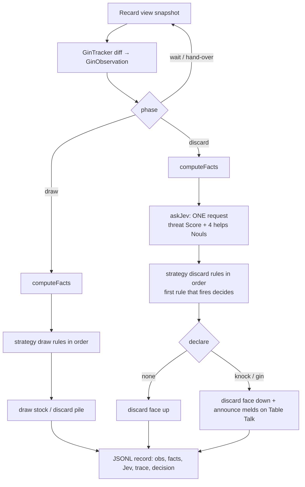

# Gin Rummy Strategy Bots (US-120, D137)

**TL;DR** — Four Gin Rummy strategies, each an ordered list of typed
rules in `tools/gin/strategies.mjs`. Anything that can be computed
(melds, deadwood, gin outs, whether you can knock) is computed in code.
Jev (TypeSafe System One) answers only what code can't: how close the
opponent is to knocking, and how likely each candidate discard is to
help them. That's one request per discard decision. Jev supplies
judgments; the rules pick the move. A bot joins a table you host with
`bobp make jev-player GAME=gin STRATEGY=<name> CODE=<code>`.

## Contents
1. [Research (with sources)](#1-research)
2. [Typed inputs](#2-typed-inputs)
3. [The rule catalog](#3-the-rule-catalog)
4. [The four strategies](#4-the-four-strategies)
5. [Decision flow](#5-decision-flow)
6. [Edge cases](#6-edge-cases)
7. [Example evaluations (live Jev)](#7-example-evaluations-live-jev)
8. [Running a bot](#8-running-a-bot)

---

## 1. Research

| Finding | Where it lands in code | Source |
|---|---|---|
| Rules: melds are sets of 3-4 or runs of 3+ in a suit (ace low). Deadwood A=1, pips = face value, J/Q/K = 10. Knock at ≤10, gin at 0. The hand is dead when two stock cards are left. | `cards.mjs`, `KNOCK_LIMIT`, `isLastChance` | [pagat.com — Gin Rummy](https://www.pagat.com/rummy/ginrummy.html), [Wikipedia — Gin rummy](https://en.wikipedia.org/wiki/Gin_rummy) |
| Knock early. Under 25/25 bonuses the equilibrium strategy almost stops knocking after 8 stock draws; under 20/10 bonuses, after 17. | `stageOf` (early < 8, middle < 17, late), `knockEarlyStage` | AAAI 2021, *Extracting Learned Discard and Knocking Strategies from a Gin Rummy Bot* (cdn.aaai.org/ojs/17827) |
| Blind discards: kings are safest, then queens. Take the upcard only when it clearly improves your hand. | `meldPaths` tie-break, `takeUpcardIfGain(5)` | same AAAI paper |
| Chase gin only when it's realistic: about ≥25% over the next 1-3 draws. | `knockIfGinUnlikely(0.25, 3)`, `ginChance` | [ataygames.com — Advanced Gin Rummy Strategy](https://ataygames.com/blogs/advanced-gin-rummy-strategy) |
| Card flexibility: A and K fit 4 possible 3-card melds, Q and 2 fit 5, and 3 through J fit 6. Low-flexibility cards are safer to throw. | `meldPaths(card, obs)` (drops paths through dead cards) | ataygames (above) |
| Knock timing vs. undercut risk: knocking with high deadwood risks an undercut when the opponent can lay off. | `layoffExposure` fact | [rarepike.com — Knocking Strategy](https://rarepike.com/gin-rummy/knocking-strategy), [gamecolony.com — Gin strategies](https://gamecolony.com/andr/gin/gin_strategies.html) |
| Read the opponent: cards they take from the discard pile show what they're building; what they discard shows what they aren't. | Jev `opponent_threat` + `helps_i` questions | gamecolony, ataygames (above) |

## 2. Typed inputs

Rules read one `DecisionContext = { obs, facts, jev }`.

- **`GinObservation`** (`observe.mjs`) holds public information only:
  your own hand, the discard pile, stock count and cards drawn so far,
  the opponent's hand **size**, their discards, the discard-pile cards
  they took, and your own discards. Recard's guest view includes the
  opponent's real card ids. The tracker never copies them, and a test
  guards this (`tests/ginObserve.test.js`).
- **`GinFacts`** (`rules.mjs`, `computeFacts`) is everything code can
  compute: `stage`, `deadwood` (after the best discard), `unseen`,
  `ginOuts`, `canKnock`, `isGin`, `isBigGin`, `isLastChance`,
  `discards[]` (each discard with `deadwoodAfter` and `meldPaths`),
  `bestDiscard`, `upcard`, `upcardGain`, `upcardMelds` and
  `layoffExposure`.
- **`GinJudgments`** (`judgments.mjs`, `askJev`) comes back from one
  Jev request per discard decision:
  - `threat`: a Score on `THREAT_LEVELS` 0..4. 0 = far from knocking,
    2 = could knock in 2-3 turns, 3 = likely knocks now or next turn,
    4 = likely one card from gin.
  - `helps[cardId]`: a Noul (0..1) for each of the top 4 discard
    candidates, estimating whether the opponent would use that card in
    a meld.

  In the draw phase the bot doesn't ask Jev (`null`).

## 3. The rule catalog

Each rule is `{ name, phase, spec, when(ctx) → boolean, choose(ctx) → GinDecision }`.
`spec` is the rule written out as a readable string, which the trace
records.

| Rule | Phase | Condition (`spec`) | Decision | Jev? |
|---|---|---|---|---|
| `takeUpcardIfMelds` | draw | `upcard != null && upcardMelds` | draw discard | – |
| `takeUpcardIfGain(5)` | draw | `upcard != null && upcardGain >= 5` | draw discard | – |
| `drawStock` | draw | `true` | draw stock | – |
| `declareGin` | discard | `isGin` (covers big gin) | discard best, `gin` | – |
| `knockWhenAble` | discard | `deadwood <= 10` | discard best, `knock` | – |
| `knockEarlyStage` | discard | `canKnock && stage == 'early'` | knock | – |
| `knockUnderThreat(3)` | discard | `canKnock && jev.threat >= 3` | knock | threat |
| `knockLastChance` | discard | `canKnock && stockCount <= 2` | knock | – |
| `knockIfGinUnlikely(.25, 3)` | discard | `canKnock && ginChance(chasePlan.outs, unseen, 3) < .25` | knock | – |
| `discardLeastDeadwood` | discard | always | `bestDiscard` (least deadwood → fewest meld paths → highest card) | – |
| `discardMaximizeOuts` | discard | always | `chasePlan.option`: most gin outs among discards within 4 deadwood of the best | – |
| `discardByUtility(8)` | discard | always | `argmin(deadwoodAfter + 8·helps)` | helps |
| `discardSafest` | discard | always | lowest Jev `helps` (falls back to meldPaths/6) | helps |

For any card Jev didn't judge, `helps` falls back to the code proxy
`meldPaths / 6`.

## 4. The four strategies

| Strategy | Draw rules | Discard rules (in order) | Personality |
|---|---|---|---|
| `knock-early` | melds → gain≥5 → stock | gin → knockWhenAble → leastDeadwood | Common expert default: lock in points. No Jev. |
| `gin-hunter` | melds → stock | gin → underThreat → lastChance → ginUnlikely → maximizeOuts | Holds for gin while the chance is ≥25% over 3 draws. Takes the upcard only when it completes a meld, so the opponent learns less. |
| `equilibrium` (default) | melds → gain≥5 → stock | gin → earlyStage → underThreat → lastChance → byUtility | Based on the AAAI study: knock early; later, knock only under threat or at the last chance. |
| `defensive` | melds → stock | gin → knockWhenAble → safest | Knocks whenever it can, and never feeds the opponent if Jev can tell. |

## 5. Decision flow



## 6. Edge cases

- **Big gin** (all 11 cards melded): an 11-card meld set always
  contains a meld of 4 or more, so a gin discard always exists.
  `declareGin` covers it.
- **Knock at exactly 10**: allowed (`deadwood <= KNOCK_LIMIT`).
- **You can't discard the upcard you just took**:
  `discardOptions` leaves out `obs.takenFromDiscard`.
- **Dead hand at 2 stock cards**: `isLastChance` makes every knocking
  strategy knock if it can. Otherwise the tracker records `outcome: 'dead'`.
- **Undercut risk**: `layoffExposure` counts unseen cards that could be
  laid off on your melds (chained through runs). Every strategy
  computes it, but no strategy uses it to gate a knock yet.
- **The trace doesn't include Jev's reasoning**: the record keeps the
  scores, not a rationale.
- **Knock = face-down discard**: that's the table convention. The bot
  also says the knock in Table Talk (Smith's condition), so it isn't
  silent.

## 7. Example evaluations (live Jev)

Generated by `node tools/gin/examples.mjs` (states in `tools/gin/exampleStates.mjs`) with `TYPESAFE_API_KEY` set,
on 2026-09-19. Jev answers vary a little from run to run.
Without the key, the script prints assumed answers and labels them as
assumed.

| # | State | Facts | Live Jev | knock-early | gin-hunter | equilibrium | defensive |
|---|---|---|---|---|---|---|---|
| 1 | Midgame draw; upcard 9♠ makes a set of 9s | dw 60, upcardGain 28 | — (draw) | take upcard | take upcard | take upcard | take upcard |
| 2 | Midgame discard, 10 drawn | dw 5, canKnock, best 5♥ | threat 0.40; helps ≈ .21-.23 | **knock** 5♥ | **knock** (ginUnlikely) | discard 5♥, **hold** | **knock** |
| 3 | Midgame, no knock; opponent took 8♥ 9♥ | dw 54 | threat 1.48; helps K♦ .26 Q♠ .23 J♠ .22 **9♣ .34** | K♦ | K♦ (maxOuts) | **J♠** (utility) | **J♠** (safest) |
| 4 | Late (19 drawn); opponent took 6♥ 7♥ | dw 5, 3 gin outs of 35 unseen | threat 1.57 | **knock** 7♣ | **knock** (ginUnlikely: 24.2% < 25%) | discard 7♣, **hold** | **knock** |
| 5 | Last chance, 2 stock left | dw 9 | threat 1.44 | knock Q♣ | knock (lastChance) | knock (lastChance) | knock Q♣ |

What the examples show:
- **#2 and #4 are where the strategies differ.** Equilibrium holds a
  5-deadwood hand past the early stage because Jev's threat stays below
  3. The other three knock. In #4, gin-hunter knocks by 0.8 of a
  percentage point: 3 outs over 3 draws is 24.2%, just under the 25% bar.
- **#3 shows Jev reading the discard history.** The opponent took 8♥
  and 9♥, and Jev rates the 9♣ as the most dangerous card to throw
  (.34). The two Jev-using discard rules move from K♦ to J♠. J♠ costs
  the same deadwood as K♦ and is rated slightly safer.
- **Observation: Jev's threat never reached 3 in these states.** #4
  was written as "opponent one card from gin", but Jev gave it 1.57
  ("building melds"). So `knockUnderThreat(3)` didn't fire in any live
  example, and the helps Nouls were close together (.19-.34). Whether
  to lower the threat bar or give Jev more history is a tuning question
  for the backlog, not a bug.

## 8. Running a bot

```bash
# Host a Gin table in Recard, then:
bobp make jev-player GAME=gin STRATEGY=equilibrium CODE=<table code> FIRST=bot HANDS=1
```

- The bot joins named after its strategy (e.g. `equilibrium`) over the real PeerJS/WebRTC path
  and plays its turns.
- It writes one JSON line per decision to stdout and `build/gin/`,
  plus a one-line summary per turn on stderr. It announces knocks and
  gin in Table Talk.
- To run it step by step, agents can use the `recard-harness` MCP:
  `game_join` adds a bot to a table, and `gin_turn` runs one decision
  and returns its record.
- Strategies that use Jev need `TYPESAFE_API_KEY`. If it's missing,
  you get a clear error that names the variable. Tests never call Jev;
  they inject a fake judge.
