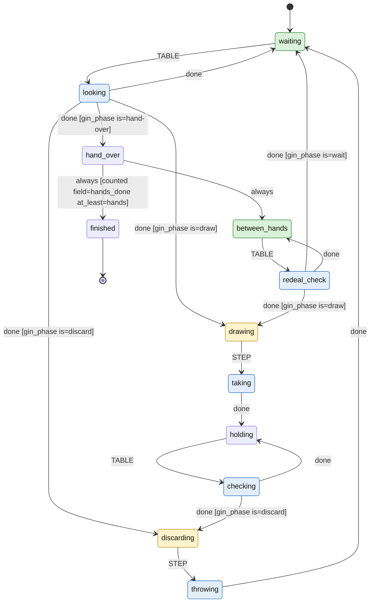

# Gin Rummy

Generated by `bobp make jev-readme` from `games/gin/` - do not edit by
hand; a test fails when this file is stale. To change it, change the files
it is generated from (and give each state of `turn.yaml` a `description`).

A Jev bot plays Gin Rummy: it works out whose move it is from the table, draws or takes the upcard, discards, and repeats until the hands are played. Who moves is computed, never judged; Jev is only asked for the move itself.

## Try it

`bobp make jev-table GAME=gin` hosts a table with 2 bots
(`jev-balanced`, `jev-cagey`), dealt and ready, as
`table.yaml` says. `bobp make jev-player GAME=gin STRATEGY=<player>
CODE=<table code>` seats one at a table you host yourself.

## A bot's turn

The statechart in `turn.yaml`, drawn from the machine the bots run. Green
states are `safe` (a bot asked to leave, by Ctrl-C or `QUIT`, leaves from
there); yellow are `move` (it is this bot's move); blue are `busy` (waiting
on Jev or the table).

| State | Tags | What it is for |
| --- | --- | --- |
| `waiting` | safe | Not my move yet; looks again when the table changes. Safe to leave. |
| `looking` | busy | Reads the table (gin_look) to find the phase: draw, discard, hand over, or wait. |
| `drawing` | move | My move: take the upcard or draw from the stock. |
| `taking` | busy | Making that draw at the table. |
| `holding` |  | Drawn, discard still owed. Not safe, so a bot asked to leave discards first. |
| `checking` | busy | Re-reads the table to see the discard is now due. |
| `discarding` | move | My move: discard, knock or go gin. |
| `throwing` | busy | Making that discard at the table. |
| `hand_over` |  | The hand ended; counts it and decides whether more hands remain. |
| `between_hands` | safe | Hand scored; waiting for the redeal. Safe to leave. |
| `redeal_check` | busy | Reads the table for the new deal. |
| `finished` |  | All requested hands played; the run ends. |

## Players

Each is one file in `players/`: the game's questions, reworded.

| Player | Description | Confidence floor | Escalation |
| --- | --- | --- | --- |
| `jev-balanced` | Balanced: takes points when they are there, keeps an eye on what the opponent is collecting. | 0.3 | floor_fallback |
| `jev-cagey` | Cagey: gives the opponent nothing, and would rather carry deadwood than feed a meld. | 0.2 | floor_fallback |

## What Jev is asked

`questions.yaml`.

| Question | Type | Asks |
| --- | --- | --- |
| `opponent_is_close` | score | From `opponent.discarded` (oldest first), `opponent.took_from_discard` and `stock.drawn_so_far`, how close is the opponent to being able to knock? |
| `opponent_wants` | choice | Which slot of `candidates` is the opponent most likely to meld, judged from `opponent.discarded` and `opponent.took_from_discard`? Answer with the slot number. |
| `move` | choice | It is my turn. Which move should I make? Weigh `me.deadwood` and what each option costs me against what `read` says the opponent is doing. |
