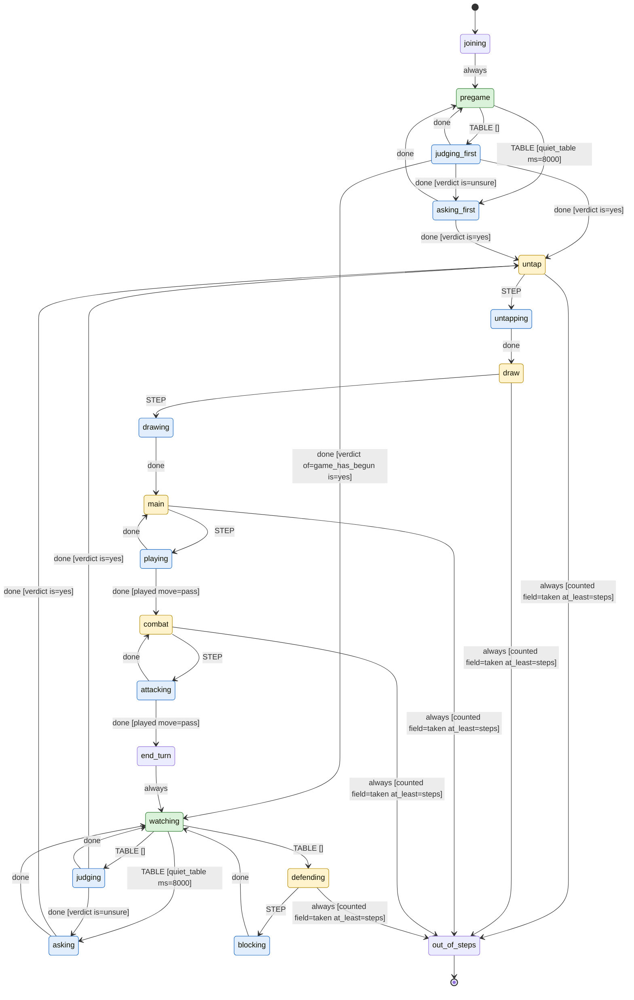

# Recard the Gathering

Generated by `bobp make jev-readme` from `games/rtg/` - do not edit by
hand; a test fails when this file is stale. To change it, change the files
it is generated from (and give each state of `turn.yaml` a `description`).

A Jev bot plays Recard the Gathering under the written rules in rules.yaml. It judges from the board and table talk whose turn it is, asking the table out loud when unsure, then plays each phase of its own turn (untap, draw, main, combat) and defends when attacked.

## Try it

`bobp make jev-table GAME=rtg` hosts a table with 2 bots
(`rules`, `aggressive`), dealt and ready, as
`table.yaml` says. `bobp make jev-player GAME=rtg STRATEGY=<player>
CODE=<table code>` seats one at a table you host yourself.

## A bot's turn

The statechart in `turn.yaml`, drawn from the machine the bots run. Green
states are `safe` (a bot asked to leave, by Ctrl-C or `QUIT`, leaves from
there); yellow are `move` (it is this bot's move); blue are `busy` (waiting
on Jev or the table).

| State | Tags | What it is for |
| --- | --- | --- |
| `joining` |  | Introduces itself at the table, then goes to pregame. |
| `pregame` | safe | Nobody has had a turn yet; waits for talk or a dice roll to settle who goes first. Safe to leave. |
| `judging_first` | busy | Asks Jev whether it goes first, and whether the game has begun. |
| `asking_first` | busy | Asks the table out loud: Do I go first? |
| `watching` | safe | Not my turn, or can't tell yet; listens for an attack or the end of their turn. Safe to leave. |
| `judging` | busy | Asks Jev whether their turn is over. |
| `asking` | busy | Asks the table out loud: Is it my turn now? |
| `untap` | move | My move: start of my turn. |
| `untapping` | busy | Untaps everything I control. |
| `draw` | move | My move: draw step. |
| `drawing` | busy | Draws a card. |
| `main` | move | My move: main phase; cast spells, play a land, or pass. |
| `playing` | busy | Jev chooses one main-phase step; a pass moves on to combat. |
| `combat` | move | My move: combat phase; attack or pass. |
| `attacking` | busy | Jev chooses the attackers; a pass ends the turn. |
| `end_turn` |  | Says the turn is over out loud, resets per-turn memory, goes back to watching. |
| `defending` | move | They attacked; my move to block. |
| `blocking` | busy | Jev chooses blockers, then back to watching. |
| `out_of_steps` |  | The run hit its STEPS limit; the run ends. |

## Players

Each is one file in `players/`: the game's questions, reworded.

| Player | Description | Confidence floor | Escalation |
| --- | --- | --- | --- |
| `aggressive` | plays by the rules, and presses the attack whenever it legally can | 0 | ask_table |
| `rules` | plays by the rules written in its game file | 0 | ask_table |

## What Jev is asked

`questions.yaml`, citing the rules written out in `rules.yaml`.

| Question | Type | Asks |
| --- | --- | --- |
| `step` | choice | It is my move in Recard the Gathering. Given `rules.goal`, what I hold in `me` and what the opponent has in `opponent`, which of these should I do next? Passing is always allowed. |
| `one_land_per_turn` | noul | The move puts a land onto the battlefield. Given `rules.land_drop`, `turn.land_played` and `turn.is_mine`, is that allowed right now? |
| `can_pay_for_it` | noul | Given `rules.mana` and `me.untapped_lands`, can this spell's cost in `proposed.cost` be paid in full right now? |
| `creature_can_attack` | noul | Given `rules.attacking` and `rules.summoning_sickness`, may the creature in `proposed.card` attack this turn, considering `proposed.arrived_this_turn` and `proposed.tapped`? |
| `block_is_legal` | noul | Given `rules.blocking`, may the creature in `proposed.card` block the attacker named in `turn.attackers`, considering `proposed.tapped`? |
| `timing_is_right` | noul | Given `rules.turn_sequence`, `rules.priority`, `turn.is_mine` and `turn.phase`, is this the right moment for the move in `proposed.what`? |
| `attack_phase_complete` | noul | Given `rules.no_mechanical_signal`, the board in `me` and `opponent`, and `table_talk` in order, IF the counter-clockwise player declared an attack this turn, has it been resolved? Answer yes if no attack was declared at all - there is nothing pending. |
| `their_turn_is_over` | noul | Given `rules.seating`, `rules.no_mechanical_signal`, the board in `me` and `opponent`, `table_talk` in order, and the read on `attack_phase_complete` - has the counter-clockwise player's turn ended? Judge only from the board and what was said - never guess about something already visible. |
| `i_go_first` | noul | Nobody has taken a turn in this game yet. Given `rules.first_player` and `table_talk` in order - including any dice rolls, and anything said to me by my name `me.name` - has the table settled that I take the first turn? |
| `game_has_begun` | noul | Given `rules.turn_sequence`, the board in `me` and `opponent` and `table_talk` in order, has another player already started the game by taking the first turn? |
