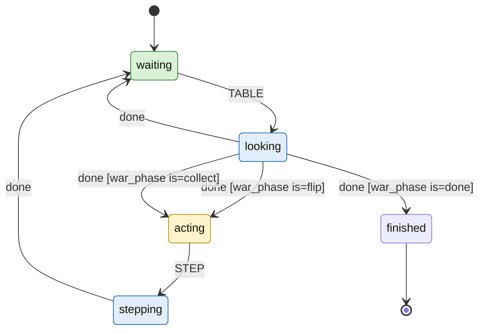

# War

Generated by `bobp make jev-readme` from `games/war/` - do not edit by
hand; a test fails when this file is stale. To change it, change the files
it is generated from (and give each state of `turn.yaml` a `description`).

A Jev bot plays War: it works out from the table whether it owes this round's flip (with the war procedure on a tie), owes the collect after winning, or has nothing to do yet, and repeats until one side's deck is empty.

## Try it

`bobp make jev-table GAME=war` hosts a table with 2 bots
(`mechanical`, `mechanical`), dealt and ready, as
`table.yaml` says. `bobp make jev-player GAME=war STRATEGY=<player>
CODE=<table code>` seats one at a table you host yourself.

## A bot's turn

The statechart in `turn.yaml`, drawn from the machine the bots run. Green
states are `safe` (a bot asked to leave, by Ctrl-C or `QUIT`, leaves from
there); yellow are `move` (it is this bot's move); blue are `busy` (waiting
on Jev or the table).

| State | Tags | What it is for |
| --- | --- | --- |
| `waiting` | safe | Not my move yet; looks again when the table changes. Safe to leave. |
| `looking` | busy | Reads the table (war_look) to find the phase: flip, collect, wait, or done. |
| `acting` | move | My move: flip this round's card (plus the war procedure on a tie) or collect a won pile. |
| `stepping` | busy | Making that move at the table. |
| `finished` |  | One side's deck is empty; the run ends. |

## Players

Each is one file in `players/`: the game's questions, reworded.

| Player | Description | Confidence floor | Escalation |
| --- | --- | --- | --- |
| `mechanical` | Mechanical: flips the top card every round, plays the war procedure on a tie, and collects the pile when it wins. No real choices to make, so nothing here is judged. | 0 | floor_fallback |

## What Jev is asked

`questions.yaml`.

| Question | Type | Asks |
| --- | --- | --- |
